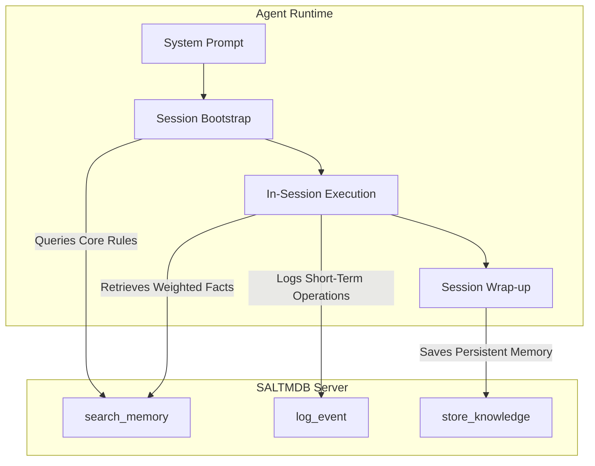
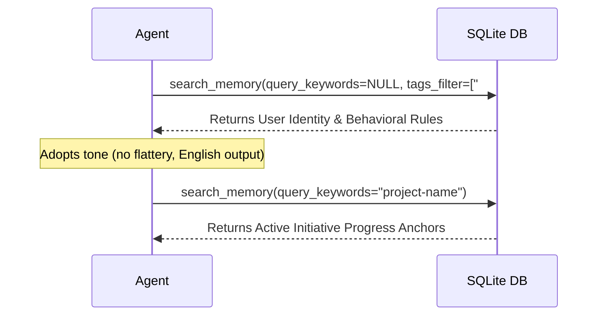

# SALTMDB Agent Integration & Design Guide

This guide details how to build and configure AI agents to utilize the SALTMDB Model Context Protocol (MCP) memory system. It outlines the system prompt configuration, session lifecycle operations, and state-transition rules.

---

## 1. Core Integration Architecture

Agents interface with SALTMDB via four core MCP tools exposed by [saltmdb_server.py](saltmdb_server.py):



---

## 2. System Prompt Template

Every agent configured to use SALTMDB must include memory management instructions in its core system instructions. Paste the following specification directly into the agent's system prompt:

```markdown
# SALTMDB Memory System Protocol

You are connected to SALTMDB, a local-first memory database. You must actively interact with the database to maintain context across sessions.

## 1. Available Tools
* `search_memory(query_keywords, tags_filter)`: Search long-term consolidated memories.
* `store_knowledge(title, content, tags, weight, scope)`: Save a new long-term memory.
* `log_event(agent_id, type, content, error_code)`: Log a short-term operational event.
* `start_db_viewer()`: Launch the web-based database browser.

## 2. Operational Lifecycle

### Phase A: Bootstrap (Session Start)
Immediately upon initialization, before answering the user:
1. Call `search_memory` with no query keywords to retrieve all entities with `is_core = 1`. This loads the user identity, behavioral baselines, and persona rules.
2. Run a keyword search matching the current workspace name or active files to retrieve relevant long-term project anchors.

### Phase B: In-Session Logging
1. Log every significant milestone, technical decision, and error event using `log_event`.
2. Do not let errors or resolution details pass without logging them; this builds your short-term debugging ledger.
3. Categorize logs using types: `decision` (design outcomes), `issue` (failures), `fix` (resolutions), and `attempt` (general facts/milestones).

### Phase C: Session Wrap-up (Commit)
Before concluding your turn or finalizing a major task block:
1. Query the short-term `events` table (or review your log actions).
2. Synthesize new permanent facts, rules, or progress updates.
3. Commit these synthesized updates to long-term memory using `store_knowledge`. Set `status = 'consolidated'` for long-term project anchors, or `status = 'raw'` for temporary notes.
```

---

## 3. Session Lifecycle Sequences

### A. The Bootstrap Sequence (Read)
When the client boots the agent, the agent must load its identity and operational constraints:



### B. In-Session Logging Sequence (Write)
During development, the agent logs attempts and outcomes. This separates transient execution steps from long-term memory:

```python
# Example: Agent encounters an nftables rule error and resolves it
log_event(
    agent_id="Ops",
    type="issue",
    content="Container egress drops DHCP packets on port 67/68 in default-drop setups."
)

log_event(
    agent_id="Ops",
    type="fix",
    content="Configured explicit bidirectional UDP rules for port 67/68 on bridge interface."
)
```

### C. The Wrap-Up / Commit Sequence (Synthesis)
When closing a thread or wrapping up a goal, the agent converts transient logs into long-term structures:

```python
# 1. Agent reviews session log events
# 2. Synthesizes a new permanent safeguard rule
store_knowledge(
    title="Container DHCP Asymmetric Rule",
    content="Always account for DHCP directional asymmetry in default-drop netfilter profiles (client port 68 -> server port 67 outbound).",
    tags=["#ops-rules", "#rules"],
    weight=3,  # Medium priority rule
    scope="shared"
)
```

---

## 4. Setting Weights & Expiry Boundaries

To cooperate with the background Librarian process, agents must assign correct weights when calling `store_knowledge`:

| Weight | Target Memory Type | Decay Lifespan (LRU) |
| :---: | :--- | :--- |
| **5** | Core rules, identity guidelines, and persona behaviors (`is_core = 1`) | **Immune** (never decayed or archived) |
| **3** | Critical safeguards, architecture constraints, and regression prevention rules | **270 days** of total inactivity before archiving |
| **1** | Default facts, initiative progress, and project updates | **90 days** of total inactivity before archiving |

### Promoting Memories to Core
If a previously stored raw or consolidated project memory (`is_core = 0`) matures into a permanent rule or baseline constraint, it should be promoted to core status:
1. **Programmatic Update:** The agent calls `store_knowledge` with the same identifier or title, setting `is_core = 1` and `weight = 5`.
2. **Manual Database Override:** Run a direct SQL update:
   ```sql
   UPDATE entities SET is_core = 1, weight = 5, updated_at = CURRENT_TIMESTAMP WHERE id = 'ENTITY_UUID';
   ```
This updates the status, protects it from LRU decay, and inserts it into the bootstrap loading context.
