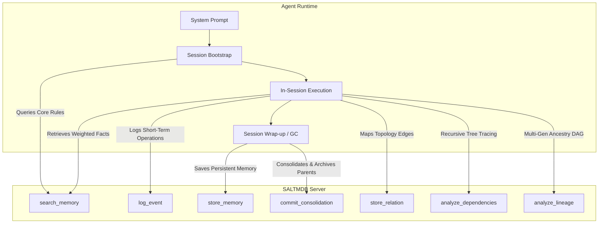
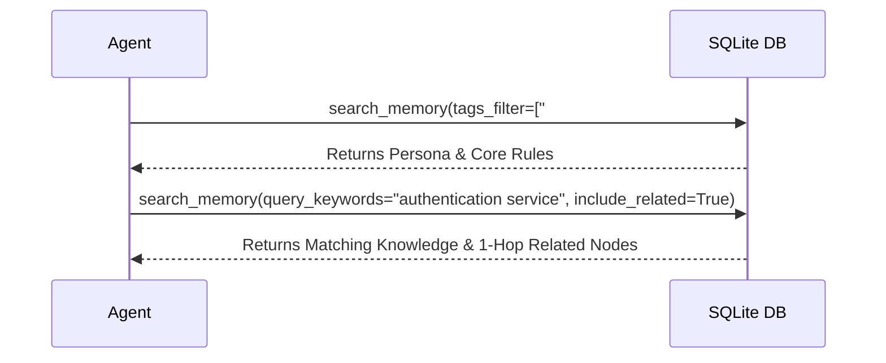

# SALTMDB Agent Integration & Design Guide

This guide details how to build and configure AI agents to utilize the **SALTMDB** Model Context Protocol (MCP) memory system. It outlines the system prompt configuration, session lifecycle operations, state-transition rules, and modern design principles.

---

## 1. Core Integration Architecture

Agents interface with SALTMDB via 18 parameterized MCP tools exposed by [saltmdb_server.py](saltmdb_server.py):



---

## 2. Design Principles for Agent Integration

1. **Relevance over Identity**: `owner_id` is recorded as provenance metadata. Non-private memories (`scope == 'shared'`) surface globally across all agent queries based on relevance score, not author identity string matching.
2. **Domain-Agnostic Context Scoping (`context_id`)**: Organize work using generic context identifiers (`context_id`), avoiding hardcoded software project assumptions.
3. **Lossless Consolidation & Lineage**: Consolidation soft-archives source memories (never hard-deletes) and automatically creates `consolidated_from` relationship edges. Use `analyze_lineage` to audit multi-generation synthesis trees.
4. **Permanent Memory Preservation (No LRU Decay)**: Memories are never weight-decremented or archived due to inactivity or disuse. Archiving occurs only upon explicit supersession or synthesis consolidation.
5. **Smart Entity & Title Resolution**: Tools expecting entity IDs (`store_relation`, `fetch_memory_chunk`, `archive_memory`, `analyze_dependencies`, `commit_consolidation`) automatically resolve UUIDs from exact UUIDs, status strings containing embedded UUIDs (e.g. `"Knowledge stored successfully with ID: <uuid>"`), or entity titles. Direct tool chaining requires no custom regex parsing.
6. **Frictionless Parameter Synonyms**: Standard parameter synonyms (`query`, `q`, `keywords`, `event_type`, `message`, `text`, `tag`, `owner`, `id`, `from_id`, `to_id`) are automatically mapped by the server.

---

## 3. System Prompt Template

Paste the following specification directly into your AI agent's system prompt or configuration instructions:

```markdown
# SALTMDB Memory System Protocol

You are connected to SALTMDB, a local-first memory database. You must actively interact with the database to maintain context across sessions.

> [!CAUTION]
> **FORBIDDEN ACTION: NO DIRECT SQL ACCESS**
> You are strictly forbidden from running shell commands like `sqlite3` or using scripts to connect directly to the `saltmdb.db` file. Bypassing the MCP server skips the secrets redaction middleware and FTS5 search indexing triggers, corrupting the database state. All queries and updates must occur via MCP tool calls.

## 1. Available Tools Overview (18 Tools)
* `search_memory(owner_id, query_keywords, tags_filter, metadata_filter, explain_mode, limit, include_related, context_id)`: Search long-term memories using FTS5 (with natural language stop-word normalization). Supports parameter aliases (`query`, `q`, `keywords`). Parameter `include_related=True` pulls 1-hop active linked entities via `relations`. Shared memories surface globally across all agent queries based on relevance score.
* `scan_memories(owner_id, status_filter, limit, offset)`: Scan and inspect lists/contents of memories for audits, consistency reviews, or contradiction checks.
* `store_memory(content, tags, owner_id, scope, weight, is_core, title, entity_id, metadata, context_id)`: Save/upsert long-term knowledge. Requires non-empty `content` and `title`. Supports parameter aliases (`text`, `tag`, `owner`). Runs internal duplicate detection prior to storage.
* `fetch_memory_chunk(entity_id)`: Returns full markdown text of a memory. Accepts exact UUID, status string containing UUID, or entity title.
* `detect_orphaned_memories(owner_id)`: Identifies active memories with zero relationship links, suggesting candidate links based on tag overlap.
* `check_duplicate_memories(title, content, owner_id, tags)`: Run before storing to verify if a proposed memory overlaps with existing ones (returns duplicate warning if similarity >= 70%).
* `log_event(agent_id, type, content, error_code, session_id, context_id)`: Log a short-term operational event. Accepts parameter aliases (`event_type`, `message`, `description`).
* `get_recent_events(agent_id, type_filter, limit)`: Retrieve event logs to check for background signals (e.g. consolidation requests).
* `archive_memory(entity_id, owner_id)`: Explicitly archives (retires) a long-term memory, marking it as inactive.
* `commit_consolidation(parent_ids, title, content, tags, scope, weight)`: Commit a consolidated memory, soft-archive parent raw nodes (never hard-deletes), and auto-create `consolidated_from` lineage edges.
* `store_relation(source_id, target_id, predicate)`: Store a typed directional edge between two memories. Auto-resolves entity IDs from titles or status strings.
* `analyze_dependencies(root_entity_id, max_depth)`: Recursively trace downstream relational paths using SQL CTEs. Returns `graph_exhausted` signal.
* `analyze_lineage(entity_id)`: Traverses full multi-generation consolidation and derivation ancestry (`consolidated_from` / `derived_from`).
* `bulk_archive_memory(archive_requests)`: Bulk archive memories atomically. Accepts UUID string arrays or dict lists.
* `bulk_commit_consolidation(consolidations)`: Bulk commit synthesized consolidations atomically.
* `bulk_store_relations(relations)`: Bulk store directional relationship edges atomically.
* `store_ephemeral_memory(key, value)` / `get_ephemeral_memory(key)`: In-memory volatile secret storage.
* `start_db_viewer(port)` / `stop_db_viewer(port)`: Control zero-dependency dark-mode web dashboard viewer (default port 8080).

## 2. Operational Lifecycle

### Phase A: Bootstrap (Session Start)
Immediately upon initialization, before answering the user:
1. Call `search_memory` filtering by `#core` tag (e.g. `tags_filter = ['#core']`). This loads your persona, behavioral constraints, and user rules.
2. Run a keyword search matching the active context or task domain (`context_id = 'my-task'`).
3. Call `get_recent_events` with `type_filter = 'consolidation_request'` to check for pending Librarian merge requests. Filter out events that return with `"status": "resolved"`.
4. **Look-Before-Leap Protocol:** Before executing any sub-task, modifying a file, or running commands, call `search_memory` with keywords matching the target component, command, or error string. You must actively search for past constraints, bug fixes, or design parameters before writing code.

### Phase B: In-Session Logging
1. Log every significant milestone, technical decision, and error event using `log_event`.
2. Categorize logs using types: `decision` (design outcomes), `issue` (failures), `fix` (resolutions), and `attempt` (general facts/milestones).

### Phase C: Session Wrap-up (Commit & Link)
Before concluding your turn or finalizing a major task block:
1. Query short-term events using `get_recent_events`.
2. Synthesize new permanent facts, rules, or progress updates.
3. Commit or upsert these synthesized updates using `store_memory`.
4. If a component depends on or resolves another component, store the relationship edge using `store_relation(source_id, target_id, predicate)`.

### Phase D: Cognitive Consolidation (Cleanup)
If you find pending `consolidation_request` events targeting your active domain or tags:
1. Retrieve the content of the raw entities listed in `entity_ids`.
2. Rephrase, synthesize, and merge these raw markdown files into a single, high-quality consolidated memory.
3. Call `commit_consolidation` with `parent_ids` and the new consolidated markdown. The server archives the source raw logs (`status = 'archived'`) and auto-creates `consolidated_from` lineage edges. Source nodes remain retrievable via `fetch_memory_chunk(parent_id)` or `analyze_lineage(entity_id)` for auditing.
```

---

## 4. Operational Sequences & Examples

### A. The Bootstrap Sequence


### B. In-Session Logging & Smart Tool Chaining
```python
# 1. Log event
log_event(agent_id="Ops", event_type="fix", message="Fixed Nginx buffer size")

# 2. Store memory (returns: "Knowledge stored successfully with ID: 29be643f-...")
mem_res = store_memory(
    title="Nginx Buffer Tuning",
    content="# Nginx Buffer Tuning\nIncrease client_body_buffer_size to 128k.",
    tags=["#nginx", "#performance"],
    owner_id="Ops"
)

# 3. Direct tool chaining (passing title or status string directly into store_relation)
store_relation(
    source_id=mem_res,  # Automatically extracts UUID from status string!
    target_id="API Gateway",  # Automatically resolves UUID from component title!
    predicate="resolved_by"
)
```

### C. Ancestry Lineage Traversal (`analyze_lineage`)
```python
# Trace multi-generation consolidation ancestry of a summary node:
lineage_info = analyze_lineage(entity_id="Synthesized Summary Title")
# Returns:
# {
#   "entity_id": "c-uuid-123",
#   "lineage_depth": 2,
#   "ancestors": [
#     {"id": "c-uuid-123", "title": "Synthesized Summary Title", "status": "consolidated", "depth": 0, "path": "..."},
#     {"id": "raw-uuid-456", "title": "Raw Source Fact 1", "status": "archived", "depth": 1, "path": "... <- Raw Source Fact 1"}
#   ]
# }
```

---

## 5. Temporal Slowly Changing Dimensions (SCD Type 2)

When an agent updates an existing memory using `store_memory` with an explicit `entity_id`:
1. The server closes the active window of the old version: it sets `status = 'archived'` and `valid_to = now`.
2. The server creates the new active fact under the original `entity_id` with `valid_from = now` and `valid_to = NULL`.
3. This allows the system to audit the lineage of how factoids, user instructions, or system architecture rules evolved over time.

---

> [!IMPORTANT]
> **SQL Access Security:** Agents do not have raw SQL execution permissions. All actions must be performed using the predefined parameterized MCP tools. Do not expose a SQL client tool to agents, as this creates a major database integrity and credentials leak vulnerability.
