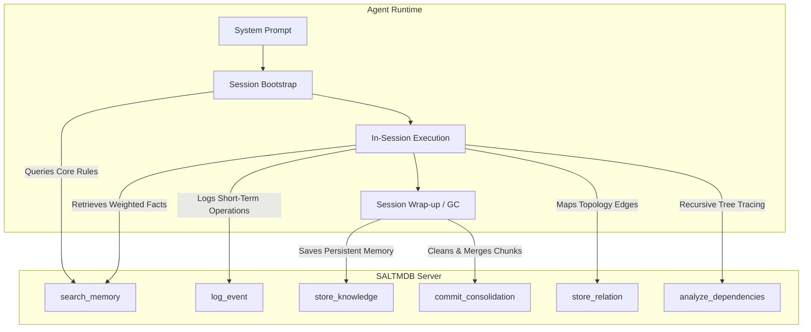
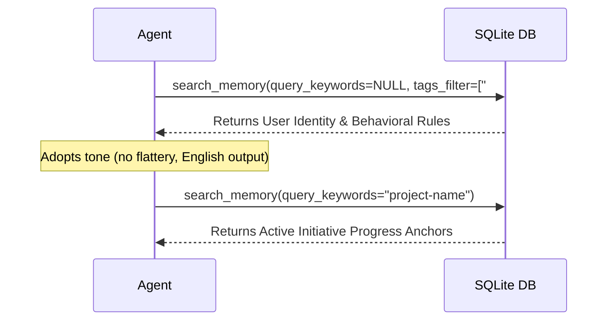

# SALTMDB Agent Integration & Design Guide

This guide details how to build and configure AI agents to utilize the SALTMDB Model Context Protocol (MCP) memory system. It outlines the system prompt configuration, session lifecycle operations, and state-transition rules.

---

## 1. Core Integration Architecture

Agents interface with SALTMDB via seven core MCP tools exposed by [saltmdb_server.py](saltmdb_server.py):



---

## 2. System Prompt Template

Every agent configured to use SALTMDB must include memory management instructions in its core system instructions. Paste the following specification directly into the agent's system prompt:

```markdown
# SALTMDB Memory System Protocol

You are connected to SALTMDB, a local-first memory database. You must actively interact with the database to maintain context across sessions.

> [!CAUTION]
> **FORBIDDEN ACTION: NO DIRECT SQL ACCESS**
> You are strictly forbidden from running shell commands like `sqlite3` or using scripts to connect directly to the `saltmdb.db` file. Bypassing the MCP server skips the secrets redaction middleware and FTS5 search indexing triggers, corrupting the database state. All queries and updates must occur via MCP tool calls.

## 1. Available Tools
* `search_memory(owner_id, query_keywords, tags_filter, metadata_filter, explain_mode, limit)`: **[MANDATORY `owner_id`]** Search long-term memories. Safe FTS5 parser handles syntax errors automatically. Supports `metadata_filter` (exact lookups by project, source_path, etc.), `explain_mode` (diagnostics on zero-match), and `limit` (default 5, max 25).
* `scan_memories(owner_id, status_filter, limit, offset)`: **[MANDATORY `owner_id`]** Retrieve and scan lists/contents of memories for audits, consistency reviews, or contradiction checks.
* `store_knowledge(owner_id, content, tags, scope, ..., metadata)`: **[MANDATORY `owner_id`]** Save/upsert long-term knowledge. Supports optional `metadata` dict for structured search.
* `detect_orphaned_memories(owner_id)`: **[MANDATORY `owner_id`]** Returns a list of active memories with zero connections, suggesting link candidates based on shared tags.
* `check_duplicate_memories(title, content, owner_id, tags)`: **[MANDATORY `owner_id`]** Run before storing to verify if a proposed memory overlaps with existing ones (returns duplicate warning if similarity >= 70%).
* `log_event(agent_id, type, content, error_code)`: Log a short-term operational event to the ledger.
* `get_recent_events(agent_id, type_filter, limit)`: Retrieve event logs to check for background signals (e.g. consolidation requests).
* `archive_memory(entity_id, owner_id)`: **[MANDATORY `owner_id`]** Explicitly archives (retires) a long-term memory, marking it as inactive.
* `commit_consolidation(parent_ids, title, content, tags, scope, weight)`: Commit a consolidated memory and prune the raw source components.
* `store_relation(source_id, target_id, predicate)`: Store a typed directional edge between two memories.
* `analyze_dependencies(root_entity_id)`: Recursively trace downstream relational paths using recursive SQL CTEs.
* `start_db_viewer()`: Launch the web-based database browser.
* `stop_db_viewer()`: Close/terminate the database browser process.

## 2. Operational Lifecycle

### Phase A: Bootstrap (Session Start)
Immediately upon initialization, before answering the user:
1. Call `search_memory` with no query keywords, filtering by `#core` tag, and passing your assigned `owner_id` (e.g. `owner_id = 'agent1'`). This loads your persona, behavioral constraints, and user rules.
2. Run a keyword search matching the workspace or active component path, passing your `owner_id` to isolate workspace initiative memory anchors.
3. Call `get_recent_events` with your `agent_id` set to your `owner_id` and `type_filter = 'consolidation_request'` to check for pending Librarian merge requests. **Filter out events that return with `"status": "resolved"`** (as their target raw entities have already been consolidated).
4. **Look-Before-Leap Protocol:** Before executing any sub-task, modifying a file, or running commands, call `search_memory` with keywords matching the target component, command, error string, or library. You must actively search for past constraints, bug fixes, or design parameters before writing code.

### Phase B: In-Session Logging
1. Log every significant milestone, technical decision, and error event using `log_event`.
2. Categorize logs using types: `decision` (design outcomes), `issue` (failures), `fix` (resolutions), and `attempt` (general facts/milestones).

### Phase C: Session Wrap-up (Commit & Link)
Before concluding your turn or finalizing a major task block:
1. Query short-term events using `get_recent_events` (or review your log actions).
2. Synthesize new permanent facts, rules, or progress updates.
3. Commit or upsert these synthesized updates using `store_knowledge`. Always pass your `owner_id`. If you save a memory with an identical title under the same owner, the server automatically routes it to an update, preserving history via SCD versioning.
4. If a component depends on or resolves another component, store the relationship edge using `store_relation(source_id, target_id, predicate)`.

### Phase D: Cognitive Consolidation (Cleanup)
If you find pending `consolidation_request` events targeting your `owner_id` during Phase A:
1. Retrieve the content of the raw entities listed in the event's `entity_ids`.
2. Rephrase, synthesize, and merge these raw markdown files into a single, high-quality consolidated memory.
3. Call `commit_consolidation` with the parent UUIDs and the new consolidated markdown, which physically prunes the source raw logs from the database.
```

---

## 3. Session Lifecycle Sequences

### A. The Bootstrap Sequence (Read)
When the client boots the agent, the agent must load its identity and operational constraints:



### B. In-Session Logging Sequence (Write)
During development, the agent logs attempts and outcomes. This separates transient execution steps from long-term memory:

```python
# Example: Agent encounters an nftables rule error and resolves it
log_event(
    agent_id="Ops",
    type="issue",
    content="Container egress drops DHCP packets on port 67/68 in default-drop setups."
)

log_event(
    agent_id="Ops",
    type="fix",
    content="Configured explicit bidirectional UDP rules for port 67/68 on bridge interface."
)
```

### C. The Wrap-Up / Commit Sequence (Synthesis)
When closing a thread or wrapping up a goal, the agent converts transient logs into long-term structures:

```python
# 1. Agent reviews session log events
# 2. Synthesizes a new permanent safeguard rule
store_knowledge(
    title="Container DHCP Asymmetric Rule",
    content="Always account for DHCP directional asymmetry in default-drop netfilter profiles (client port 68 -> server port 67 outbound).",
    tags=["#ops-rules", "#rules"],
    weight=3,  # Medium priority rule
    scope="shared"
)
```

### D. Cognitive Consolidation Sequence (Cleanup)
When the Librarian logs a `consolidation_request` (indicating $\ge 5$ raw memories under a tag or general scope), the agent resolves it programmatically:

```python
# 1. Agent detects consolidation_request event in bootstrap:
#    Event content: {"target": "tag", "tag_name": "#ops", "entity_ids": ["uuid-1", "uuid-2", ...]}

# 2. Agent reads raw contents of those IDs, merges them into a clean Markdown text.

# 3. Agent commits the summary and archives the sources:
commit_consolidation(
    parent_ids=["uuid-1", "uuid-2", "uuid-3", "uuid-4", "uuid-5"],
    title="Consolidated Operations Memory",
    content="# Consolidated Operations Memory\n\n- Fact 1 details...\n- Fact 2 details...",
    tags=["#ops"],
    scope="shared",
    weight=1
)
```

### E. Temporal Relational Topology mapping (Recursive CTE Tracing)
Agents can natively link component dependencies to perform recursive dependency impact analysis:

```python
# 1. Agent maps dependency between component 'A' and component 'B':
store_relation(
    source_id="uuid-component-a",
    target_id="uuid-component-b",
    predicate="depends_on"
)

# 2. Agent checks downstream impact graph before refactoring Component A:
affected_components = analyze_dependencies(root_entity_id="uuid-component-a")
# Returns a recursive dependency tree path: e.g. "Component A -> Component B -> Component C"
```

---

## 4. Setting Weights & Expiry Boundaries

To cooperate with the background Librarian process, agents can assign importance weights when calling `store_knowledge`. Alternatively, agents should supply **Multi-Dimensional Importance Scores** (`relevance`, `impact`, `novelty`, `actionability` rated 1-5) to let the server calculate weights:

| Computed Weight | Target Memory Type | Decay Lifespan (LRU) |
| :---: | :--- | :--- |
| **5** | Core rules, identity guidelines, and persona behaviors (`is_core = 1`) | **Immune** (never decayed or deleted) |
| **3** | Critical safeguards, architecture constraints, and regression prevention rules | **270 days** of inactivity before decay |
| **1-2**| Default facts, initiative progress, and project updates | **90 days** of inactivity before decay |

### Temporal Slowly Changing Dimensions (SCD Type 2)
When an agent updates an existing memory using `store_knowledge` with an explicit `entity_id`:
1. The server closes the active window of the old version: it writes the historical snapshot with `status = 'archived'` and sets `valid_to = now`.
2. The server creates the new active fact under the original `entity_id` with `valid_from = now` and `valid_to = NULL`.
3. This allows the system to audit the lineage of how factoids, user instructions, or system architecture rules evolved.

### Promoting Memories to Core
If a previously stored raw or consolidated project memory matures into a permanent rule or baseline constraint, it should be promoted to core status:
1. **Programmatic Update (Agent-driven):** The agent calls the `store_knowledge` MCP tool with the target `entity_id`, passing `is_core = true` and `weight = 5`.
2. **Manual Developer Override:** The user runs a direct SQL update manually on the database file:
   ```sql
   UPDATE entities SET is_core = 1, weight = 5, updated_at = CURRENT_TIMESTAMP WHERE id = 'ENTITY_UUID';
   ```

> [!IMPORTANT]
> **SQL Access Security:** Agents do not have raw SQL execution permissions. All actions must be performed using the predefined parameterized MCP tools. Do not expose a SQL client tool to agents, as this creates a major database integrity and credentials leak vulnerability.
