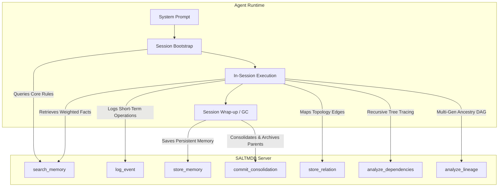
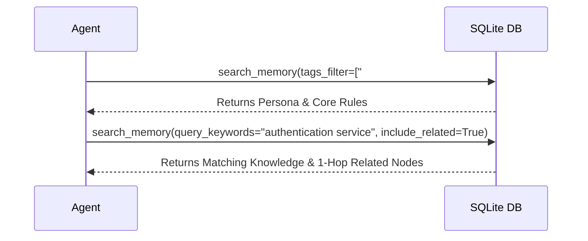

# SALTMDB Agent Integration & Design Guide

This guide details how to build and configure AI agents to utilize the **SALTMDB** Model Context Protocol (MCP) memory system. It outlines the system prompt configuration, session lifecycle operations, state-transition rules, and modern design principles.

---

## 1. Core Integration Architecture

Agents interface with SALTMDB via 10 parameterized MCP tools exposed by the `saltmdb` package (`src/saltmdb/mcp/tools.py`):


```mermaid
graph TD
    subgraph Client [Agent Runtime]
        A[System Prompt] --> B[Session Bootstrap]
        B --> C[In-Session Execution]
        C --> D[Session Wrap-up / GC]
    end
    subgraph MCP [SALTMDB Server]
        B -->|Queries Core Rules| E[search_memory]
        C -->|Logs Short-Term Operations| F[log_event]
        C -->|Retrieves Weighted Facts| E
        D -->|Saves Persistent Memory| G[store_memory]
        D -->|Consolidates & Archives Parents| H[commit_consolidation]
        C -->|Maps Topology Edges| I[store_relation]
        C -->|Recursive Tree Tracing| J[analyze_dependencies]
        C -->|Multi-Gen Ancestry DAG| K[analyze_lineage]
    end
```

---

## 2. Design Principles for Agent Integration

1. **Relevance over Identity**: `owner_id` is recorded as provenance metadata. Non-private memories (`scope == 'shared'`) surface globally across all agent queries based on relevance score, not author identity string matching.
2. **Domain-Agnostic Context Scoping (`context_id`)**: Organize work using generic context identifiers (`context_id`), avoiding hardcoded software project assumptions.
3. **Lossless Consolidation & Lineage**: Consolidation soft-archives source memories (never hard-deletes) and automatically creates `consolidated_from` relationship edges. Use `analyze_lineage` to audit multi-generation synthesis trees.
4. **Permanent Memory Preservation (No LRU Decay)**: Memories are never weight-decremented or archived due to inactivity or disuse. Archiving occurs only upon explicit supersession or synthesis consolidation.
5. **Smart Entity & Title Resolution**: Tools expecting entity IDs (`store_relation`, `fetch_memory_chunk`, `archive_memory`, `analyze_dependencies`, `commit_consolidation`) automatically resolve UUIDs from exact UUIDs, status strings containing embedded UUIDs (e.g. `"Knowledge stored successfully with ID: <uuid>"`), or entity titles. Direct tool chaining requires no custom regex parsing.
6. **Frictionless Parameter Synonyms**: Standard parameter synonyms (`query`, `q`, `keywords`, `event_type`, `message`, `text`, `tag`, `owner`, `id`, `from_id`, `to_id`) are automatically mapped by the server.

---

## 3. System Prompt Template

Paste the following specification directly into your AI agent's system prompt or configuration instructions:

```markdown
# SALTMDB Memory System Protocol

You are connected to SALTMDB, a local-first memory database. You must actively interact with the database to maintain context across sessions.

> [!CAUTION]
> **FORBIDDEN ACTION: NO DIRECT SQL ACCESS**
> You are strictly forbidden from running shell commands like `sqlite3` or using scripts to connect directly to the `saltmdb.db` file. Bypassing the MCP server skips the secrets redaction middleware and FTS5 search indexing triggers, corrupting the database state. All queries and updates must occur via MCP tool calls.

## 1. Available Tools Overview (10 Consolidated Tools)
> [!NOTE]
> **MCP Tool Schema Compliance**: FastMCP servers auto-generate a `kwargs` parameter in JSON schemas. If your MCP client validator enforces `required: ["kwargs"]`, simply include `kwargs=""` or `kwargs={}` in your tool call payload to satisfy strict schema validation.

* `search_memory(owner_id, query_keywords, tags_filter, entity_id, fetch_full, limit, context_id, is_core, cursor, include_related)`: Search long-term memories using Hybrid FTS5 + Dense Vector RRF Search. Automatically includes 1-hop active linked entities via `relations` by default (`include_related=True`). Supports parameter aliases (`query`, `q`, `keywords`). Setting `entity_id` or `fetch_full=True` retrieves full markdown text.
* `store_memory(content, title, tags, is_core, owner_id, context_id, scope, check_duplicates_only)`: Save/upsert long-term knowledge with built-in quality gates, auto-supersession ($\ge 0.88$ similarity), and Tier 4 technical quality scoring. Setting `check_duplicates_only=True` returns duplicate detection without writing to the DB. Supports parameter aliases (`text`, `tag`, `owner`).
* `get_canonical_tags(query, domain)`: Queries non-alias tags matching the search query substring to suggest existing tags and prevent tag fragmentation (`query`, `substring`, `tag_filter`).
* `log_event(agent_id, type, content, error_code, session_id, context_id)`: Log a short-term operational event. Accepts parameter aliases (`event_type`, `message`, `description`).
* `get_events(agent_id, type_filter, session_id, limit, offset, status_filter, owner_id, mode)`: Retrieve operational events (`mode='events'`), session summary events (`mode='session'`), or scan memory logs (`mode='memories'`).
* `archive_memory(entity_id, owner_id)`: Polymorphic tool to archive (retire) one or multiple long-term memories. Accepts a single `entity_id` string OR a list of string IDs.
* `manage_relation(relations, source_id, target_id, predicate)`: Polymorphic tool to store single or multiple directional semantic relationship edges between memory nodes.
* `commit_consolidation(consolidations, parent_ids, title, content, tags, owner_id, context_id)`: Polymorphic tool to commit single or multiple synthesized consolidations, soft-archiving parent raw nodes and creating `consolidated_from` lineage edges.
* `inspect_graph(entity_id, mode, max_depth, owner_id)`: Unifies graph inspection (`mode='dependencies'`, `mode='lineage'`, or `mode='orphans'`). `entity_id` is optional when `mode='orphans'`.
* `ephemeral_memory(action, key, value)`: Unified volatile in-memory secret manager (`action='get'` or `action='store'`).


## 2. Operational Lifecycle

### Phase A: Bootstrap (Session Start)
Immediately upon initialization, before answering the user:
1. Call `search_memory` filtering by `#core` tag (e.g. `tags_filter = ['#core']`). This loads your persona, behavioral constraints, and user rules.
2. Run a keyword search matching the active context or task domain (`context_id = 'my-task'`).
3. Call `get_recent_events` with `type_filter = 'consolidation_request'` to check for pending Librarian merge requests. A consolidation request is considered **resolved** when all entity IDs listed in the event's `content.entity_ids` JSON field have a `status` of `'consolidated'` or `'archived'` (i.e., they are no longer `'raw'`). You can verify this by calling `fetch_memory_chunk` on each listed entity ID and checking its status, or by inspecting if a subsequent `commit_consolidation` was already performed.
4. **Look-Before-Leap Protocol:** Before executing any sub-task, modifying a file, or running commands, call `search_memory` with keywords matching the target component, command, or error string. You must actively search for past constraints, bug fixes, or design parameters before writing code.

### Phase B: In-Session Logging
1. Log every significant milestone, technical decision, and error event using `log_event`.
2. Categorize logs using types: `decision` (design outcomes), `issue` (failures), `fix` (resolutions), and `attempt` (general facts/milestones).

### Phase C: Session Wrap-up (Commit & Link)
Before concluding your turn or finalizing a major task block:
1. Query short-term events using `get_recent_events`.
2. Synthesize new permanent facts, rules, or progress updates.
3. Commit or upsert these synthesized updates using `store_memory`.
4. If a component depends on or resolves another component, store the relationship edge using `store_relation(source_id, target_id, predicate)`.

### Phase D: Cognitive Consolidation (Cleanup)
If you find pending `consolidation_request` events targeting your active domain or tags:
1. Retrieve the content of the raw entities listed in `entity_ids`.
2. Rephrase, synthesize, and merge these raw markdown files into a single, high-quality consolidated memory.
3. Call `commit_consolidation` with `parent_ids` and the new consolidated markdown. The server archives the source raw logs (`status = 'archived'`) and auto-creates `consolidated_from` lineage edges. Source nodes remain retrievable via `fetch_memory_chunk(parent_id)` or `analyze_lineage(entity_id)` for auditing.
```

---

## 4. Operational Sequences & Examples

### A. The Bootstrap Sequence

```mermaid
sequenceDiagram
    participant Agent
    participant DB as SQLite DB
    Agent->>DB: search_memory(tags_filter=["#core"])
    DB-->>Agent: Returns Persona & Core Rules
    Agent->>DB: search_memory(query_keywords="authentication service", include_related=True)
    DB-->>Agent: Returns Matching Knowledge & 1-Hop Related Nodes
```

### B. In-Session Logging & Smart Tool Chaining
```python
# 1. Log event
log_event(agent_id="Ops", event_type="fix", message="Fixed Nginx buffer size")

# 2. Store memory (returns: "Knowledge stored successfully with ID: 29be643f-...")
mem_res = store_memory(
    title="Nginx Buffer Tuning",
    content="# Nginx Buffer Tuning\nIncrease client_body_buffer_size to 128k.",
    tags=["#nginx", "#performance"],
    owner_id="Ops"
)

# 3. Direct tool chaining (passing title or status string directly into store_relation)
store_relation(
    source_id=mem_res,  # Automatically extracts UUID from status string!
    target_id="API Gateway",  # Automatically resolves UUID from component title!
    predicate="resolved_by"
)
```

### C. Ancestry Lineage Traversal (`analyze_lineage`)
```python
# Trace multi-generation consolidation ancestry of a summary node:
lineage_info = analyze_lineage(entity_id="Synthesized Summary Title")
# Returns:
# {
#   "entity_id": "c-uuid-123",
#   "lineage_depth": 2,
#   "ancestors": [
#     {"id": "c-uuid-123", "title": "Synthesized Summary Title", "status": "consolidated", "depth": 0, "path": "..."},
#     {"id": "raw-uuid-456", "title": "Raw Source Fact 1", "status": "archived", "depth": 1, "path": "... <- Raw Source Fact 1"}
#   ]
# }
```

---

## 5. Temporal Slowly Changing Dimensions (SCD Type 2)

When an agent updates an existing memory using `store_memory` with an explicit `entity_id`:
1. The server closes the active window of the old version: it sets `status = 'archived'` and `valid_to = now`.
2. The server creates the new active fact under the original `entity_id` with `valid_from = now` and `valid_to = NULL`.
3. This allows the system to audit the lineage of how factoids, user instructions, or system architecture rules evolved over time.

---

> [!IMPORTANT]
> **SQL Access Security:** Agents do not have raw SQL execution permissions. All actions must be performed using the predefined parameterized MCP tools. Do not expose a SQL client tool to agents, as this creates a major database integrity and credentials leak vulnerability.
