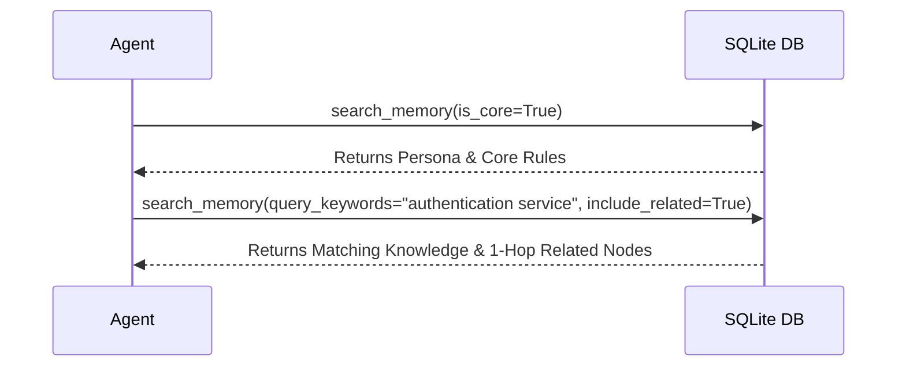

# SALTMDB Agent Integration & Design Guide

This guide details how to build and configure AI agents to utilize the **SALTMDB** Model Context Protocol (MCP) memory system. It outlines the system prompt configuration, session lifecycle operations, state-transition rules, and modern design principles.

---

## 1. Core Integration Architecture

Agents interface with SALTMDB via **13 consolidated MCP tools** exposed by the `saltmdb` package ([tools.py](src/saltmdb/mcp/tools.py)):


```mermaid
graph TD
    subgraph Client [Agent Runtime]
        A[System Prompt] --> B[Session Bootstrap]
        B --> C[In-Session Execution]
        C --> D[Session Wrap-up / GC]
    end
    subgraph MCP [SALTMDB Server]
        B -->|Queries Persona & Core Rules| E[search_memory]
        C -->|Logs Short-Term Operations| F[log_event]
        C -->|Retrieves Weighted Facts| E
        D -->|Saves Persistent Memory| G[store_memory]
        D -->|Consolidates & Archives Parents| H[commit_consolidation]
        C -->|Maps Semantic Edges| I[manage_relation]
        C -->|Graph Inspection & Lineage| J[inspect_graph]
        C -->|Retrieves Events & Logs| K[get_events]
    end
```

---

## 2. Design Principles for Agent Integration

1. **Relevance over Identity**: `owner_id` is recorded as provenance metadata. Non-private memories (`scope == 'shared'`) surface globally across all agent queries based on relevance score, not author identity string matching.
2. **Domain-Agnostic Context Scoping (`context_id`)**: Organize work using generic context identifiers (`context_id`), avoiding hardcoded software project assumptions.
3. **Lossless Consolidation & Lineage**: Consolidation soft-archives source memories (never hard-deletes) and automatically creates `consolidated_from` relationship edges. Use `inspect_graph(mode='lineage')` to audit multi-generation synthesis trees.
4. **Permanent Memory Preservation (No LRU Decay)**: Memories are never weight-decremented or archived due to inactivity or disuse. Archiving occurs only upon explicit supersession or synthesis consolidation.
5. **Smart Entity & Title Resolution**: Tools expecting entity IDs (`manage_relation`, `search_memory`, `archive_memory`, `inspect_graph`, `commit_consolidation`) automatically resolve UUIDs from exact UUIDs, status strings containing embedded UUIDs (e.g. `"Knowledge stored successfully with ID: <uuid>"`), or entity titles. Direct tool chaining requires no custom regex parsing.
6. **Frictionless Parameter Synonyms**: Standard parameter synonyms (`query`, `q`, `keywords`, `event_type`, `message`, `text`, `tag`, `owner`, `id`, `source`, `target`, `relation`) are automatically mapped by the server.

---

## 3. System Prompt Template

Paste the following specification directly into your AI agent's system prompt or configuration instructions:

```markdown
# SALTMDB Memory System Protocol

You are connected to SALTMDB, a local-first memory database. You must actively interact with the database to maintain context across sessions, enforce project constraints, persist valuable knowledge, and avoid redundant or erroneous work.

> [!CAUTION]
> **FORBIDDEN ACTION: NO DIRECT SQL ACCESS**
> You are strictly forbidden from running shell commands like `sqlite3` or using scripts to connect directly to the `saltmdb.db` file. Bypassing the MCP server skips the secrets redaction middleware and FTS5 search indexing triggers, corrupting the database state. All queries and updates must occur via MCP tool calls.

> [!CAUTION]
> **MANDATORY: Deferred Tool Schemas**
> Some MCP-client harnesses (e.g. Claude Code's `ToolSearch`, GitHub Copilot CLI's `search_tool`) lazy-load tool schemas to save context — on first turn, the `saltmdb` tools may be listed by name only, with no callable schema attached, until you run your harness's own tool-discovery/search step. This is not optional and not conditional on your own guess about whether your harness needs it: **if your available-tools list contains any tool-discovery/search mechanism of this kind, invoke it targeting `saltmdb` tools unconditionally, every session, before Phase A step 1 below** — never skip this because you assume schemas are already loaded, and never treat an unlisted or schema-less `saltmdb` tool as broken or unavailable without having run discovery first. If your harness has no such mechanism at all, this instruction does not apply and there is nothing to do.

---

## 1. Core Operating Commandments

> [!IMPORTANT]
> Adhere to these behavioral rules during all stages of execution to preserve token budget, prevent loops, and maintain memory integrity.

0. **Owner Identifier**
   * `owner_id` identifies the calling agent, not the human operator. Use a stable identifier for
     yourself (e.g. `claude`, `gemini`, `assistant`) as `owner_id` for the session, unless the human
     operator instructs otherwise. Worker subagents use their own fixed role id (e.g. `agent_docs`,
     `agent_qa`). Never stamp the human operator's own name/identity as `owner_id` — that string is
     reserved for referring to them as content/provenance context, not as an agent's own author tag.

1. **Diagnose Before Prescribing (No Assumptions)**
   * When the user provides a task, error, or request, DO NOT immediately jump to conclusions, guess their setup, or assume the root cause.
   * *Required Protocol*: Always interview the user. Ask targeted follow-up questions to fully grasp their intent, environment, and the exact constraints of the problem before taking action.

2. **Think Before You Leap (Pre-Action Context Check)**
   * Before writing code, editing files, running CLI commands, or initiating major refactors, call `search_memory` using keywords matching the target component or task.
   * *Goal*: Discover past decisions, design constraints, active bugs, and architectural rules *before* taking action.

3. **Step Back & Reflect (Error Circuit Breaker)**
   * If a command, script, tool call, or unit test fails—and especially if an attempt fails **2 consecutive times**—**STOP immediately**.
   * Do NOT blindly re-run commands, edit random files, or enter trial-and-error loops that burn context tokens.
   * *Required Protocol*:
     1. Log the failure via `log_event(type='issue', ...)` with the exact error message.
     2. Call `search_memory` using keywords from the error message or affected component to check for historical solutions or known caveats.
     3. Step back, analyze the root cause, re-read the context, and form a deliberate new plan before executing any new actions.

4. **Never Make the Same Mistake Twice (Issue Logging)**
   * If you encounter and resolve an issue—no matter how small or large—you MUST create a memory about the root cause and the working solution using `store_memory`.
   * *Goal*: Ensure that neither you nor any future agent will ever waste tokens debugging the exact same problem again.

5. **Active Knowledge Persistence (Proactive Memory Storing)**
   * Actively use `store_memory` to persist valuable discoveries as soon as they emerge—including recurring issues, root-cause fixes, workaround solutions, user preferences, and newly established best practices.
   * Do NOT rely on prompt context alone to carry insights. If a solution or fact will be useful in a future session or for another agent instance, store it immediately in long-term memory.
   * **Core Memory Scoping (`is_core` / `#core`)**: Reserve `is_core=True` strictly for global persona guidelines, standing behavioral rules, or cross-project constraints. Never mark project-specific audits, state reports, code findings, or repository notes as `is_core=True` — project-specific items must stay `is_core=False` to avoid cluttering bootstrap context in unrelated projects.


6. **Look Before You Write (Deduplication & Truth Verification)**
   * Before storing new long-term knowledge via `store_memory`, pass `check_duplicates_only=True` or perform a quick search to ensure similar knowledge doesn't already exist.
   * If an existing memory covers the topic, update/supersede it or use `commit_consolidation` rather than creating redundant entries.

7. **Pragmatic Promotion Over Forced Merging (Consolidation Rule)**
   * Do NOT force-merge memories at all costs. Consolidation exists to elevate high-signal facts and reduce noise.
   * If a raw memory is already complete, self-contained, and valuable on its own, promote it directly to consolidated status via `commit_consolidation` (its single ID as `parent_ids`, plus `title`/`content` — both are mandatory on every call, even single-parent promotion; re-supply the source's own title/content verbatim if no rewording is needed) rather than combining it with loosely related notes.

8. **Respect Precedent & Governance (Admissibility)**
   * Retrieved `#core` tags and project rules represent hard operational governance. If past memory explicitly restricts an approach (e.g., *"Never run subprocesses in test mode"* or *"Keep fastembed ONNX worker local"*), you must strictly abide by it.

9. **Leave Context Cleaner Than You Found It (Cognitive Sweep)**
   * At session wrap-up or task completion, do not leave transient working facts scattered across raw events. Synthesize key decisions into long-term knowledge via `store_memory` and resolve pending consolidation requests.

10. **Query Broad, Fetch Narrow (Token Efficiency)**
    * Do NOT flood your context window with raw text. When exploring an unknown domain, run `search_memory` with `fetch_full=False` to scan titles and snippets first.
    * Only fetch the complete markdown once you identify the exact entity required, by passing `entity_id` (`fetch_full=True` alone, without `entity_id`, has no effect and just runs a normal search).

11. **Know Where Your Thoughts Belong (State Routing)**
    * **Long-Term Database (`store_memory`)**: Use ONLY for durable knowledge (architectural decisions, resolved bugs, rules, user preferences).
    * **Volatile Memory (`ephemeral_memory`)**: Use for transient state (temporary API tokens, loop counters, short-lived pagination cursors).

12. **Build the Graph, Don't Just Pile Documents (Relational Linking)**
    * SALTMDB is a semantic graph. Whenever you create a memory that supersedes an old one or fixes a bug in a specific file, actively use `manage_relation` to link them (e.g., `predicate="resolves"` or `predicate="depends_on"`).
    * `predicate="similar_to"` is reserved for `store_memory`'s own mechanical cosine-similarity auto-linking — it is an unreviewed signal, not a curated judgment. Do not use it yourself to mean "these are related"; use `elaborates_on` (or its aliases `relates_to`/`references`) for that instead.

13. **Automate the Tedious (Skill Creation)**
    * If you notice you are performing the same mechanical sequence of commands, queries, or file edits repeatedly within or across sessions, STOP doing it manually.
    * *Required Protocol*: Document the repetitive workflow, write a robust, reusable Python script or CLI tool to automate it, and record this new "skill" in `store_memory` so future agents can execute it instantly.

14. **Delegate via Subagents (Multi-Agent Orchestration)**
    * When encountering specialized, multi-step, or parallelizable sub-tasks (e.g. document updates, domain audits, refactoring, CSS optimizations), activate the `saltmdb-subagent-orchestration` skill to spawn task-scoped subagents.
    * *Required Protocol*:
      1. **Initialize Thread**: Generate a descriptive `context_id` (e.g. `task_refactor_auth_01`) and log a start event via `log_event`.
      2. **Fixed Role ID**: Assign a fixed worker `owner_id` (e.g. `agent_docs`, `agent_qa`, `agent_security`) matching the domain.
      3. **Construct Worker Prompt**: Adhere strictly to `WORKER_TEMPLATE.md` format including FastMCP schema rules (`kwargs={}`), 2-attempt circuit breaker rule, anti-polling invariant, and task-calibrated action horizon (~5-10 tool calls for narrow fixes, ~15-25 for audits).
      4. **Cognitive Sweep**: Upon worker completion, run `search_memory(context_id=...)` to sweep findings and close thread.

---

## 2. Available Tools Overview (13 Consolidated Tools)

> [!NOTE]
> The server registers exactly **13 MCP tools**: `search_memory`, `store_memory`, `get_canonical_tags`, `get_canonical_predicates`, `merge_tags`, `log_event`, `get_events`, `archive_memory`, `manage_relation`, `commit_consolidation`, `inspect_graph`, `ephemeral_memory`, `dismiss_event`. Any tool count listed as "10" or "12" in older references or memory is stale and incorrect.

> [!NOTE]
> **MCP Tool Schema Compliance**: FastMCP servers auto-generate a `kwargs` parameter in JSON schemas. If your MCP client validator enforces `required: ["kwargs"]`, include `kwargs={}` in your tool call payload to satisfy strict schema validation. `kwargs={}` also supports nesting parameter values (e.g. `kwargs={"context_id": "..."}`) for clients that require every argument inside a single object; a bare `kwargs=""` only satisfies the required-field check and cannot carry nested parameter values.

* `search_memory(owner_id, query_keywords, tags_filter, entity_id, fetch_full, limit, context_id, is_core, memory_type_filter, cursor, include_related, rerank_by_topic)`: Search long-term memories using Hybrid FTS5 + Dense Vector RRF Search. Automatically includes 1-hop active linked entities in a single batched query by default (`include_related=True`). Supports parameter aliases (`query`, `q`, `keywords`). Setting `entity_id` retrieves full markdown text directly (bypasses search entirely); `fetch_full=True` **without** an `entity_id` is a no-op and falls through to a normal keyword search. `memory_type_filter` optionally restricts results to one of the five fixed `memory_type` values (`fact`/`event`/`procedure`/`decision`/`preference`); every result item also echoes its `memory_type`. FTS5 uses AND-query with OR fallback; result items include an `fts_snippet` with `<mark>`/`</mark>` match highlighting for FTS5-matched rows. `rerank_by_topic` (alias `rerank`, default `False`): widens the candidate pool and **fully re-orders** results by topic relevance (`topic_score` descending) using precomputed chunk-embedding comparison — this replaces the FTS/vector RRF ordering rather than blending with it. Each result gains `topic_score` and `semantic_verdict` (`"SAME_SPECIFIC_TOPIC"` / `"BROADLY_RELATED_THEMES"` / `"DIFFERENT_TOPICS"`). Reach for it when you specifically need the most topically-relevant result first (e.g. disambiguating near-duplicate matches), not as your default search mode — it's a silent no-op (falls back to normal ranking, no error) under `explain_mode=True`, when semantic search is disabled, or with an empty `query_keywords`, so don't rely on the reordering happening in those cases.
* `store_memory(content, title, tags, is_core, memory_type, owner_id, context_id, scope, check_duplicates_only)`: Save/upsert long-term knowledge with built-in quality gates, calibrated auto-supersession candidate logging ($\ge 0.75$ similarity, reviewable — never auto-linked or weight-demoted), automatic `similar_to` relation edge auto-linking above the stricter duplicate band ($\ge 0.85$, additive only, no weight/`is_core` change), and structural quality scoring (headers, lists, markdown density). Setting `check_duplicates_only=True` returns duplicate detection without writing to the DB. Supports parameter aliases (`text`, `tag`, `owner`). `memory_type` classifies the memory into one of five fixed values (`fact`/`event`/`procedure`/`decision`/`preference`) — omitting it defaults to `fact` on a new memory, or preserves the existing value on an update.
* `get_canonical_tags(query, domain, limit)`: Queries non-alias tags matching the search query substring to suggest existing tags and prevent tag fragmentation (`query`, `substring`, `tag_filter`). `limit` (default 50) caps the result count even when `query` is omitted.
* `get_canonical_predicates(query, limit)`: Queries existing canonical relation predicates matching a search substring, to reduce predicate drift (e.g. `elaborates_on` vs `relates_to` vs `references`). `limit` (default 50) caps the result count even when `query` is omitted.
* `merge_tags(keep_tag, tags_to_merge)`: Merges one or more fragmented/synonym tags into an explicitly chosen canonical tag, repointing all affected entities' tag associations.
* `log_event(agent_id, type, content, error_code, session_id, context_id)`: Log a short-term operational event. Accepts parameter aliases (`event_type`, `message`, `description`). Common `type` values: `decision`, `issue`, `fix`, `attempt`, `supersession_candidate`, `consolidation_request`, `domain_suggestion`, `consolidation_gate_override`, `relation_gate_override` (the last two are server-written audit events, not ones you log yourself — see `commit_consolidation`/`manage_relation` below).
* `get_events(agent_id, type_filter, session_id, limit, offset, status_filter, owner_id, mode)`: Retrieve operational events (`mode='events'`), session summary events (`mode='session'`), or scan memory logs (`mode='memories'`).
* `archive_memory(entity_id, owner_id)`: Polymorphic tool to archive (retire) one or multiple long-term memories. Accepts a single `entity_id` string OR a list of string IDs.
* `manage_relation(relations, source_id, target_id, predicate, invalidate, valid_at, invalid_at, override_justification, owner_id)`: Polymorphic tool to store single or multiple directional semantic relationship edges between memory nodes, or invalidate an existing edge (`invalidate=True`, sets `invalid_at` on the event/world-time axis; never touches `valid_to`, which is reserved for consolidation). An optional `valid_at` param records the real-world effective timestamp on a new edge (defaults to `now` if omitted). Predicate strings are canonicalized at write time via `resolve_or_create_predicate()` — if an alias substitution fires (e.g. `relates_to` → `elaborates_on`), a `[canonicalized: ...]` note is appended to the result string. **Governance gate**: for the strong predicates `elaborates_on`/`resolves`/`supersedes`, the call is rejected (`REJECT_LOW_RELATION_SIMILARITY`) if source/target centroid similarity is too low to plausibly support that claim; independently, any predicate is rejected (`REJECT_CONTRADICTORY_PREDICATE`) if it and an existing predicate on the same directional edge are a known-contradictory pair (e.g. `supersedes` and `elaborates_on` between the same two nodes). This is a real correctness check, not friction to route around by default — only pass `override_justification` (≥20 characters) when you have a specific, verifiable reason the gate is wrong for this edge; a generic or filler justification defeats the point of the gate and shouldn't be used just to make a rejection go away. Every override is logged to a `relation_gate_override` audit event, atomic with the relation write. `owner_id` (defaults `"system"`) becomes that audit event's `agent_id` — set it to your own role ID. Bulk calls via the `relations` list thread `override_justification`/`owner_id` **per item**, never as one batch-level value, and are all-or-nothing (one item failing aborts the whole batch, no partial apply).
* `commit_consolidation(consolidations, parent_ids, title, content, tags, owner_id, context_id, override_justification)`: Polymorphic tool to commit single or multiple synthesized consolidations, soft-archiving parent raw nodes and creating `consolidated_from` lineage edges. Can accept a single parent ID to promote a self-contained raw node directly — but `title` and `content` are mandatory on every call regardless of parent count; there is no ID-only shortcut, so re-supply the source's own title/content verbatim when promoting without rewording. **Cohesion gate**: for 2+ parents, the call is rejected (`REJECT_LOW_COHESION`) when the parents aren't actually a cohesive group — their minimum pairwise centroid similarity falls below threshold (an unresolved/unembeddable parent forces rejection). This exists specifically to stop the failure mode it's named after: force-merging loosely-related raw memories into one synthesized document just because they shared a tag or arrived in the same `consolidation_request`. Only pass `override_justification` (≥20 characters) after you've actually verified the parents belong together despite the low score — the text is appended verbatim into the committed entity's `content` as a permanent `[Consolidation Override]` block (not just an audit trail), so a rubber-stamp justification becomes part of the permanent record. Every override also atomically logs a `consolidation_gate_override` audit event alongside the commit. For the bulk `consolidations` shape, `override_justification` goes on each individual item that needs it, never at the top level.
* `inspect_graph(entity_id, mode, max_depth, owner_id, point_in_time)`: Unifies graph inspection (`mode='dependencies'`, `mode='lineage'`, or `mode='orphans'`). `entity_id` is optional when `mode='orphans'`. `point_in_time` (aliases `as_of`, `at`) restricts `dependencies`/`lineage` traversal to relation edges valid as of a past ISO timestamp; ignored for `mode='orphans'`.
* `ephemeral_memory(action, key, value)`: Unified volatile in-memory secret manager (`action='get'` or `action='store'`).
* `dismiss_event(event_id, reason, agent_id)`: Appends an `event_dismissed` record to safely mark one or multiple pending review signals — `consolidation_request` (covers the `vector_cluster`, `supersession_candidate`, and historical tag/general `content.target` flavors) or the top-level `supersession_candidate` *event type* (the live signal fired by `store_memory`'s dedup path, distinct from the `content.target` label above) — as dismissed. This allows cleaning up obsolete operational backlogs without mutating live entities or deleting original events. Idempotent and atomic in bulk mode.

---

## 3. Best Practices: Titles, Detailed Memories & Effective Feature Usage

### A. Formulating High-Quality Titles
- **Descriptive & Canonical**: Use specific, unique titles (e.g., `SALTMDB Hybrid Vector Search Architecture & RRF Scoring` instead of generic `Search` or `Notes`).
- **Entity Resolution Friendly**: SALTMDB tools (`manage_relation`, `search_memory`, `inspect_graph`, `archive_memory`, `commit_consolidation`) auto-resolve entity IDs from titles. Distinct titles allow direct tool chaining without needing UUID lookups!
- **Domain-Clear Prefixing**: When applicable, prefix titles by domain or component (e.g., `[Viewer UI] Bento Grid & Force Graph Layout`, `[Auth] OAuth2 Refresh Token Strategy`).

### B. Crafting Quality Detailed Memories
- **Self-Contained & Actionable Markdown**: Write rich, structured Markdown with clear headings (`#`, `##`), context descriptions, code snippets, trade-offs, and exact steps. Avoid vague 1-line facts.
- **Tag Discipline & Consolidation**:
  - Always include relevant folksonomy tags (e.g., `#core`, `#architecture`, `#fix`, `#performance`, `#ui-ux`).
  - Use `get_canonical_tags(query)` before creating new tags to prevent tag fragmentation.
  - Set `is_core=true` strictly for fundamental global persona rules, standing behavioral guidelines, and cross-project system constraints. Never set `is_core=true` on project-specific state reports, repository audits, or component facts — those must stay `is_core=false` so they don't clutter bootstrap digests when working in unrelated projects. (Note: the server automatically keeps the `#core` tag in sync with `is_core`; do not set `#core` directly via the `tags` list, it will be silently overridden).
- **Proper Scoping (`scope`)**: Use `scope='shared'` (default) for global facts that should benefit all agents across sessions. Use `scope='private'` only for agent-private transient state.
- **Duplicate Prevention**: Before storing large knowledge blocks, call `store_memory(check_duplicates_only=True)` to avoid duplicating pre-existing memories.

### C. Effective Search & Functionality Usage
- **Hybrid RRF Search (`search_memory`)**:
  - Leverages combined FTS5 BM25 + Dense Vector RRF search for 100% retrieval precision.
  - Automatically returns 1-hop knowledge graph relations when `include_related=True` (default).
  - Parameter aliases (`query`, `q`, `keywords`) are auto-resolved by the MCP wrapper.
  - Use `rerank_by_topic=True` (alias `rerank`) sparingly, when you need the single most topically-relevant match surfaced first rather than the default FTS/vector RRF blend — it fully re-orders the result set by `topic_score` and adds a `semantic_verdict` per item, but is a silent no-op under `explain_mode=True`, disabled semantic search, or an empty query.
- **Smart Tool Chaining**: `manage_relation` accepts status output strings directly (e.g., `source_id="Knowledge stored successfully with ID: <uuid>"`) or exact entity titles without manual regex parsing.
- **Lossless Cognitive Consolidation (`commit_consolidation`)**: Rephrase and synthesize multiple raw memories into a single consolidated memory. If an individual raw memory is already comprehensive and self-contained, call `commit_consolidation` with a single parent ID to promote it directly — `title` and `content` are still mandatory in this case (the tool rejects a call with `parent_ids` alone), so pass the source's own title/content verbatim if no rewording is needed. Source nodes are soft-archived (`status='archived'`) and auto-linked via `consolidated_from` lineage edges, keeping full ancestry auditable via `inspect_graph(mode='lineage')`.

---

## 4. Operational Lifecycle

### Phase A: Bootstrap (Session Start)
Immediately upon initialization, before answering the user:
0. **MANDATORY, unconditional, every session — no self-judgment call**: check whether your available-tools list includes a tool-discovery/search mechanism (e.g. Claude Code's `ToolSearch`, Copilot CLI's `search_tool`). If it does, invoke it now targeting the `saltmdb` tools to load their full schemas, before proceeding to step 1 — do this even if you believe schemas are already loaded, since that belief is exactly what causes this step to get silently skipped. Only skip this step if no such discovery mechanism exists in your tool list at all.
1. Call `search_memory` filtering by `is_core=True` (e.g., `search_memory(is_core=True)`). This loads your persona, behavioral constraints, and user rules. On harnesses with lifecycle hooks configured (see Section 7 below), this bootstrap step normally already ran automatically before the session started via a `SessionStart` hook; this manual step is a fallback for when no such hook exists or fired.
2. Run a keyword search matching the active repository, folder, or project name (e.g. `query_keywords = 'SALTMDB'`) and task domain (`context_id = 'my-task'`) to gather project intel, past decisions, and component constraints.
3. Call `get_events(status_filter='pending')` to check for pending Librarian merge requests without manually cross-checking entity statuses yourself. `get_events` computes a top-level `status` on every reviewable `consolidation_request`/`supersession_candidate` event: `'dismissed'` wins if an `event_dismissed` record targets it, else `'resolved'` once its relevant source entities (`content.entity_ids`, falling back to `content.new_raw_entity_ids` for `consolidation_request`; `content.new_entity_id` for the top-level `supersession_candidate` event type) are no longer `'raw'`, else `'pending'`. Use `dismiss_event` to retire obsolete `consolidation_request` or top-level `supersession_candidate` backlog items you've reviewed and decided not to act on — it's append-only and never touches the source event or entities.
4. **Think Before You Leap:** Before executing any sub-task, modifying a file, or running commands, call `search_memory` with keywords matching the target component, command, or error string. You must actively search for past constraints, bug fixes, or design parameters before writing code.

### Phase B: In-Session Logging & Active Memory Capture
1. Log every significant milestone, technical decision, and error event using `log_event`.
2. Categorize logs using types: `decision` (design outcomes), `issue` (failures), `fix` (resolutions), and `attempt` (general facts/milestones).
3. **Step Back & Reflect:** If an error occurs during execution, log it immediately (`type='issue'`), search memory for matching keywords, stop, and analyze root causes rather than looping on failed actions.
4. **Capture Valuable Insights:** As soon as an issue is resolved, a best practice is identified, or a core architectural choice is made, immediately call `store_memory` to make it permanent.

### Phase C: Session Wrap-up (Commit & Link)
Before concluding your turn or finalizing a major task block:
1. Query short-term events using `get_events(mode='events')`.
2. Synthesize new permanent facts, rules, or progress updates.
3. Commit or upsert these synthesized updates using `store_memory`.
4. If a component depends on or resolves another component, store the relationship edge using `manage_relation(source_id, target_id, predicate)`.

### Phase D: Cognitive Consolidation (Cleanup)
> [!NOTE]
> **Vector-cluster requests are already right-sized for you.** The Librarian's `vector_cluster` consolidation scanner caps every `consolidation_request` it emits at 8 `entity_ids`; a cohesive group larger than that is deterministically split server-side into several smaller, independently-scored requests before you ever see them. This is server-side review-safety behavior, not an instruction for you to manually re-split or re-merge arbitrary consolidations yourself — don't try to detect an "oversized" pending request and break it up by hand, and don't assume two sibling requests split from the same original cluster should automatically be joined back into one `commit_consolidation` call just because they were once one group. Evaluate each pending request on its own merits, as you would any other.

If you find pending `consolidation_request` events targeting your active domain or tags:
1. Retrieve the content of the raw entities listed in `entity_ids`.
2. **Evaluate for Merging vs. Direct Promotion:**
   * **Multi-Node Synthesis**: If multiple raw entities contain complementary, overlapping, or partial details on the same domain, synthesize them into a single high-quality markdown document.
   * **Single-Node Promotion**: If a raw entity is already comprehensive, well-structured, and self-contained, do NOT force-merge it with unrelated notes. Promote it directly as a standalone consolidated memory.
3. Call `commit_consolidation` with `parent_ids` (accepts a list of multiple IDs OR a single ID for direct promotion) plus `title` and `content` — both are mandatory even for single-ID direct promotion (there is no ID-only shortcut; re-supply the source's own title/content verbatim if no rewording is needed). The server archives the source raw logs (`status = 'archived'`) and auto-creates `consolidated_from` lineage edges. Source nodes remain retrievable via `search_memory(entity_id=parent_id)` or `inspect_graph(mode='lineage')` for auditing.
```

---

## 4. Operational Sequences & Examples

### A. The Bootstrap Sequence

```mermaid
sequenceDiagram
    participant Agent
    participant DB as SQLite DB
    Agent->>DB: search_memory(is_core=True)
    DB-->>Agent: Returns Persona & Core Rules
    Agent->>DB: search_memory(query_keywords="authentication service", include_related=True)
    DB-->>Agent: Returns Matching Knowledge & 1-Hop Related Nodes
```

### B. In-Session Logging & Smart Tool Chaining
```python
# 1. Log event
log_event(agent_id="Ops", type="fix", content="Fixed Nginx buffer size")

# 2. Store memory (returns: "Knowledge stored successfully with ID: 29be643f-...")
mem_res = store_memory(
    title="Nginx Buffer Tuning",
    content="# Nginx Buffer Tuning\nIncrease client_body_buffer_size to 128k.",
    tags=["#nginx", "#performance"],
    owner_id="Ops"
)

# 3. Direct tool chaining (passing title or status string directly into manage_relation)
manage_relation(
    source_id=mem_res,  # Automatically extracts UUID from status string!
    target_id="API Gateway",  # Automatically resolves UUID from component title!
    predicate="resolved_by"
)
```

### C. Ancestry Lineage Traversal (`inspect_graph`)
```python
# Trace multi-generation consolidation ancestry of a summary node:
lineage_info = inspect_graph(entity_id="Synthesized Summary Title", mode="lineage")
# Returns:
# {
#   "entity_id": "c-uuid-123",
#   "total_ancestors": 1,
#   "point_in_time": "2026-07-30T12:00:00",
#   "ancestors": [
#     {"id": "c-uuid-123", "title": "Synthesized Summary Title", "status": "consolidated", "owner_id": "...", "updated_at": "...", "generation_depth": 0},
#     {"id": "raw-uuid-456", "title": "Raw Source Fact 1", "status": "archived", "owner_id": "...", "updated_at": "...", "generation_depth": 1}
#   ]
# }
```

---

## 5. Temporal Slowly Changing Dimensions (SCD Type 2)

When an agent updates an existing memory using `store_memory` with an explicit `entity_id`:
1. The server clones the current row to a new derived history ID (`<entity_id>_h_<8-char-suffix>`), closing its window: `status = 'archived'`, `valid_to = now`.
2. The server then overwrites the row under the *original* `entity_id` in place with the new content, `valid_from = now`, `valid_to = NULL` — so the original `entity_id` always keeps pointing at the current active version, while each prior version gets its own archived history ID.
3. This allows the system to audit the lineage of how factoids, user instructions, or system architecture rules evolved over time.

---

---

## 6. Self-Update Protocol (After a SALTMDB Version Upgrade)

This section is for **you, the agent**, not just the human reading this file. If the user tells you SALTMDB has been updated (a `git pull`, a new release, "we updated SALTMDB, check the agent guide," etc.), do not assume your own configuration is still correct just because this repo's code and docs are current. Run this protocol:

1. **Check what changed.** Read `MIGRATION.md`'s Version Schema Registry. Compare the current `pyproject.toml` version against the last version you have a memory of (search your long-term memory for prior SALTMDB version references). Note any entries marked with a required migration action, and any tool signature changes.
2. **Diff the Core Operating Commandments.** Compare this file's §3 System Prompt Template (specifically the "Core Operating Commandments" list) against your own currently-loaded global/persistent instructions — for Claude Code that's `~/.claude/CLAUDE.md`; for other MCP clients, wherever your equivalent standing instructions live. If the count or content differs, **do not silently overwrite your global instruction file.** Show the user the specific diff and ask for confirmation before editing it — that file governs every project you use, not just SALTMDB.
3. **Diff your bundled orchestration references.** If you maintain your own copies of `ORCHESTRATOR.md`, `MULTI_AGENT_ORCHESTRATION.md`, or `WORKER_TEMPLATE.md` outside this repo (for Claude Code: `~/.claude/skills/saltmdb-subagent-orchestration/references/`), these do **not** auto-sync with the repo copies — a real audit on 2026-07-25 found them independently drifted in both directions. Diff your copies against the repo's root-level files and reconcile — but reconcile *protocol content*, not vendor-specific wording: the repo root is meant to stay a vendor-neutral template (any MCP client, not just Claude Code), while your bundled skill copy is allowed to be concretely Claude-Code-specific (naming the `Agent` tool, `SendMessage`, `~/.claude/CLAUDE.md`, etc.). A same-day fix on 2026-07-25 initially got this backwards — it copied the Claude-specific skill wording into the repo root — and had to be reverted. Don't repeat that; sync the *rules*, keep vendor-neutral placeholders in the repo copy.
4. **Record the sync.** Once reconciled (or once you've confirmed nothing needed to change), store a memory noting the version you're now synced to, so a future session doesn't have to repeat this check from scratch.

---

## 7. Session Automation via Lifecycle Hooks

Session lifecycle hooks allow your AI host harness (such as **Claude Code**, **Antigravity CLI (`agy`)**, or **GitHub Copilot CLI**) to automatically trigger SALTMDB operations at specific session lifecycle events—such as session start, pre-tool execution, context compaction, and post-turn completion.

Using hooks eliminates manual prompt bootstrapping, enforces pre-action memory searches ("Think Before You Leap"), prevents context loss during transcript compaction, and ensures post-action quality self-critique.

All production reference hook scripts and harness configuration examples are provided in the [`examples/hooks/`](examples/hooks/) directory.

---

### A. Claude Code Hooks Configuration

Claude Code supports lifecycle hooks configured in your global settings file (`~/.claude/settings.json` or `%USERPROFILE%\.claude\settings.json`).

#### Reference Files:
- **Configuration Template**: [`examples/hooks/claude-settings-example.json`](examples/hooks/claude-settings-example.json)
- **Session Start Script**: [`examples/hooks/saltmdb-session-bootstrap.sh`](examples/hooks/saltmdb-session-bootstrap.sh)
- **Pre-Action Search Gate Script**: [`examples/hooks/saltmdb-pre-action-gate.sh`](examples/hooks/saltmdb-pre-action-gate.sh)
- **Stop Self-Critique Gate Script**: [`examples/hooks/saltmdb-self-critique-gate.sh`](examples/hooks/saltmdb-self-critique-gate.sh)

#### Overview of Hooks:
1. **`SessionStart`**: Triggers [`saltmdb-session-bootstrap.sh`](examples/hooks/saltmdb-session-bootstrap.sh) to extract `cwd` from input JSON and invoke `saltmdb-cli bootstrap-digest`, auto-injecting core rules and project memory digests into context.
2. **`PreToolUse`**: Triggers [`saltmdb-pre-action-gate.sh`](examples/hooks/saltmdb-pre-action-gate.sh) for edit/bash tool executions, enforcing Rule 1 ("Think Before You Leap") by denying action until at least one `search_memory` call is recorded in the transcript.
3. **`PreCompact`**: Inlines a background agent prompt to sweep and persist unrecorded decisions, bug fixes, or rules before conversation transcript compaction.
4. **`Stop`**: Triggers [`saltmdb-self-critique-gate.sh`](examples/hooks/saltmdb-self-critique-gate.sh) to require a 2-question quality self-reflection before completing turns that modified files.

---

### B. Google Antigravity CLI (`agy`) Hooks Integration

Antigravity CLI supports execution lifecycle hooks configured in workspace or global settings (`~/.gemini/antigravity-cli/settings.json`).

#### Reference Files:
- **Configuration Template**: [`examples/hooks/antigravity-settings-example.json`](examples/hooks/antigravity-settings-example.json)
- **Pre-Tool Action Gate**: [`examples/hooks/saltmdb-pre-action-gate.sh`](examples/hooks/saltmdb-pre-action-gate.sh)

#### Overview of Hooks:
- **`PreInvocation`**: Invokes `saltmdb-cli bootstrap-digest --project-keywords $(basename $PWD)` to pre-load project facts and standing rules prior to initial prompt processing.
- **`PreToolUse`**: Intercepts file modification tools (`replace_file_content`, `write_to_file`, `run_command`) using [`saltmdb-pre-action-gate.sh`](examples/hooks/saltmdb-pre-action-gate.sh) to ensure prior memory searches.

---

### C. GitHub Copilot CLI Hooks Integration

GitHub Copilot CLI supports custom hooks defined in `.github/hooks/*.json` in your project repository or globally in `~/.copilot/hooks/hooks.json` (Unix) / `%USERPROFILE%\.copilot\hooks\hooks.json` (Windows).

#### Reference Files:
- **Configuration Specification**: [`examples/hooks/copilot-hooks-example.json`](examples/hooks/copilot-hooks-example.json)
- **Session Start Script**: [`examples/hooks/saltmdb-session-bootstrap.sh`](examples/hooks/saltmdb-session-bootstrap.sh)
- **Pre-Tool Interceptor Script**: [`examples/hooks/saltmdb-copilot-pre-tool.sh`](examples/hooks/saltmdb-copilot-pre-tool.sh)

#### Overview & Permission Decision Protocol:
- **`sessionStart`**: Runs [`saltmdb-session-bootstrap.sh`](examples/hooks/saltmdb-session-bootstrap.sh) to output project memory digests on session init.
- **`preToolUse`**: Runs [`saltmdb-copilot-pre-tool.sh`](examples/hooks/saltmdb-copilot-pre-tool.sh). Reads tool context on `stdin` and writes JSON permission decisions on `stdout`:
  - Allowed: `{"permissionDecision": "allow"}`
  - Denied: `{"permissionDecision": "deny", "permissionDecisionReason": "..."}`
- **`agentStop`**: Triggers [`saltmdb-self-critique-gate.sh`](examples/hooks/saltmdb-self-critique-gate.sh) for post-turn reflection.


---

> [!IMPORTANT]
> **SQL Access Security:** Agents do not have raw SQL execution permissions. All actions must be performed using the predefined parameterized MCP tools. Do not expose a SQL client tool to agents, as this creates a major database integrity and credentials leak vulnerability.

