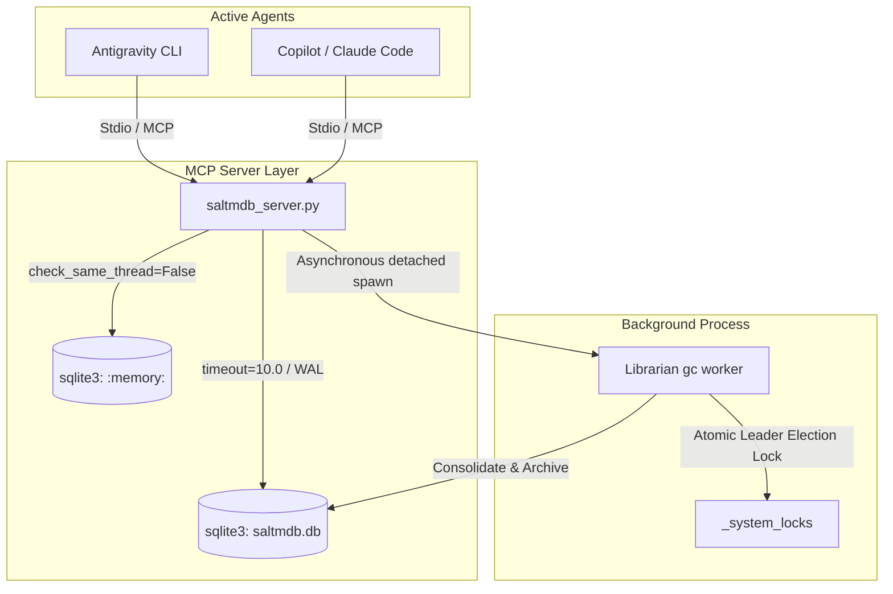

# SALTMDB: Local-First MCP Memory Server

**SALTMDB** (Short And Long-Term Memory DataBase) is a centralized, local-first memory framework designed for AI CLI tools and agents (such as Antigravity, Copilot, and Claude Code). It acts as a shared memory layer, allowing multiple concurrent agents to read, write, and consolidate contextual facts without heavy ML dependencies, vector databases, or high API overhead.

> [!TIP]
> * **Installation:** To install and register the MCP server, see the **[Installation Guide](INSTALL.md)**.
> * **Developer Guide:** To learn how to configure your AI agents to utilize this memory system, read the **[Agent Integration & Design Guide](AGENT_GUIDE.md)**.

---

## 🏛️ System Architecture

SALTMDB is built using standard Python libraries and SQLite, prioritizing concurrency safety, security, and low memory overhead.



### 1. Database Schema
The SQLite database operates in **Write-Ahead Logging (WAL)** mode for safe concurrent readers. It includes the following tables:
* **`events`**: An immutable, append-only ledger tracking agent operations (issues, attempts, decisions, fixes).
* **`entities`**: The long-term knowledge base storing facts, markdown content, weights, and status fields (`raw`, `consolidated`, `archived`).
* **`tags`**: A folksonomy table allowing tags, categorizations, and canonical redirects.
* **`entity_tags`**: A mapping table linking knowledge entities to folksonomy tags.
* **`entities_fts`**: A virtual table using **SQLite FTS5** to index entity titles and full contents for fast, weighted keyword searches.
* **`_system_locks`**: A system table facilitating leader election mutex locks for concurrent processes.

---

## 🚀 Core Features

### 1. Weighted Keyword FTS5 Search
SALTMDB bypasses expensive vector embedding models in favor of standard keyword search. It leverages SQLite FTS5's built-in `bm25` auxiliary function configured with a **10:1 title-to-content weight ratio**:
* Matches found in the entity's **Title** are prioritized 10x higher than matches in the **Body Content**.
* The final rank score merges BM25 ranking and the entity's priority `weight` multiplier.

### 2. Hybrid Title Extraction
When storing new knowledge, agents can optionally specify a custom `title`. If omitted, the server automatically extracts the first markdown heading (`# Heading`) as the title, falling back to a snippet of the first line if no heading is present.

### 3. Security & Redaction Middleware
Before any database writes occur, the text is evaluated by a regex-based scrubbing pipeline:
* **Core Redactions:** Automatically censors standard credentials (GitHub tokens, Anthropic API keys, OpenAI API keys, AWS credentials, and Discord tokens).
* **Custom Developer Rules:** On startup, the server reads `.saltmdb_redact` from the current working directory. You can add one custom regex pattern per line (e.g. internal staging domains, proprietary IDs) to strip out company-specific secrets.

### 4. Ephemeral State Layer
For temporary data (like short-lived session tokens, OTPs, or process variables), the server maintains an isolated `:memory:` SQLite database. These variables are never written to disk and disappear completely when the server stops.

### 5. Atomic Leader Election Mutex
To prevent multiple parent processes from launching redundant garbage collection tasks simultaneously, the server uses an **Atomic SQLite lock** in the `_system_locks` table.
* The lock uses a **10-minute expiry safety net**. If a terminal session crashes mid-run, the lock automatically expires, preventing permanent deadlocks.

---

## 🧹 The Librarian Process (Garbage Collection)

Whenever the database is modified, the server asynchronously spawns a detached background instance of the server in Librarian mode (`python saltmdb_server.py --librarian`):
* **Windows Detachment:** Spawns with `0x08000000` (`CREATE_NO_WINDOW`) to prevent distracting terminal window popups.
* **Unix Detachment:** Spawns with `start_new_session=True` so it survives parent process termination.

Once the background Librarian acquires the atomic lock, it runs the following tasks:
1. **Tag Merging:** Merges case-insensitive tag aliases (e.g. `#Auth-Error` and `#auth_error`) into a canonical tag to prevent folksonomy fragmentation.
2. **Access Decay (LRU):** Tracks `last_accessed_at` timestamps. Non-core memories unaccessed for 90 days have their ranking `weight` decremented. If weight drops to 0, they are automatically soft-deleted (`status = 'archived'`).
3. **Clutter Tag Consolidation:** Identifies tags accumulating $\ge 5$ raw entries and consolidates them into a single markdown summary.
4. **General Consolidation:** Combines raw fragments into unified consolidated documents. If LLM keys (`GEMINI_API_KEY`, `OPENAI_API_KEY`, or `ANTHROPIC_API_KEY`) are present, it uses cheap API calls to summarize and resolve contradictions. If no keys exist, it defaults to a clean structural markdown concatenation.

---

## 🛠️ API & MCP Tools Reference

The server exposes 8 tools over standard I/O:

| Tool Name | Parameters | Description |
| :--- | :--- | :--- |
| `log_event` | `agent_id`, `type`, `content`, `error_code` | Appends a scrubbed entry to the immutable short-term ledger. |
| `get_canonical_tags` | `domain` (optional) | Queries non-alias tags matching the search filter to prevent duplicate tag names. |
| `store_knowledge` | `content`, `tags`, `scope`, `weight`, `is_core`, `owner_id`, `title` | Scrubs secrets and stores long-term facts in raw markdown. |
| `search_memory` | `query_keywords`, `tags_filter` | Searches matching knowledge using FTS5 (10:1 title weights) and tag filters. |
| `fetch_memory_chunk` | `entity_id` | Returns the complete markdown text of a specific entity. |
| `store_ephemeral_memory`| `key`, `value` | Saves a volatile secret to the in-memory database. |
| `get_ephemeral_memory` | `key` | Retrieves a volatile secret. |

---

## ⚙️ Configuration & Installation

### 1. Configuration Path
By default, the server initializes the database under `~/.saltmdb/saltmdb.db`. You can override this behavior by setting the `SALTMDB_DB_PATH` environment variable:
```bash
$env:SALTMDB_DB_PATH = "C:\custom_path\memory.db"
```

### 2. Registering with MCP Clients
To connect SALTMDB to Claude Desktop or Claude Code, add the following to your configuration file:
```json
"mcpServers": {
  "saltmdb": {
    "command": "python",
    "args": ["/path/to/SALTMDB/saltmdb_server.py"],
    "env": {
      "GEMINI_API_KEY": "YOUR_GEMINI_API_KEY"
    }
  }
}
```

### 3. Database Dashboard Viewer
SALTMDB includes a sleek, zero-dependency dark-mode dashboard to inspect events, memories, tags, and system lock states:
1. Run the viewer script locally:
   ```bash
   python saltmdb_viewer.py
   ```
2. Open your web browser and navigate to:
   [http://localhost:8080](http://localhost:8080)

### 4. Running Unit Tests
You can run the test suite to verify database schemas, triggers, and lock rules:
   ```bash
$env:PYTHONPATH="C:\path\to\SALTMDB"
python scratch/test_db.py
```

---

## 📄 License & Community

* **License:** Distributed under the **[GNU Affero General Public License v3 (AGPLv3)](LICENSE)**.
* **Contributing:** Read the **[Contributing Guidelines](CONTRIBUTING.md)** for details on testing and branch setups.
* **Conduct:** We adhere to the **[Contributor Covenant Code of Conduct](CODE_OF_CONDUCT.md)**.