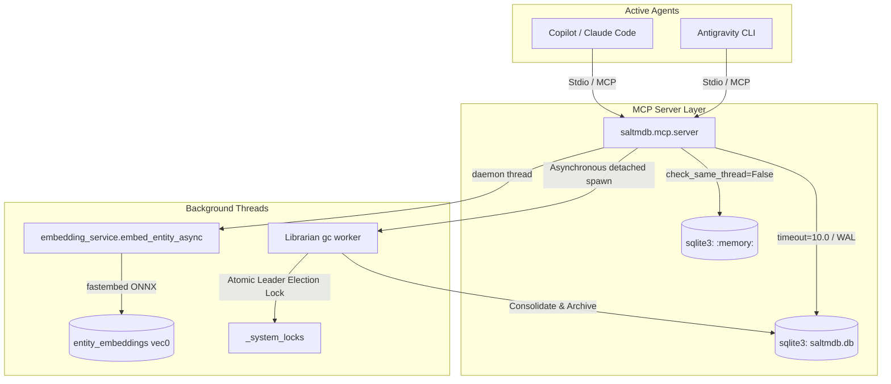

# SALTMDB: Local-First MCP Memory Server

**SALTMDB** (Short And Long-Term Memory DataBase) is a centralized, local-first memory framework designed for AI CLI tools and agents (such as Antigravity, Copilot, and Claude Code). It acts as a shared memory layer, allowing multiple concurrent agents to read, write, and consolidate contextual facts using a lightweight Python package with SQLite and ONNX-based vector embeddings.

> [!TIP]
> * **Installation:** To install and register the MCP server, see the **[Installation Guide](INSTALL.md)**.
> * **Developer Guide:** To learn how to configure your AI agents to utilize this memory system, read the **[Agent Integration & Design Guide](AGENT_GUIDE.md)**.

---

## 🏛️ System Architecture

SALTMDB is built using standard Python libraries and SQLite, prioritizing concurrency safety, security, and low memory overhead.



## Features

- **Hybrid Search (FTS5 + Vector RRF):** Parallel FTS5/BM25 keyword search and `BAAI/bge-small-en-v1.5` dense vector search (via `fastembed` + `onnxruntime`) combined via Reciprocal Rank Fusion. Feature-gated via `SALTMDB_ENABLE_SEMANTIC=true`.
- **Secrets Redaction:** Built-in regex scrubbing pipeline automatically redacts API keys, tokens, and private paths before any write.
- **Folksonomy & Canonical Tags:** Flexible tagging with alias resolution and canonical redirects.
- **SCD Type 2 Temporal History:** Every upsert preserves the prior version as an archived snapshot for full audit lineage.
- **Lossless Consolidation:** Soft-archives source memories, auto-creates `consolidated_from` graph edges — never hard-deletes.

### 1. Database Schema
The SQLite database operates in **Write-Ahead Logging (WAL)** mode for safe concurrent readers. It includes the following tables:
* **`events`**: An immutable, append-only ledger tracking agent operations (issues, attempts, decisions, fixes).
* **`entities`**: The long-term knowledge base storing facts, markdown content, weights, status (`raw`, `consolidated`, `archived`), and `embedding_status` (`pending`, `ready`, `failed`, `archived`).
* **`tags`**: A folksonomy table allowing tags, categorizations, and canonical redirects.
* **`entity_tags`**: A mapping table linking knowledge entities to folksonomy tags.
* **`relations`**: A typed directional edge table for the knowledge graph (`source_id → predicate → target_id`).
* **`entities_fts`**: A virtual table using **SQLite FTS5** (Porter tokenizer) to index titles, full content, and search aliases for weighted keyword search.
* **`entity_embeddings`**: A `sqlite-vec` `vec0` virtual table storing 384-dimensional ONNX embeddings for semantic vector search.
* **`_system_locks`**: A system table facilitating leader election mutex locks for concurrent processes.

---

## 🚀 Core Features

### 1. Hybrid FTS5 + Vector Search
SALTMDB runs FTS5/BM25 keyword search and dense vector semantic search **in parallel**, merging results via **Reciprocal Rank Fusion (RRF)**:
* FTS5 uses SQLite's built-in `bm25` auxiliary function with a **10:1 title-to-content weight ratio**.
* Semantic search uses `fastembed` (`BAAI/bge-small-en-v1.5`, 384-dim ONNX, ~130MB auto-downloaded) stored in a `sqlite-vec` `vec0` virtual table.
* RRF merges on rank position (not raw scores), keeping the existing BM25 tuning intact.
* Enable via `SALTMDB_ENABLE_SEMANTIC=true`; write-path embedding generation is **always active** regardless of the flag.

### 2. Hybrid Title Extraction
When storing new knowledge, agents can optionally specify a custom `title`. If omitted, the server automatically extracts the first markdown heading (`# Heading`) as the title, falling back to a snippet of the first line if no heading is present.

### 3. Security & Redaction Middleware
Before any database writes occur, the text is evaluated by a regex-based scrubbing pipeline:
* **Core Redactions:** Automatically censors standard credentials (GitHub tokens, Anthropic API keys, OpenAI API keys, AWS credentials, and Discord tokens).
* **Custom Developer Rules:** On startup, the server reads `.saltmdb_redact` from the current working directory. You can add one custom regex pattern per line (e.g. internal staging domains, proprietary IDs) to strip out company-specific secrets.

### 4. Ephemeral State Layer
For temporary data (like short-lived session tokens, OTPs, or process variables), the server maintains an isolated `:memory:` SQLite database. These variables are never written to disk and disappear completely when the server stops.

### 5. Atomic Leader Election Mutex
To prevent multiple parent processes from launching redundant garbage collection tasks simultaneously, the server uses an **Atomic SQLite lock** in the `_system_locks` table.
* The lock uses a **10-minute expiry safety net**. If a terminal session crashes mid-run, the lock automatically expires, preventing permanent deadlocks.

---

## 🧹 The Librarian Process (Garbage Collection)

Whenever the database is modified, the server asynchronously spawns a detached background instance of the server in Librarian mode (`python saltmdb_server.py --librarian`):
* **Windows Detachment:** Spawns with `0x08000000` (`CREATE_NO_WINDOW`) to prevent distracting terminal window popups.
* **Unix Detachment:** Spawns with `start_new_session=True` so it survives parent process termination.

Once the background Librarian acquires the atomic lock, it runs the following tasks:
1. **Tag Merging:** Merges case-insensitive tag aliases (e.g. `#Auth-Error` and `#auth_error`) into a canonical tag to prevent folksonomy fragmentation.
2. **Lossless Memory Preservation (No LRU Decay):** Unaccessed memories are never archived or weight-decremented based purely on access recency. Archiving occurs only upon explicit supersession or synthesis consolidation, preserving rare-but-important root cause knowledge indefinitely.
3. **Clutter Tag Consolidation (Request-based):** Identifies tags accumulating $\ge 5$ raw entries and logs a JSON-formatted `consolidation_request` event to the short-term `events` ledger.
4. **General Consolidation (Request-based):** Identifies overall raw accumulation ($\ge 5$ items sharing owner/scope) and logs a `consolidation_request` event. The cognitive task of merging and rephrasing markdown is offloaded to the active client agent, ensuring the server runs fully offline without independent API requirements.

---

## 🛠️ API & MCP Tools Reference

The server exposes 23 tools over standard I/O:

| Tool Name | Parameters | Description |
| :--- | :--- | :--- |
| `log_event` | `agent_id`, `type`, `content`, `error_code`, `session_id`, `context_id` | Appends a scrubbed entry to the immutable short-term ledger. |
| `get_recent_events` | `agent_id` (optional), `type_filter` (optional), `limit` | Retrieves events logged to the short-term ledger, allowing agents to read consolidation requests. |
| `get_session_summary` | `session_id` | Retrieves all events logged under a specific session ID for targeted session auditing. |
| `get_canonical_tags` | `query (alias: domain)` | Queries non-alias tags matching the search filter (or alias parameters `query`, `substring`, `tag_filter`). |
| `store_memory` | `content`, `tags`, `owner_id`, `scope`, `weight`, `is_core`, `title`, `entity_id`, `metadata`, `context_id`, `skip_duplicate_check`, `relevance`, `impact`, `novelty`, `actionability` | Stores/upserts facts in raw markdown. Validates mandatory `content` and `title`. |
| `search_memory` | `query_keywords`, `tags_filter`, `owner_id`, `metadata_filter`, `explain_mode`, `include_related`, `context_id`, `is_core`, `tag_operator`, `cursor` | Hybrid FTS5 + vector RRF search (when `SALTMDB_ENABLE_SEMANTIC=true`; otherwise FTS5-only). Supports stop-word normalization, tag filtering, metadata filters, and 1-hop related entity fetching. |
| `fetch_memory_chunk` | `entity_id` | Returns the complete markdown text of a specific entity. Accepts exact UUID, status string containing UUID, or entity title. |
| `scan_memories` | `owner_id`, `status_filter`, `limit`, `offset` | Scans and inspects lists/contents of memories for audits, consistency reviews, or contradiction checks. |
| `archive_memory` | `entity_id`, `owner_id` | Explicitly archives (retires) a long-term memory, marking it as inactive. |
| `detect_orphaned_memories`| `owner_id` | Identifies active memories with no relationship links and suggests candidate links based on tag overlap. |
| `check_duplicate_memories`| `title`, `content`, `owner_id`, `tags` | Checks the database for potential near-duplicates of a proposed memory using stemming and stop-word similarity. |
| `store_ephemeral_memory`| `key`, `value` | Saves a volatile secret to the in-memory database. |
| `get_ephemeral_memory` | `key` | Retrieves a volatile secret. |
| `commit_consolidation` | `parent_ids`, `title`, `content`, `tags`, `scope`, `weight`, `owner_id`, `context_id` | Atomically commits a consolidated memory, archives parent raw nodes (never deletes), and auto-links `consolidated_from` lineage edges. |
| `store_relation` | `source_id`, `target_id`, `predicate` | Stores a directional semantic relationship edge between two entity nodes. Auto-resolves UUIDs from titles or status strings. |
| `analyze_dependencies` | `root_entity_id`, `max_depth` | Traverses relationship trees using recursive SQL CTEs to map downstream components. Returns `graph_exhausted` signal. |
| `analyze_lineage` | `entity_id` | Traverses full multi-generation consolidation and derivation ancestry (`consolidated_from` / `derived_from`). |
| `create_snapshot` | None | Safely creates a timestamped database backup in `backups/` using SQLite's backup API. |
| `start_db_viewer` | `port` (optional, default 8080) | Launches the zero-dependency database dashboard viewer locally on specified port. |
| `stop_db_viewer` | None | Terminates the database dashboard viewer running on port 8080 or specified port. |
| `bulk_commit_consolidation` | `consolidations` | Bulk commits synthesized consolidations atomically. |
| `bulk_archive_memory` | `archive_requests` | Bulk archives memories atomically. |
| `bulk_store_relations` | `relations` | Bulk stores directional relationship edges atomically. |


---

## ⚙️ Configuration & Installation

### 1. Configuration Path
By default, the server initializes the database under `~/.saltmdb/saltmdb.db`. You can override this behavior by setting the `SALTMDB_DB_PATH` environment variable:
```bash
$env:SALTMDB_DB_PATH = "C:\custom_path\memory.db"
```

### 2. Registering with MCP Clients
To connect SALTMDB to Claude Desktop or Claude Code, add the following to your configuration file:
```json
"mcpServers": {
  "saltmdb": {
    "command": "python",
    "args": ["-m", "saltmdb"],
    "env": {
      "SALTMDB_DB_PATH": "/path/to/saltmdb.db",
      "SALTMDB_ENABLE_SEMANTIC": "true"
    }
  }
}
```

### 3. Database Dashboard Viewer
SALTMDB includes a sleek, zero-dependency dark-mode dashboard to inspect events, memories, tags, system locks, **Lineage Explorer (tree & graph)**, and **interactive SVG Force-Directed Relations Topology**:
1. Run the viewer script locally:
   ```bash
   python saltmdb_viewer.py
   ```
2. Open your web browser and navigate to:
   [http://localhost:8080](http://localhost:8080)

### 4. Running Unit Tests
Run the hybrid search test suite (against the refactored package):
```bash
python -m unittest discover tests
```

---

## 🧠 Google Antigravity Skills

SALTMDB ships with four specialized **Google Antigravity Skills** to guide agents in executing high-quality memory management tasks:

* **`saltmdb_ingestion_and_write`** (`skills/saltmdb_ingestion_and_write`): Rules for semantic document splitting (granularity rule), parent-child graph linking, and metadata tagging to prevent monolithic content blocks.
* **`saltmdb_consolidation`** (`skills/saltmdb_consolidation`): Guidelines for lossless cognitive consolidation, ensuring code blocks, parameter listings, and version histories are fully preserved during memory merges.
* **`saltmdb_lifecycle`** (`skills/saltmdb_lifecycle`): Best practices for SCD Type 2 updates, archiving obsolete records, and promoting system rules and constraints to core memories.
* **`saltmdb_relations`** (`skills/saltmdb_relations`): Graph topology management, standard relationship predicates, recursive CTE impact tracing, and resolving orphaned memory nodes.

### Skill Installation
To make these skills available to your active `copilot-cli` or `agy` CLI/Antigravity agents, copy the folders from `skills/` directly to your local skills directory:
```bash
Copy-Item -Path "skills/*" -Destination "$HOME/.gemini/antigravity-cli/builtin/skills/" -Recurse -Force
```

---

## 📄 License & Community

* **License:** Distributed under the **[GNU Affero General Public License v3 (AGPLv3)](LICENSE)**.
* **Contributing:** Read the **[Contributing Guidelines](CONTRIBUTING.md)** for details on testing and branch setups.
* **Conduct:** We adhere to the **[Contributor Covenant Code of Conduct](CODE_OF_CONDUCT.md)**.