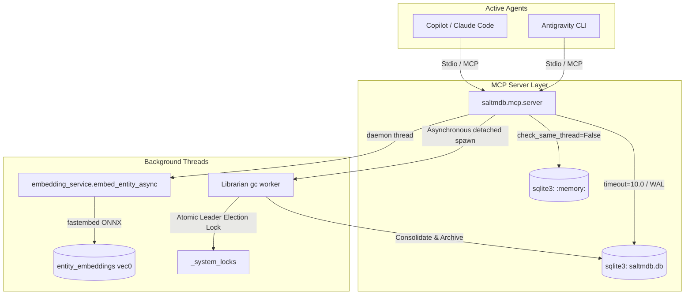

# SALTMDB: Local-First MCP Memory Server

**SALTMDB** (Short And Long-Term Memory DataBase) is a centralized, local-first memory framework designed for AI CLI tools and agents (such as Antigravity, Copilot, and Claude Code). It acts as a shared memory layer, allowing multiple concurrent agents to read, write, and consolidate contextual facts using a lightweight Python package with SQLite and ONNX-based vector embeddings.

> [!TIP]
> * **Installation:** To install and register the MCP server, see the **[Installation Guide](INSTALL.md)**.
> * **Developer Guide:** To learn how to configure your AI agents to utilize this memory system, read the **[Agent Integration & Design Guide](AGENT_GUIDE.md)**.

---

## 🏛️ System Architecture

SALTMDB is built using standard Python libraries and SQLite, prioritizing concurrency safety, security, and low memory overhead.


```mermaid
graph TD
    subgraph Active Agents
        A[Antigravity CLI]
        B[Copilot / Claude Code]
    end

    subgraph MCP Server Layer
        A -->|Stdio / MCP| Server[saltmdb.mcp.server]
        B -->|Stdio / MCP| Server
        Server -->|timeout=10.0 / WAL| MainDB[(sqlite3: saltmdb.db)]
        Server -->|check_same_thread=False| EphemDB[(sqlite3: :memory:)]
    end

    subgraph Background Threads
        Server -->|daemon thread| EmbedWorker[embedding_service.embed_entity_async]
        EmbedWorker -->|fastembed ONNX| VecDB[(entity_embeddings vec0)]
        Server -->|Asynchronous detached spawn| Lib[Librarian gc worker]
        Lib -->|Atomic Leader Election Lock| Lock[_system_locks]
        Lib -->|Consolidate & Archive| MainDB
    end
```

- **Mechanical Text Quality Gate & Sub-ms Deduplication:** Sub-millisecond multi-stage pre-embedding quality evaluation (idempotent auto-formatting, prose extraction, Shannon character entropy, Word N-Gram sequence repetition, Coleman-Liau readability bounds, and MSDI structural density scoring) and Stage A SHA-256 exact hash collision lookups before ONNX embedding generation. Calibrated cosine similarity ($\ge 0.75$) logs a reviewable `supersession_candidate` event rather than auto-linking or demoting weight (a prior auto-supersession design was reverted after it silently buried an unreviewed memory); crossing the stricter duplicate band ($\ge 0.85$) additionally auto-links a non-authoritative `similar_to` relation edge, and warns the caller of a likely duplicate, while target exclusion prevents false deduplication warnings during parent memory consolidation.
- **Hybrid Search (FTS5 + Vector RRF):** Parallel FTS5/BM25 keyword search and `BAAI/bge-small-en-v1.5` dense vector search (via `fastembed` + `onnxruntime`) combined via Reciprocal Rank Fusion. Enabled by default.
- **Secrets Redaction:** Built-in regex scrubbing pipeline automatically redacts API keys, tokens, and private paths before any write.
- **Folksonomy & Canonical Tags:** Flexible tagging with alias resolution and canonical redirects.
- **SCD Type 2 Temporal History:** Every upsert preserves the prior version as an archived snapshot for full audit lineage.
- **Lossless Consolidation:** Soft-archives source memories, auto-creates `consolidated_from` graph edges — never hard-deletes.

### 1. Database Schema
The SQLite database operates in **Write-Ahead Logging (WAL)** mode for safe concurrent readers. It includes the following tables:
* **`events`**: An immutable, append-only ledger tracking agent operations (issues, attempts, decisions, fixes).
* **`entities`**: The long-term knowledge base storing facts, markdown content, weights, status (`raw`, `consolidated`, `archived`), and `embedding_status` (`pending`, `ready`, `failed`, `archived`).
* **`tags`**: A folksonomy table allowing tags, categorizations, and canonical redirects.
* **`entity_tags`**: A mapping table linking knowledge entities to folksonomy tags.
* **`relations`**: A typed directional edge table for the knowledge graph (`source_id → predicate → target_id`).
* **`predicates`**: A canonical-predicate lookup table (mirrors `tags`' alias-resolution shape) reducing relation-predicate drift (e.g. `elaborates_on` vs `relates_to` vs `references`).
* **`entities_fts`**: A virtual table using **SQLite FTS5** (Porter tokenizer) to index titles, full content, and search aliases for weighted keyword search.
* **`entity_embeddings`**: A `sqlite-vec` `vec0` virtual table storing 384-dimensional ONNX embeddings for semantic vector search.
* **`_system_locks`**: A system table facilitating leader election mutex locks for concurrent processes.

---

## 🚀 Core Features

### 1. Hybrid FTS5 + Vector Search
SALTMDB runs FTS5/BM25 keyword search and dense vector semantic search **in parallel**, merging results via **Reciprocal Rank Fusion (RRF)**:
* FTS5 uses SQLite's built-in `bm25` auxiliary function with a **10:1 title-to-content weight ratio**.
* Semantic search uses `fastembed` (`BAAI/bge-small-en-v1.5`, 384-dim ONNX, ~66MB pre-bundled model weights) stored in a `sqlite-vec` `vec0` virtual table.
* RRF merges on rank position (not raw scores), keeping the existing BM25 tuning intact.
* Enabled by default; set `SALTMDB_ENABLE_SEMANTIC=false` to explicitly disable vector search.

### 2. Hybrid Title Extraction
When storing new knowledge, agents can optionally specify a custom `title`. If omitted, the server automatically extracts the first markdown heading (`# Heading`) as the title, falling back to a snippet of the first line if no heading is present.

### 3. Security & Redaction Middleware
Before any database writes occur, the text is evaluated by a regex-based scrubbing pipeline:
* **Core Redactions:** Automatically censors standard credentials (GitHub tokens, Anthropic API keys, OpenAI API keys, AWS credentials, and Discord tokens).
* **Custom Developer Rules:** On startup, the server reads `.saltmdb_redact` from the current working directory. You can add one custom regex pattern per line (e.g. internal staging domains, proprietary IDs) to strip out company-specific secrets.

### 4. Ephemeral State Layer
For temporary data (like short-lived session tokens, OTPs, or process variables), the server maintains an isolated `:memory:` SQLite database. These variables are never written to disk and disappear completely when the server stops.

### 5. Atomic Leader Election Mutex
To prevent multiple parent processes from launching redundant garbage collection tasks simultaneously, the server uses an **Atomic SQLite lock** in the `_system_locks` table.
* The lock uses a **10-minute expiry safety net**. If a terminal session crashes mid-run, the lock automatically expires, preventing permanent deadlocks.

### 6. Automated Session Lifecycle Hooks
SALTMDB integrates with native lifecycle hooks across major AI agent frameworks (**Claude Code**, **Google Antigravity CLI**, and **GitHub Copilot CLI**):
* **Context Digest Injection (`SessionStart` / `PreInvocation` / `sessionStart`):** Automatically injects core rules and project memory digests at session initialization.
* **Pre-Action Memory Search Gate (`PreToolUse`):** Enforces Rule 1 ("Think Before You Leap") by requiring a memory search before executing code edits or terminal commands. Supports Copilot CLI's JSON `permissionDecision` (`allow`/`deny`) protocol.
* **Pre-Compaction Memory Sweeps (`PreCompact`):** Triggers autonomous background agent sweeps to persist unrecorded decisions and bug fixes before transcript truncation.
* **Stop Self-Critique Gate (`Stop` / `agentStop`):** Triggers mandatory self-reflection checks on confidence and unknown risks before finishing complex turns.

---


## 🧹 The Librarian Process (Garbage Collection)

Whenever the database is modified, the server asynchronously spawns a detached background instance of the server in Librarian mode (`python -m saltmdb --librarian`):
* **Windows Detachment:** Spawns with `0x08000000` (`CREATE_NO_WINDOW`) to prevent distracting terminal window popups.
* **Unix Detachment:** Spawns with `start_new_session=True` so it survives parent process termination.

Once the background Librarian acquires the atomic lock, it runs the following tasks:
1. **Tag Merging:** Merges case-insensitive tag aliases (e.g. `#Auth-Error` and `#auth_error`) into a canonical tag to prevent folksonomy fragmentation.
2. **Lossless Memory Preservation (No LRU Decay):** Unaccessed memories are never archived or weight-decremented based purely on access recency. Archiving occurs only upon explicit supersession or synthesis consolidation, preserving rare-but-important root cause knowledge indefinitely.
3. **Clutter Tag Consolidation (Request-based):** Identifies tags accumulating $\ge 5$ raw entries and logs a JSON-formatted `consolidation_request` event to the short-term `events` ledger.
4. **General Consolidation (Request-based):** Identifies overall raw accumulation ($\ge 5$ items sharing owner/scope) and logs a `consolidation_request` event. The cognitive task of merging and rephrasing markdown is offloaded to the active client agent, ensuring the server runs fully offline without independent API requirements.

---

## 🛠️ API & MCP Tools Reference

The server exposes 12 consolidated tools over standard I/O:

| Tool Name | Parameters | Description |
| :--- | :--- | :--- |
| `search_memory` | `query_keywords`, `tags_filter`, `owner_id`, `entity_id`, `fetch_full`, `limit`, `context_id`, `is_core`, `memory_type_filter`, `cursor`, `include_related` | Hybrid FTS5 + vector RRF search. Setting `entity_id` retrieves full markdown text directly; `fetch_full=True` without an `entity_id` has no effect. |
| `store_memory` | `content`, `title`, `tags`, `is_core`, `memory_type`, `owner_id`, `context_id`, `scope`, `check_duplicates_only` | Stores/upserts facts in raw markdown. Enforces quality gates, logs a reviewable supersession-candidate signal, and auto-links a `similar_to` edge above the duplicate threshold. `check_duplicates_only=True` returns duplicate detection without writing to DB. |
| `get_canonical_tags` | `query (alias: domain)`, `limit` (default 50) | Queries non-alias tags matching the search filter to prevent tag fragmentation. Result count is capped by `limit` even when `query` is omitted. |
| `get_canonical_predicates` | `query`, `limit` (default 50) | Queries existing canonical relation predicates matching a search substring, to reduce predicate drift (e.g. `elaborates_on` vs `relates_to` vs `references`). Result count is capped by `limit` even when `query` is omitted. |
| `merge_tags` | `keep_tag`, `tags_to_merge` (list) | Merges one or more fragmented/synonym tags into an explicitly chosen canonical tag, repointing all affected entities' tag associations. |
| `log_event` | `agent_id`, `type`, `content`, `error_code`, `session_id`, `context_id` | Appends a scrubbed entry to the immutable short-term ledger. |
| `get_events` | `agent_id`, `type_filter`, `session_id`, `limit`, `offset`, `status_filter`, `owner_id`, `mode` | Query events (`mode='events'`), session summaries (`mode='session'`), or scan memory logs (`mode='memories'`). |
| `archive_memory` | `entity_id` (str \| list[str]), `owner_id` | Polymorphic tool to archive (retire) one or multiple long-term memories. |
| `manage_relation` | `relations` (list), `source_id`, `target_id`, `predicate`, `invalidate` | Polymorphic tool to store single or multiple directional semantic relationship edges, or invalidate an existing edge (`invalidate=True`). |
| `commit_consolidation`| `consolidations` (list), `parent_ids`, `title`, `content`, `tags`, `owner_id`, `context_id` | Polymorphic tool to commit single or multiple synthesized consolidations, soft-archiving parents and linking lineage. |
| `inspect_graph` | `entity_id` (optional), `mode` (`dependencies` \| `lineage` \| `orphans`), `max_depth`, `owner_id`, `point_in_time` | Unifies dependency CTE traversals, consolidation lineage tracing, and orphan memory detection. `point_in_time` (aliases `as_of`/`at`) restricts traversal to relation edges valid as of a past ISO timestamp. |
| `ephemeral_memory` | `action` (`get` \| `store`), `key`, `value` | Unified volatile in-memory secret storage manager. |


---

## ⚙️ Configuration & Installation

### 1. Configuration Path
By default, the server initializes the database under `~/.saltmdb/saltmdb.db`. You can override this behavior by setting the `SALTMDB_DB_PATH` environment variable:
```bash
$env:SALTMDB_DB_PATH = "C:\custom_path\memory.db"
```

### 2. Registering with MCP Clients
MCP clients do not inherit your shell's PATH — always use the **full path** to your Python executable. Find it first:
```bash
python -c "import sys; print(sys.executable)"
```

Then add to your MCP client configuration file:
```json
"mcpServers": {
  "saltmdb": {
    "command": "/full/path/to/python",
    "args": ["-m", "saltmdb"],
    "env": {
      "SALTMDB_DB_PATH": "/path/to/saltmdb.db",
      "SALTMDB_ENABLE_SEMANTIC": "true"
    }
  }
}
```

See [INSTALL.md](INSTALL.md) for platform-specific examples and troubleshooting.

### 3. Database Dashboard Viewer
SALTMDB includes a sleek, zero-dependency dark-mode dashboard to inspect events, memories, tags, system locks, **Lineage Explorer (tree & graph)**, and **interactive SVG Force-Directed Relations Topology**:
1. Run the viewer:
   ```bash
   python -m saltmdb.viewer.server
   # or if installed via pip install -e .:
   saltmdb-viewer
   ```
   Override the default port with `--port <PORT>` or the `SALTMDB_VIEWER_PORT` environment variable.
2. Open your web browser and navigate to:
   [http://localhost:8080](http://localhost:8080)

### 4. Running Unit Tests
Run the hybrid search test suite (against the refactored package):
```bash
python -m unittest discover tests
```

---

## 📄 License & Community

* **License:** Distributed under the **[GNU Affero General Public License v3 (AGPLv3)](LICENSE)**.
* **Contributing:** Read the **[Contributing Guidelines](CONTRIBUTING.md)** for details on testing and branch setups.
* **Conduct:** We adhere to the **[Contributor Covenant Code of Conduct](CODE_OF_CONDUCT.md)**.