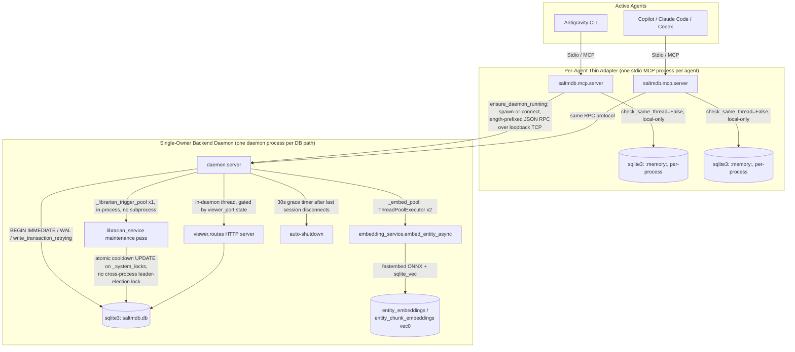

# SALTMDB: Local-First MCP Memory Server

**SALTMDB** (Short And Long-Term Memory DataBase) is a centralized, local-first memory framework designed for AI CLI tools and agents (such as Antigravity, Copilot, and Claude Code). It acts as a shared memory layer, allowing multiple concurrent agents to read, write, and consolidate contextual facts using a lightweight Python package with SQLite and ONNX-based vector embeddings.

> [!TIP]
> * **Installation:** To install and register the MCP server, see the **[Installation Guide](INSTALL.md)**.
> * **Developer Guide:** To learn how to configure your AI agents to utilize this memory system, read the **[Agent Integration & Design Guide](AGENT_GUIDE.md)**.

---

## 🏛️ System Architecture

SALTMDB is built using standard Python libraries and SQLite, prioritizing concurrency safety, security, and low memory overhead.

> [!NOTE]
> **Memory-core rework, Track B.** As of `v0.1.0-alpha.72`, SALTMDB no longer lets each agent's MCP process open SQLite directly. A single backend daemon (`src/saltmdb/daemon/`) is now the sole process that ever opens the DB; every agent process is a thin RPC adapter. See "Single-Owner Backend Daemon" below the feature list for the full design.


```mermaid
graph TD
    subgraph Active Agents
        A[Antigravity CLI]
        B[Copilot / Claude Code / Codex]
    end

    subgraph "Per-Agent Thin Adapter (one stdio MCP process per agent)"
        A -->|Stdio / MCP| AdA[saltmdb.mcp.server]
        B -->|Stdio / MCP| AdB[saltmdb.mcp.server]
        AdA -->|check_same_thread=False, local-only| EphA[(sqlite3: :memory:, per-process)]
        AdB -->|check_same_thread=False, local-only| EphB[(sqlite3: :memory:, per-process)]
    end

    subgraph "Single-Owner Backend Daemon (one daemon process per DB path)"
        AdA -->|ensure_daemon_running: spawn-or-connect,<br/>length-prefixed JSON RPC over loopback TCP| Daemon[daemon.server]
        AdB -->|same RPC protocol| Daemon
        Daemon -->|BEGIN IMMEDIATE / WAL / write_transaction_retrying| MainDB[(sqlite3: saltmdb.db)]
        Daemon -->|_embed_pool: ThreadPoolExecutor x2| EmbedWorker[embedding_service.embed_entity_async]
        EmbedWorker -->|fastembed ONNX + sqlite_vec| VecDB[(entity_embeddings /<br/>entity_chunk_embeddings vec0)]
        Daemon -->|_librarian_trigger_pool x1, in-process, no subprocess| Lib[librarian_service maintenance pass]
        Lib -->|atomic cooldown UPDATE on _system_locks,<br/>no cross-process leader-election lock| MainDB
        Daemon -->|in-daemon thread, gated by viewer_port state| Viewer[viewer.routes HTTP server]
        Viewer --> MainDB
        Daemon -->|30s grace timer after last session disconnects| Shutdown[auto-shutdown]
    end
```

- **Mechanical Text Quality Gate & Store-Time Disposition:** Sub-millisecond multi-stage pre-embedding quality evaluation — idempotent auto-formatting (`auto_format_markdown`), prose extraction (`extract_prose_content`), Shannon character entropy ($H(X) \in [2.5, 5.3]$), Word 3-gram and 5-gram sequence repetition, Type-Token Ratio ($\ge 0.35$), Coleman-Liau readability bounds ($CLI \in [2.0, 26.0]$), and MSDI structural density scoring — followed by Stage A SHA-256 exact hash collision lookup before ONNX embedding generation. A synchronous preflight then runs on every brand-new `store_memory` write (skipped when the call already resolves to an existing entity, or `skip_duplicate_check=True`): a candidate at $\ge 0.75$ cosine similarity with compatible `memory_type`/`scope` is actually flagged only if it *also* shows correction language, crosses the stricter $\ge 0.85$ duplicate band, or is a stale consolidated node — weak thematic similarity alone never flags. A flag surfaces the candidate(s) as an advisory-only `REVIEW_REQUIRED` response instead of persisting; the calling agent resolves each candidate (`distinct` always available, plus `elaborate`/`supersede` against a core target or `consolidate`/`supersede` against a non-core one) and resubmits with a `review_token`, committed atomically. No async queue, no auto-linking, no auto weight demotion.
- **Hybrid Search (FTS5 + Vector RRF):** Parallel FTS5/BM25 keyword search and `BAAI/bge-small-en-v1.5` dense vector search (via `fastembed` + `onnxruntime`) combined via Reciprocal Rank Fusion. Enabled by default; each search type runs on a dedicated thread pool. FTS5 uses a Porter tokenizer with title-biased BM25 weights (10:1 title-to-content, 5:1 alias-to-content). Semantic search uses a dedicated per-request connection to avoid cross-thread sqlite_vec conflicts.
- **Secrets Redaction:** Built-in regex scrubbing pipeline automatically redacts API keys, tokens, and private paths before any write. Custom patterns can be added via `.saltmdb_redact` in the working directory (one regex per line).
- **Folksonomy & Canonical Tags:** Flexible tagging with alias resolution, canonical redirects, and three seeded top-level tags (`episodic`, `semantic`, `procedural`).
- **SCD Type 2 Temporal History:** Every upsert preserves the prior version as an archived snapshot (`<entity_id>_h_<8-char-suffix>`) for full audit lineage.
- **Lossless Consolidation:** Soft-archives source memories, auto-creates `consolidated_from` graph edges — never hard-deletes.
- **Bi-Temporal Relations:** Relation edges carry both a system/transaction-time axis (`valid_from`/`valid_to`, set by consolidation) and an independent event/world-time axis (`valid_at`/`invalid_at`, settable directly by agents via `manage_relation(invalidate=True)`).
- **Single-Owner Backend Daemon (memory-core rework, Track B):** Exactly one background daemon process (`src/saltmdb/daemon/`) opens SQLite for a given DB path; every MCP client and most CLI entrypoints connect as a thin RPC adapter over loopback TCP (length-prefixed JSON framing), auto-spawning the daemon on first connect (`saltmdb-viewer` is the one exception — a read-only status client that never spawns, see "Running the Database Dashboard Viewer" below). Ownership is arbitrated by a bind-only guard socket on a per-DB-path election port — never a stale-lock file a crashed process could leave behind. The Librarian and web viewer both moved in-process into the daemon as part of this change, eliminating the old cross-process leader-election lock entirely. See "Single-Owner Backend Daemon & Librarian Throttling" under Core Features for the full design.

### 1. Database Schema
The SQLite database operates in **Write-Ahead Logging (WAL)** mode (`PRAGMA journal_mode=WAL`, `PRAGMA synchronous=NORMAL`). All writes use explicit `BEGIN IMMEDIATE` transactions with exponential backoff retry (up to 4 total attempts). It includes the following tables:

* **`events`**: An immutable, append-only ledger tracking agent operations (`decision`, `issue`, `fix`, `attempt`, `supersession_candidate`, `consolidation_request`, `domain_suggestion`, `consolidation_gate_override`, `relation_gate_override`). Columns: `id`, `timestamp`, `agent_id`, `type`, `content`, `error_code`, `session_id`, `context_id`.
* **`entities`**: The long-term knowledge base. Key columns: `id` (UUID), `title`, `full_content` (markdown), `status` (`raw`/`consolidated`/`archived`), `embedding_status` (`pending`/`ready`/`failed`/`archived`), `memory_type` (`fact`/`event`/`procedure`/`decision`/`preference`), `is_core`, `weight`, `scope` (`private`/`shared`), `owner_id`, `context_id`, `content_hash` (SHA-256), `quality_score`, `quality_status`, `quality_flags`, `valid_from`/`valid_to` (SCD Type 2 windows).
* **`tags`**: A folksonomy table allowing tags, categorizations, and canonical redirects. Seeded with `episodic`, `semantic`, `procedural`.
* **`entity_tags`**: A mapping table linking knowledge entities to folksonomy tags.
* **`relations`**: A typed directional edge table for the knowledge graph (`source_id → predicate → target_id`). Supports bi-temporal tracking via `valid_from`/`valid_to` (system time, set by `commit_consolidation`) and `valid_at`/`invalid_at` (event time, set by agents via `manage_relation`). A **partial unique index** `WHERE valid_to IS NULL` prevents duplicate live edges while allowing expired + live replacements to coexist.
* **`predicates`**: A canonical-predicate lookup table (mirrors `tags`' alias-resolution shape). Seeded with: `resolves`, `depends_on`, `references`, `elaborates_on`, `consolidated_from`, `supersedes`, `relates_to`, `similar_to`. `relates_to` and `references` are pre-aliased onto `elaborates_on`. Write-time predicate canonicalization via `resolve_or_create_predicate()` normalizes all submitted predicates before storage and notes any alias substitution in the result string.
* **`entities_fts`**: A virtual table using **SQLite FTS5** (Porter tokenizer) indexing `title`, `full_content`, and `search_aliases` (from `metadata.search_aliases`). Kept in sync with entities via four triggers (`insert_entity_fts`, `update_entity_fts`, `update_entity_fts_unarchived`, `archive_memory_fts`, `delete_entity_fts`).
* **`entity_embeddings`**: A `sqlite-vec` `vec0` virtual table storing 384-dimensional ONNX float32 embeddings (`embedding FLOAT[384]`). Loaded via `sqlite_vec.load(conn)` on a per-connection basis; the extension is pre-imported *before* any `BEGIN IMMEDIATE` transaction opens to prevent stalled cold-import from holding the write lock.
* **`_system_locks`**: A system table backing the Librarian's cooldown throttle inside the single backend daemon (Track B retired its former cross-process leader-election use — see "Single-Owner Backend Daemon & Librarian Throttling" above). Columns: `task_name`, `locked_at`, `locked_by_pid`, `last_run_at`. Trigger cooldown: 5 minutes between in-daemon maintenance passes, claimed via a single atomic `UPDATE`. `locked_at`/`locked_by_pid` are retained columns from the pre-Track-B leader-election shape but are no longer written to.
* **`_viewer_sessions`**: Tracks active web viewer sessions by `port` + `session_pid` for reference-counted lifecycle management.

---

## 🚀 Core Features

### 1. Hybrid FTS5 + Vector Search
SALTMDB runs FTS5/BM25 keyword search and dense vector semantic search **in parallel** using a `ThreadPoolExecutor`, merging results via **Reciprocal Rank Fusion (RRF)**:
* FTS5 uses SQLite's built-in `bm25` auxiliary function with a **10:1 title-to-content weight ratio** (alias weight: 5:1). An AND-query is tried first; if it returns no results with multiple terms, an OR-fallback is automatically applied.
* Semantic search uses `fastembed` (`BAAI/bge-small-en-v1.5`, 384-dim ONNX, ~66MB pre-bundled model weights) stored in a `sqlite-vec` `vec0` virtual table. The query text is `{title}\n\n{full_content}` concatenated for embedding.
* RRF merges on rank position (not raw scores) with `k=60`, keeping the existing BM25 tuning intact. Rows that matched via FTS5 carry a query-centered `fts_snippet` excerpt with `<mark>`/`</mark>` highlighting; rows that only surfaced via semantic search fall back to the heuristic snippet extractor.
* Incoming currently-live relation count is factored into FTS5 ranking as a small boost. SQLite BM25 ranks lower scores first, so the boost is subtracted: `ORDER BY (bm25 * weight - rel_count * 0.1) ASC`. An edge is counted when it targets the result and its `valid_to` is unset or later than the current time.
* Enabled by default; set `SALTMDB_ENABLE_SEMANTIC=false` to explicitly disable vector search. **Note**: `search_memory` no longer has an FTS-only fallback for query-based calls -- with semantic search disabled, a call that passes `query_keywords` returns `[{"error": "..."}]` instead of degraded FTS-only results. Filter/tag-only browsing (no `query_keywords`) is unaffected.
* Duplicate checks (`check_duplicate_memories`) use batched precomputed vector lookups (`_batch_semantic_similarities`) to avoid re-embedding each candidate, with FTS5 pre-filtering to cap candidates at ~30 before the similarity pass.
* Optional Stage-2 ONNX cross-encoder reranking (`search_memory`'s `use_cross_encoder`, experimental, opt-in): set `SALTMDB_RERANKER_MODEL` to a supported model name to enable. Independent of `rerank_by_topic` -- either flag alone widens the candidate pool and shares the same decisive-hybrid-winner gap-gate; if both are requested and neither is gated off, cross-encoder's reorder wins. No PyTorch runtime (uses `fastembed`'s existing ONNX `TextCrossEncoder` API). See the environment variable table below for supported model names. `Xenova/ms-marco-MiniLM-L-6-v2` (~88MB, pre-bundled under `src/saltmdb/models/`, same offline-first convention as the bi-encoder below) is the benchmark-recommended choice — it matched or beat every larger candidate tested (`BAAI/bge-reranker-base`, `jinaai/jina-reranker-v2-base-multilingual`, both 1GB+) on holdout top-1 accuracy at a fraction of the latency/footprint.

> [!NOTE]
> **Calibration caveat.** SALTMDB's constants fall into two different categories that must not be conflated:
> * **Benchmark-calibrated embedding thresholds** — `COHESION_MIN_PAIRWISE_THRESHOLD`, `RERANK_SAME_TOPIC_THRESHOLD`/`RERANK_BROAD_THEME_THRESHOLD`, `DEDUP_SUPERSESSION_THRESHOLD`/`DEDUP_DUPLICATE_THRESHOLD`, `RELATION_GATE_MIN_SIMILARITY_THRESHOLD` — are cosine-similarity cut points locked from English-language, codebase/engineering-domain benchmark corpora against this specific embedding model (`bge-small-en-v1.5`); they are defaults calibrated to that measurement, not a universal guarantee across other languages, content domains, or embedding models, and re-tuning any of them requires new benchmark evidence, not ad hoc adjustment.
> * **Cardinality / review-safety policy constants** — `MAX_CONSOLIDATION_REQUEST_SIZE`, `COHESION_OVERRIDE_MIN_LENGTH`, `MAX_REVIEW_CANDIDATES`, `REVIEW_TOKEN_TTL_SECONDS` — are **not** embedding measurements; they're deliberately chosen operational safeguards (how many items is reviewable in one commit, how long an override justification must be, how long a store-time disposition review token stays valid). These are reviewed and changed through normal policy/design review, not benchmark evidence.
> * Retired (memory-core rework, Track A): `CLUSTER_MIN_PAIRWISE_THRESHOLD`, `SUPERSESSION_MIN_SIMILARITY_THRESHOLD`, `SUPERSESSION_MIN_OVERLAP_COUNT`, `COHESION_MAX_COMPONENT_SIZE_FOR_EXTRACTION` calibrated/bounded the now-deleted async Librarian scanners and no longer exist.

### 2. Hybrid Title Extraction
When storing new knowledge, agents can optionally specify a custom `title`. If omitted, the server automatically extracts the first markdown heading (`# Heading`) as the title, falling back to a snippet of the first line if no heading is present. Title bounds: minimum 5 characters, maximum 120 characters.

### 3. Quality Gate Pipeline
All `store_memory` and `commit_consolidation` calls pass through a multi-tier quality gate before any embedding or write:
1. **Tier 1 — Boundary & Fluff:** Minimum length (20 chars), conversational fluff regex patterns, maximum symbol-to-alpha ratio (0.35), oversized payload warning (>8000 chars).
2. **Tier 1.5 — Markdown Syntax Integrity:** Balanced code fences, table pipe symmetry, header hierarchy validation (no level-skipping). Also scored: MSDI (Markdown Structural Density Index = ratio of words in headers+lists+code blocks to total words).
3. **Tier 2 — Information-Theoretic Filters:** Shannon entropy bounds (`[2.5, 5.3]` bits/char), 3-gram duplicate ratio (>0.30 → REJECT), 5-gram duplicate ratio (>0.20 → REJECT), Type-Token Ratio (>30 words: TTR < 0.35 → REJECT).
4. **Tier 2.5 — Coleman-Liau Readability (prose-only):** On extracted prose (code blocks, URLs, file paths stripped), if >30 prose words: CLI outside `[2.0, 26.0]` → REJECT.
5. **Tier 4 — Structural Scoring:** Base score 0.50; +0.15 for headers, +0.10 for lists, +0.15 for MSDI ≥ 0.35, −0.15 for MSDI < 0.10 on large (>80 word) text, −0.10 for untyped code blocks, −0.10 for non-hierarchical headers. Score clamped to `[0.0, 1.0]`.

`auto_format_markdown` runs as an idempotent pre-pass: normalizes line endings, annotates untyped code fences with language identifiers (Python/SQL/JSON/JavaScript heuristics), collapses 3+ consecutive blank lines.

### 4. Security & Redaction Middleware
Before any database writes occur, the text is evaluated by a regex-based scrubbing pipeline:
* **Core Redactions:** Automatically censors standard credentials (GitHub tokens, Anthropic API keys, OpenAI API keys, AWS credentials, Discord tokens).
* **Custom Developer Rules:** On startup, the server reads `.saltmdb_redact` from the current working directory. You can add one custom regex pattern per line (e.g. internal staging domains, proprietary IDs) to strip out company-specific secrets.

### 5. Ephemeral State Layer
For temporary data (like short-lived session tokens, OTPs, or process variables), the server maintains an isolated `:memory:` SQLite database (a module-level singleton on `connection.py`). These variables are never written to disk and disappear completely when the server stops.

### 6. Single-Owner Backend Daemon & Librarian Throttling
Exactly one daemon process (`src/saltmdb/daemon/server.py`) ever opens SQLite for a given DB path. Ownership is arbitrated by a **bind-only guard socket** on a per-DB-path "election port" (derived deterministically from the resolved DB path into the `49500`–`65499` range) — the daemon binds it and holds it for its entire lifetime, never `accept()`-ing a connection; a losing contender's own bind attempt fails almost instantly and it exits cleanly without ever touching the DB. This replaces a lock *row* (which a crashed process could leave stale) with a lock the OS itself releases the instant the holding process dies. A paired "probe port" (`election_port + 1`) answers lightweight identify requests so a client can tell "daemon still starting up" apart from "a stale/foreign process holds this port," without needing to open the DB to find out.
* Every MCP client and most CLI entrypoints (`python -m saltmdb`, `--librarian`, `--backfill-chunk-embeddings`) are thin RPC adapters: `ensure_daemon_running()` connects to an already-running daemon or spawns one (detached subprocess, `CREATE_NO_WINDOW` on Windows / `start_new_session=True` on Unix, stdout/stderr redirected to `daemon.log`) and retries discovery for a bounded window. `saltmdb-viewer` is the one exception — a read-only `viewer_status` RPC client that requires an already-running daemon and never spawns one itself; run any of the other entrypoints first if you get a "no daemon running" message.
* The daemon starts a 30-second grace-period shutdown timer (`DAEMON_SHUTDOWN_GRACE_PERIOD_S`) both at its own startup and every time its session count returns to zero, so a daemon spawned only to service a one-shot RPC (no client ever opens a session) still shuts itself down on the same timer, not just after a connected session disconnects. An in-flight RPC (a librarian pass, a chunk-embedding backfill) is tracked separately and blocks the timer from firing mid-call. `saltmdb-daemon --foreground` (explicit manual launch) disables this timer entirely and runs until `SIGINT`/`SIGTERM`.
* **Librarian throttling**, now that only one process ever runs the maintenance pass: the old cross-process leader-election lock (`acquire_librarian_lock`/`release_librarian_lock`, two separate `BEGIN IMMEDIATE` transactions against `_system_locks`) is retired outright — there is nothing left to elect a leader among. The cooldown check collapses to a single atomic `UPDATE _system_locks SET last_run_at = ? WHERE last_run_at IS NULL OR last_run_at < now - 300s` on the daemon's single-worker `_librarian_trigger_pool` thread, and a manual pass (`--librarian`, or the `run_librarian_now` RPC) shares that same pool so the automatic and manual paths can never run concurrently.

### 7. Automated Session Lifecycle Hooks
SALTMDB integrates with native lifecycle hooks across major AI agent frameworks (**Claude Code**, **Google Antigravity CLI**, and **GitHub Copilot CLI**):
* **Context Digest Injection (`SessionStart` / `PreInvocation` / `sessionStart`):** Automatically injects core rules and project memory digests at session initialization.
* **Pre-Action Memory Search Gate (`PreToolUse`):** Enforces Rule 1 ("Think Before You Leap") by requiring a memory search before executing code edits or terminal commands. Supports Copilot CLI's JSON `permissionDecision` (`allow`/`deny`) protocol.
* **Pre-Compaction Memory Sweeps (`PreCompact`):** Triggers autonomous background agent sweeps to persist unrecorded decisions and bug fixes before transcript truncation.
* **Stop Self-Critique Gate (`Stop` / `agentStop`):** Triggers mandatory self-reflection checks on confidence and unknown risks before finishing complex turns.

---


## 🧹 The Librarian Process (Garbage Collection)

> [!NOTE]
> **Memory-core rework, Track B.** The Librarian is no longer its own detached subprocess (`python -m saltmdb --librarian` spawned per triggering client process). It now runs **in-process inside the single backend daemon**, on the daemon's existing single-worker `_librarian_trigger_pool` — see "Single-Owner Backend Daemon & Librarian Throttling" above. The description below reflects the current in-daemon behavior; the subprocess-spawn description this section used to carry is gone along with the subprocess itself.

Whenever the database is modified, the daemon schedules a fire-and-forget cooldown check on its single-worker `_librarian_trigger_pool` background thread. If at least 2 raw entities exist and 5 minutes have elapsed since the last pass, the maintenance pass runs directly on that thread — no subprocess spawn, no separate process to detach or redirect. A manual pass (`python -m saltmdb --librarian`, now an RPC-forwarding client, or the daemon's own `run_librarian_now` RPC) submits to the *same* pool and blocks on the result, which is what makes the automatic and manual paths mutually exclusive without any separate lock.

A spawned background daemon's output goes to its own `daemon.log` (same directory as `saltmdb.db`) rather than a dedicated `librarian.log` — there's no longer a separate subprocess whose output needs its own redirection. (A daemon launched explicitly in the foreground, `saltmdb-daemon --foreground`, logs to the terminal as normal instead.)

Once the Librarian's cooldown-claim UPDATE wins (see above), it runs:

1. **Tag Merging (`merge_tags_heuristics`):** Merges case-insensitive, punctuation-stripped tag aliases (e.g. `#Auth-Error` and `#auth_error` normalize to `autherror`) into a canonical tag to prevent folksonomy fragmentation. Arbitrary SQL row order determines the canonical winner.

**Maintenance pass (`_run_librarian_maintenance`):** Runs unconditionally after the tag-merging pass (even on partial failure), on the same trigger-pool thread: `PRAGMA wal_checkpoint(TRUNCATE)` + `PRAGMA optimize=0x10002`.

> [!NOTE]
> **Retired (memory-core rework, Track A).** The Librarian used to run two additional async passes here — vector topic clustering (`consolidate_vector_clusters`) and consolidated-supersession scouting (`scout_consolidated_supersessions`) — each logging a reviewable `consolidation_request`/`supersession_candidate` event for a human/agent to resolve later. Both were deleted outright, no replacement queue. Store-time disposition (see the Quality Gate section above) folds the duplicate/supersession/stale-consolidated-node evidence-gathering those passes did into a **synchronous** `store_memory` preflight instead — evaluated inline on the write that's actually relevant, not from a periodic scan of the whole DB. See `scratch/plans/track_a_disposition_detailed.md` for the full design and rationale.

### No LRU Decay
Memories are **never** weight-decremented or archived due to inactivity or disuse. Archiving occurs only upon explicit supersession or synthesis consolidation. The previously-present `decay_low_quality_memories` function was removed in alpha.62 as confirmed-dead code.

---

## 🛠️ API & MCP Tools Reference

The server exposes **13 consolidated tools** over standard I/O (stdio MCP):

| Tool Name | Key Parameters | Description |
| :--- | :--- | :--- |
| `search_memory` | `query_keywords`, `tags_filter`, `owner_id`, `entity_id`, `fetch_full`, `limit`, `context_id`, `is_core`, `memory_type_filter`, `cursor`, `include_related`, `rerank_by_topic`, `prefer_durable_types`, `demote_superseded`, `use_cross_encoder`, `mode` | Hybrid FTS5 + vector RRF search. Setting `entity_id` retrieves full markdown text directly; `fetch_full=True` without `entity_id` is a no-op (falls through to normal search). `include_related=True` (default) batches 1-hop active linked entities in a single query. `rerank_by_topic` (alias `rerank`, default `False`) widens the Stage-1 candidate pool to `RERANK_CANDIDATE_POOL_SIZE` (20), scores the full pool via `rerank_candidates_by_topic` using precomputed chunk embeddings (entities without chunk rows fall back to entity-level similarity, capped at `"BROADLY_RELATED_THEMES"` — never `"SAME_SPECIFIC_TOPIC"`), and **fully re-orders** results by `topic_score` descending (not a blend with the FTS/vector RRF ranking). Each result gains `topic_score` and `semantic_verdict` (`"SAME_SPECIFIC_TOPIC"` ≥ 0.7680, `"BROADLY_RELATED_THEMES"` ≥ 0.5322, else `"DIFFERENT_TOPICS"`). Silently a no-op under `explain_mode=True`, semantic-search-disabled, or an empty `query_keywords`. `prefer_durable_types`/`demote_superseded` (**default `True`** as of `v0.1.0-alpha.70`) stable-reorder the widened candidate pool: the former sinks `event`-typed memories behind the four durable types (fact/decision/procedure/preference), the latter sinks a memory that is the target of a `supersedes` relation with an unset or future `valid_to` to the back (a narrower single-column check than the full bitemporal validity `mode="strict"`/`"history"` use elsewhere — pre-existing, unchanged by this default flip) — pass `False` to opt either out. `use_cross_encoder` (alias `cross_encoder`, default `False`, experimental) is an independent Stage-2 reordering alternative to `rerank_by_topic` — requires `SALTMDB_RERANKER_MODEL` set server-side to a supported model name (a no-op with no error otherwise); scores the widened pool with a local ONNX cross-encoder and fully reorders by score, adding a `cross_encoder_score` field. If both `rerank_by_topic` and `use_cross_encoder` fire, cross-encoder's ordering wins (it runs second). `mode` (default `"broad"`): `"strict"` resolves a matched-but-superseded candidate to its live `supersedes` successor and requires every surviving candidate to clear a calibrated relevance-abstention gate (an empty list is then a normal, successful result); `"history"` leaves every candidate visible and tags a currently-superseded one with `"is_superseded": true` — `prefer_durable_types`/`demote_superseded` (on by default) still apply and can reorder under both modes, independent of that tagging. |
| `store_memory` | `content`, `title`, `tags`, `is_core`, `memory_type`, `owner_id`, `context_id`, `scope`, `check_duplicates_only`, `review_token`, `dispositions` | Stores/upserts facts in raw markdown. Enforces quality gates and SHA-256 hash deduplication, triggers background embedding generation. A synchronous store-time preflight (Track A) runs on every call: a strict multi-signal bar (≥0.75 cosine plus correction-language/type/scope compatibility — weak similarity alone never flags) surfaces one or more candidates as `status: "REVIEW_REQUIRED"` (advisory `suggested_label`, never authoritative) instead of persisting; resend with `review_token` + `dispositions` (one `distinct`/`supersede`/`consolidate`/`elaborate` per flagged candidate) to commit atomically. A stale/expired token or a resend that no longer matches the preview returns `status: "REVIEW_STALE"`. `check_duplicates_only=True` returns duplicate detection without writing or preflighting. On a clean single-call store with `tags` (no candidates flagged, or all resolved `distinct`), appends a one-time nudge to consider `manage_relation`. |
| `get_canonical_tags` | `query` (alias: `domain`), `limit` (default 50) | Queries non-alias tags matching the search filter to prevent tag fragmentation. Capped by `limit` even when `query` is omitted. |
| `get_canonical_predicates` | `query`, `limit` (default 50) | Queries existing canonical relation predicates matching a search substring, to reduce predicate drift. Capped by `limit` even when `query` is omitted. |
| `merge_tags` | `keep_tag`, `tags_to_merge` (list) | Merges one or more fragmented/synonym tags into an explicitly chosen canonical tag, repointing all affected entity_tags associations. |
| `log_event` | `agent_id`, `type`, `content`, `error_code`, `session_id`, `context_id` | Appends a scrubbed entry to the immutable short-term ledger. Aliases: `event_type`, `message`, `description`. |
| `get_events` | `agent_id`, `type_filter`, `session_id`, `limit`, `offset`, `status_filter`, `owner_id`, `mode` | Query events (`mode='events'`, default), session summaries (`mode='session'`), or scan memory logs (`mode='memories'`). Reviewable `consolidation_request`/`supersession_candidate` event items carry a computed top-level `status`: `'dismissed'` (an `event_dismissed` record targets it, wins over natural resolution), `'resolved'` (relevant source entities — `content.entity_ids`/`content.new_raw_entity_ids` for `consolidation_request`, `content.new_entity_id` for `supersession_candidate` — are no longer `status='raw'`), or `'pending'` otherwise. `status_filter` (`mode='events'`) filters on this computed status. |
| `archive_memory` | `entity_id` (str \| list[str]), `owner_id` | Polymorphic: archives one or multiple long-term memories. Bulk archive is all-or-nothing (a single failed item rolls back the entire batch). Archiving also sets `valid_to` on all active outgoing/incoming relation edges. |
| `manage_relation` | `relations` (list), `source_id`, `target_id`, `predicate`, `invalidate`, `valid_at`, `invalid_at`, `override_justification`, `owner_id` | Polymorphic: store single or multiple directional semantic relationship edges (bulk via `relations` list), or invalidate an existing live edge (`invalidate=True`, sets `invalid_at` on the event/world-time axis; does not touch `valid_to`). Predicate strings are canonicalized at write time via `resolve_or_create_predicate()`. **Governance gate** (memory-core rework Phase 5): applies only to `RELATION_GATE_STRONG_PREDICATES` (`elaborates_on`, `resolves`, `supersedes`), rejecting with `REJECT_LOW_RELATION_SIMILARITY` when source/target centroid similarity is below `RELATION_GATE_MIN_SIMILARITY_THRESHOLD` (0.6505); independently, any predicate is rejected with `REJECT_CONTRADICTORY_PREDICATE` if it and an existing predicate on the same directional edge form a pair in `RELATION_GATE_CONTRADICTORY_PREDICATE_PAIRS` (currently just `{supersedes, elaborates_on}`). Re-submitting an already-active identical edge always short-circuits as a no-op before the gate runs. `owner_id` (defaults `"system"`) becomes the audit event's `agent_id`. `override_justification` (≥ `COHESION_OVERRIDE_MIN_LENGTH` = 20 chars, no separate relation-gate constant) force-passes any violation and is stored **only** in the audit event (relations have no free-text body to append to, unlike consolidation). Bulk calls via the `relations` list thread `override_justification`/`owner_id` **per item**, never as one batch-level value; a single item failing aborts the whole bulk call all-or-nothing (`RuntimeError`, no partial apply). Logs a `relation_gate_override` event (`source_id`, `target_id`, `predicate`, `violations`, `similarity`, `similarity_threshold`, `contradicting_predicates`, `justification`, `relation_id`), atomic with the relation insert. |
| `commit_consolidation` | `consolidations` (list), `parent_ids`, `title`, `content`, `tags`, `owner_id`, `context_id`, `override_justification` | Polymorphic: commit single or multiple synthesized consolidations. Soft-archives parents, creates `consolidated_from` lineage edges, expires old relation edges and re-inserts them pointing at the consolidated entity. Triggers background embedding generation for the new consolidated entity. `title` and `content` are mandatory on every call — no ID-only shortcut. **Cohesion gate** (memory-core rework Phase 3): for ≥2 resolved parents, rejects with `REJECT_LOW_COHESION` when the minimum pairwise centroid cosine similarity falls below `COHESION_MIN_PAIRWISE_THRESHOLD` (0.6547), naming the offending pair. An unresolved (unembeddable) parent forces a 0.0 similarity, guaranteeing rejection without an override. Passing `override_justification` (≥ `COHESION_OVERRIDE_MIN_LENGTH` = 20 chars) force-passes the gate, appends the justification text verbatim into the committed entity's `content` (a permanent `[Consolidation Override]` block, not just an audit trail), and atomically logs a `consolidation_gate_override` event (`parent_ids`, `min_pairwise_similarity`, `threshold`, `offending_pair`, `unresolved`, `justification`, `consolidated_id`) as the first write in the same transaction — a logging failure rolls back the whole commit. |
| `inspect_graph` | `entity_id` (optional), `mode` (`dependencies` \| `lineage` \| `orphans`), `max_depth`, `owner_id`, `point_in_time` | Unifies dependency CTE traversals, consolidation lineage tracing (`consolidated_from` edges, recursive CTE), and orphan memory detection. `point_in_time` (aliases `as_of`/`at`) filters `dependencies`/`lineage` to relation edges valid as of a past ISO timestamp (checks `valid_to`, `valid_from`, `invalid_at`, `valid_at`); ignored for `mode='orphans'`. |
| `ephemeral_memory` | `action` (`get` \| `store`), `key`, `value` | Unified volatile in-memory secret storage manager. Backed by a module-level singleton `:memory:` SQLite connection. |
| `dismiss_event` | `event_id`, `reason`, `agent_id` | Appends an `event_dismissed` record to safely mark one or multiple pending review signals — `consolidation_request` (covers the `vector_cluster`, `supersession_candidate`, and historical tag/general `content.target` flavors) or the top-level `supersession_candidate` event type — as dismissed. This allows cleaning up obsolete operational backlogs without mutating live entities or deleting original events. Idempotent and atomic in bulk mode. |


---

## ⚙️ Configuration & Installation

### 1. Configuration Path
By default, the server initializes the database under `~/.saltmdb/saltmdb.db`. You can override this behavior by setting the `SALTMDB_DB_PATH` environment variable:
```bash
# Unix
export SALTMDB_DB_PATH="/custom/path/memory.db"
# Windows PowerShell
$env:SALTMDB_DB_PATH = "C:\custom_path\memory.db"
```

### 2. Environment Variables

| Variable | Default | Description |
| :--- | :--- | :--- |
| `SALTMDB_DB_PATH` | `~/.saltmdb/saltmdb.db` | Path to the SQLite database file. |
| `SALTMDB_ENABLE_SEMANTIC` | `true` | Set to `false`/`0`/`off`/`no` to disable vector search. Query-based `search_memory` calls then return an error instead of an FTS-only fallback -- see the Search Architecture section above. |
| `SALTMDB_RERANKER_MODEL` | _(unset)_ | Experimental, opt-in: set to an ONNX cross-encoder model name (`Xenova/ms-marco-MiniLM-L-6-v2`, `Xenova/ms-marco-MiniLM-L-12-v2`, `BAAI/bge-reranker-base`, `jinaai/jina-reranker-v1-tiny-en`, `jinaai/jina-reranker-v1-turbo-en`, or `jinaai/jina-reranker-v2-base-multilingual`) to enable `search_memory`'s `use_cross_encoder` Stage-2 reranking flag. Unset (default) or an unsupported name leaves `use_cross_encoder` a no-op. No PyTorch runtime -- uses `fastembed`'s existing ONNX Runtime backend, the same one already used for the bi-encoder. |
| `SALTMDB_VIEWER_PORT` | `8080` | Port for the database dashboard viewer, read when the backend daemon starts its in-process viewer thread. |
| `SALTMDB_VIEWER_HOST` | `127.0.0.1` | **Currently not consumed** — the daemon binds the viewer directly to `127.0.0.1` regardless of this variable (a known gap from the Track B rework, not yet wired through). |
| `SALTMDB_VIEWER_ENABLED` | `true` | Set to `false` to disable the backend daemon's in-process viewer thread. |
| `SALTMDB_DISABLE_LIBRARIAN` | _(unset)_ | Set to any value to suppress all Librarian maintenance-pass triggers (runs in-daemon as of Track B; no longer a separate subprocess). |
| `SALTMDB_TEST_MODE` | _(unset)_ | Set to any value in test environments to suppress Librarian maintenance-pass triggers. |

### 3. Registering with MCP Clients
MCP clients do not inherit your shell's PATH — always use the **full path** to your Python executable. Find it first:
```bash
python -c "import sys; print(sys.executable)"
```

Then add to your MCP client configuration file:
```json
"mcpServers": {
  "saltmdb": {
    "command": "/full/path/to/python",
    "args": ["-m", "saltmdb"],
    "env": {
      "SALTMDB_DB_PATH": "/path/to/saltmdb.db",
      "SALTMDB_ENABLE_SEMANTIC": "true"
    }
  }
}
```

See [INSTALL.md](INSTALL.md) for platform-specific examples and troubleshooting.

### 4. Database Dashboard Viewer
SALTMDB includes a zero-build, local-only knowledge-operations Viewer for Overview, Memory Explorer, Activity, local relationship exploration, Quality, Operations, Tags, and diagnostics. It safely renders agent-authored Markdown with pinned local assets and exposes read-only browser APIs only. The legacy System Locks page is retired: Librarian cooldown state is not a cross-process lock. As of the Track B backend-daemon rework, the Viewer runs as an in-process daemon thread and comes up automatically as soon as any MCP client causes the daemon to spawn (gated by `SALTMDB_VIEWER_ENABLED`, default on) — there's nothing to separately launch:
1. Check status (requires a daemon already running for the resolved DB path — it does **not** spawn one, and takes no `--port` or other flags):
   ```bash
   python -m saltmdb.viewer.server
   # or if installed via pip install -e .:
   saltmdb-viewer
   ```
   The daemon reads `SALTMDB_VIEWER_PORT` (default `8080`) when it starts the viewer thread, not per `saltmdb-viewer` invocation.
2. Once a daemon is running with the viewer enabled, open your web browser and navigate to:
   [http://localhost:8080](http://localhost:8080)

### 5. Running Unit Tests
Run the hybrid search test suite (against the refactored package):
```bash
python -m unittest discover tests
```

---

## 📄 License & Community

* **License:** Distributed under the **[GNU Affero General Public License v3 (AGPLv3)](LICENSE)**.
* **Contributing:** Read the **[Contributing Guidelines](CONTRIBUTING.md)** for details on testing and branch setups.
* **Conduct:** We adhere to the **[Contributor Covenant Code of Conduct](CODE_OF_CONDUCT.md)**.
