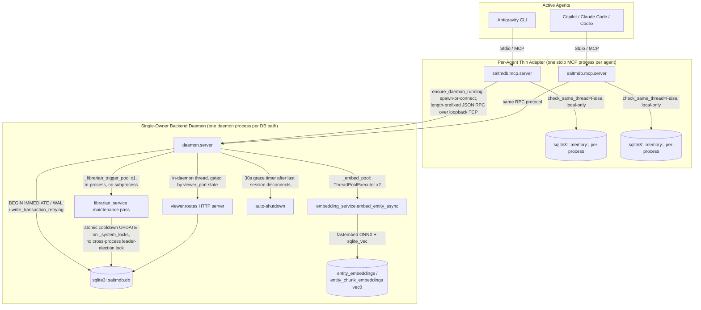

# SALTMDB: Local-First MCP Memory Server

**SALTMDB** (Short And Long-Term Memory DataBase) is a centralized, local-first memory framework designed for AI CLI tools and agents (such as Antigravity, Copilot, and Claude Code). It acts as a shared memory layer, allowing multiple concurrent agents to read, write, and consolidate contextual facts using a lightweight Python package with SQLite and ONNX-based vector embeddings.

> [!TIP]
> * **Installation:** To install and register the MCP server, see the **[Installation Guide](INSTALL.md)**.
> * **Developer Guide:** To learn how to configure your AI agents to utilize this memory system, read the **[Agent Integration & Design Guide](AGENT_GUIDE.md)**.

---

## 🏛️ System Architecture

SALTMDB is built using standard Python libraries and SQLite, prioritizing concurrency safety, security, and low memory overhead.

> [!NOTE]
> **Memory-core rework, Track B.** As of `v0.1.0-alpha.72`, SALTMDB no longer lets each agent's MCP process open SQLite directly. A single backend daemon (`src/saltmdb/daemon/`) is now the sole process that ever opens the DB; every agent process is a thin RPC adapter. See "Single-Owner Backend Daemon" below the feature list for the full design.


```mermaid
graph TD
    subgraph Active Agents
        A[Antigravity CLI]
        B[Copilot / Claude Code / Codex]
    end

    subgraph "Per-Agent Thin Adapter (one stdio MCP process per agent)"
        A -->|Stdio / MCP| AdA[saltmdb.mcp.server]
        B -->|Stdio / MCP| AdB[saltmdb.mcp.server]
        AdA -->|check_same_thread=False, local-only| EphA[(sqlite3: :memory:, per-process)]
        AdB -->|check_same_thread=False, local-only| EphB[(sqlite3: :memory:, per-process)]
    end

    subgraph "Single-Owner Backend Daemon (one daemon process per DB path)"
        AdA -->|ensure_daemon_running: spawn-or-connect,<br/>length-prefixed JSON RPC over loopback TCP| Daemon[daemon.server]
        AdB -->|same RPC protocol| Daemon
        Daemon -->|BEGIN IMMEDIATE / WAL / write_transaction_retrying| MainDB[(sqlite3: saltmdb.db)]
        Daemon -->|_embed_pool: ThreadPoolExecutor x2| EmbedWorker[embedding_service.embed_entity_async]
        EmbedWorker -->|fastembed ONNX + sqlite_vec| VecDB[(entity_embeddings /<br/>entity_chunk_embeddings vec0)]
        Daemon -->|_librarian_trigger_pool x1, in-process, no subprocess| Lib[librarian_service maintenance pass]
        Lib -->|atomic cooldown UPDATE on _system_locks,<br/>no cross-process leader-election lock| MainDB
        Daemon -->|in-daemon thread, gated by viewer_port state| Viewer[viewer.routes HTTP server]
        Viewer --> MainDB
        Daemon -->|30s grace timer after last session disconnects| Shutdown[auto-shutdown]
    end
```

- **Mechanical Text Quality Gate & Duplicate Handling:** Sub-millisecond multi-stage pre-embedding quality evaluation — idempotent auto-formatting (`auto_format_markdown`), prose extraction (`extract_prose_content`), Shannon character entropy ($H(X) \in [2.5, 5.3]$), Word 3-gram and 5-gram sequence repetition, Type-Token Ratio ($\ge 0.35$), Coleman-Liau readability bounds ($CLI \in [2.0, 26.0]$), and MSDI structural density scoring — followed by Stage A SHA-256 exact hash collision lookup before ONNX embedding generation. The quality gate aggregates every finding into one response rather than failing on the first: only malformed/empty/placeholder content, unmistakable extreme generation loops, and missing required structure at length (a paragraph break past 500 chars, a heading/list past 1500, more than one heading past 4000) are hard rejections — entropy/repetition/TTR/readability/symbol-ratio/oversized-payload findings are all advisory warnings that never block the write. Duplicate handling runs on every brand-new `store_memory` write (skipped when the call already resolves to an existing entity via an explicit `entity_id`): an **exact** content-hash match is a hard rejection naming the existing entity; a **near**-duplicate (high cosine similarity, not identical) always stores and the response includes `duplicate_candidates` (ids/titles/scores) with guidance to call `supersede_memory` or `consolidate_memories` if the relationship is confirmed. No two-phase review-token gate, no async queue, no auto-linking, no auto weight demotion.
- **Hybrid Search (FTS5 + Vector RRF):** Parallel FTS5/BM25 keyword search and `BAAI/bge-small-en-v1.5` dense vector search (via `fastembed` + `onnxruntime`) combined via Reciprocal Rank Fusion. Enabled by default; each search type runs on a dedicated thread pool. FTS5 uses a Porter tokenizer with title-biased BM25 weights (10:1 title-to-content, 5:1 alias-to-content). Semantic search uses a dedicated per-request connection to avoid cross-thread sqlite_vec conflicts.
- **Secrets Redaction:** Built-in regex scrubbing pipeline automatically redacts API keys, tokens, and private paths before any write. Custom patterns can be added via `.saltmdb_redact` in the working directory (one regex per line).
- **Folksonomy & Canonical Tags:** Flexible tagging with alias resolution, canonical redirects, and three seeded top-level tags (`episodic`, `semantic`, `procedural`).
- **Immutable Identity & Lineage:** Every memory's `entity_id` is permanent — a genuine content change (`revise_memory`/`supersede_memory`) always archives the predecessor byte-for-byte, unchanged, under its own existing ID and links a brand-new entity to it (`revises`/`supersedes`), rather than mutating the old row in place. A narrow administrative-only path (governance/lifecycle metadata fields only, never content) still updates in place on the same ID with no new entity created. Pre-redesign rows created before immutable identity existed (`<entity_id>_h_<8-char-suffix>` snapshots, from the old SCD Type 2 in-place-upsert model) remain in the database and were backfilled with `revises` edges into the lineage graph; see `MIGRATION.md`.
- **Lossless Consolidation:** Soft-archives source memories, auto-creates `consolidated_from` graph edges — never hard-deletes.
- **Bi-Temporal Relations:** Relation edges carry both a system/transaction-time axis (`valid_from`/`valid_to`, set by consolidation) and an independent event/world-time axis (`valid_at`/`invalid_at`, settable directly by agents via `manage_relation(invalidate=True)`).
- **Single-Owner Backend Daemon (memory-core rework, Track B):** Exactly one background daemon process (`src/saltmdb/daemon/`) opens SQLite for a given DB path; every MCP client and most CLI entrypoints connect as a thin RPC adapter over loopback TCP (length-prefixed JSON framing), auto-spawning the daemon on first connect (`saltmdb-viewer` is the one exception — a read-only status client that never spawns, see "Running the Database Dashboard Viewer" below). Ownership is arbitrated by a bind-only guard socket on a per-DB-path election port — never a stale-lock file a crashed process could leave behind. The Librarian and web viewer both moved in-process into the daemon as part of this change, eliminating the old cross-process leader-election lock entirely. See "Single-Owner Backend Daemon & Librarian Throttling" under Core Features for the full design.

### 1. Database Schema
The SQLite database operates in **Write-Ahead Logging (WAL)** mode (`PRAGMA journal_mode=WAL`, `PRAGMA synchronous=NORMAL`). All writes use explicit `BEGIN IMMEDIATE` transactions with exponential backoff retry (up to 4 total attempts). It includes the following tables:

* **`events`**: An immutable, append-only ledger tracking agent operations (`decision`, `issue`, `fix`, `attempt`, `consolidation_gate_override`, `relation_gate_override`). `type` is free text, not `CHECK`-constrained — `supersession_candidate`/`consolidation_request`/`domain_suggestion` are legacy values from the retired Librarian scanners and may still appear on old rows, but nothing generates them anymore. Columns: `id`, `timestamp`, `agent_id`, `type`, `content`, `error_code`, `session_id`, `context_id`.
* **`entities`**: The long-term knowledge base. Key columns: `id` (UUID), `title`, `full_content` (markdown), `status` (`raw`/`consolidated`/`archived`), `embedding_status` (`pending`/`ready`/`failed`/`archived`), `memory_type` (`fact`/`event`/`procedure`/`decision`/`preference`), `is_core`, `weight`, `scope` (`private`/`shared`), `owner_id`, `context_id`, `content_hash` (SHA-256), `quality_score`, `quality_status`, `quality_flags`, `valid_from`/`valid_to` (SCD Type 2 windows).
* **`tags`**: A folksonomy table allowing tags, categorizations, and canonical redirects. Seeded with `episodic`, `semantic`, `procedural`.
* **`entity_tags`**: A mapping table linking knowledge entities to folksonomy tags.
* **`relations`**: A typed directional edge table for the knowledge graph (`source_id → predicate → target_id`). Supports bi-temporal tracking via `valid_from`/`valid_to` (system time, set by `consolidate_memories`) and `valid_at`/`invalid_at` (event time, set by agents via `manage_relation`). A **partial unique index** `WHERE valid_to IS NULL` prevents duplicate live edges while allowing expired + live replacements to coexist.
* **`predicates`**: A canonical-predicate lookup table (mirrors `tags`' alias-resolution shape), the live-DB mirror of the closed vocabulary defined in `src/saltmdb/utils/predicate_vocabulary.py`. A fresh `init_db()` seeds all **51 canonical spellings**: 11 agent-selectable predicates (`elaborates_on`, `related_to`, `resolves`, `depends_on`, `verifies`, `corrects`, `caused_by`, `derived_from`, `distinguishes_from`, `part_of`, `contradicts`, each with `canonical_id IS NULL`), 3 reserved/system-owned predicates created only by their matching lifecycle tool (`supersedes` by `supersede_memory`, `consolidated_from` by `consolidate_memories`, `revises` by `revise_memory`), 1 legacy read-only predicate (`similar_to` — existing edges stay traversable, no new ones may be written), plus 36 known drifted aliases (30 same-direction renames, 6 requiring a source/target swap) each pointing `canonical_id` at its replacement. **`relates_to`/`references` alias onto `related_to` now, not `elaborates_on`** (reversed from older releases). Write-time predicate validation is closed-vocabulary, not open substitution: `manage_relation` **rejects** a drifted or unrecognized predicate outright with a schema-derived `corrected_call`, rather than silently canonicalizing and noting the substitution in the result string the way older releases did.
* **`entities_fts`**: A virtual table using **SQLite FTS5** (Porter tokenizer) indexing `title`, `full_content`, and `search_aliases` (from `metadata.search_aliases`). Kept in sync with entities via four triggers (`insert_entity_fts`, `update_entity_fts`, `update_entity_fts_unarchived`, `archive_memory_fts`, `delete_entity_fts`).
* **`entity_embeddings`**: A `sqlite-vec` `vec0` virtual table storing 384-dimensional ONNX float32 embeddings (`embedding FLOAT[384]`). Loaded via `sqlite_vec.load(conn)` on a per-connection basis; the extension is pre-imported *before* any `BEGIN IMMEDIATE` transaction opens to prevent stalled cold-import from holding the write lock.
* **`_system_locks`**: A system table backing the Librarian's cooldown throttle inside the single backend daemon (Track B retired its former cross-process leader-election use — see "Single-Owner Backend Daemon & Librarian Throttling" above). Columns: `task_name`, `locked_at`, `locked_by_pid`, `last_run_at`. Trigger cooldown: 5 minutes between in-daemon maintenance passes, claimed via a single atomic `UPDATE`. `locked_at`/`locked_by_pid` are retained columns from the pre-Track-B leader-election shape but are no longer written to.
* **`_viewer_sessions`**: Tracks active web viewer sessions by `port` + `session_pid` for reference-counted lifecycle management.

---

## 🚀 Core Features

### 1. Hybrid FTS5 + Vector Search
SALTMDB runs FTS5/BM25 keyword search and dense vector semantic search **in parallel** using a `ThreadPoolExecutor`, merging results via **Reciprocal Rank Fusion (RRF)**:
* FTS5 uses SQLite's built-in `bm25` auxiliary function with a **10:1 title-to-content weight ratio** (alias weight: 5:1). An AND-query is tried first; if it returns no results with multiple terms, an OR-fallback is automatically applied.
* Semantic search uses `fastembed` (`BAAI/bge-small-en-v1.5`, 384-dim ONNX, ~66MB pre-bundled model weights) stored in a `sqlite-vec` `vec0` virtual table. The query text is `{title}\n\n{full_content}` concatenated for embedding.
* RRF merges on rank position (not raw scores) with `k=60`, keeping the existing BM25 tuning intact. Rows that matched via FTS5 carry a query-centered `fts_snippet` excerpt with `<mark>`/`</mark>` highlighting; rows that only surfaced via semantic search fall back to the heuristic snippet extractor.
* In `broad` and `history` modes, a byte-identical title matching exactly one active entity inside the caller's filters uses an identity fast path: that entity is returned without running hybrid retrieval. Title collisions retain ordinary hybrid ordering. Explicit supersession-family collapse takes precedence and uses the normal pipeline. Relation popularity is deliberately not a relevance signal.
* Enabled by default; set `SALTMDB_ENABLE_SEMANTIC=false` to explicitly disable vector search. **Note**: `search_memory` no longer has an FTS-only fallback for query-based calls -- with semantic search disabled, a call that passes `query_keywords` returns `[{"error": "..."}]` instead of degraded FTS-only results, unless the query resolves through the unique exact-title identity fast path above. Filter/tag-only browsing (no `query_keywords`) is unaffected.
* Duplicate checks (`check_duplicate_memories`) use batched precomputed vector lookups (`_batch_semantic_similarities`) to avoid re-embedding each candidate, with FTS5 pre-filtering to cap candidates at ~30 before the similarity pass.
* Optional Stage-2 ONNX cross-encoder reranking (`use_cross_encoder`, experimental, opt-in) exists in the underlying search domain service, gated behind `SALTMDB_RERANKER_MODEL`: set it to a supported model name to enable. Independent of `rerank_by_topic` -- either flag alone widens the candidate pool and shares the same decisive-hybrid-winner gap-gate; if both are requested and neither is gated off, cross-encoder's reorder wins. No PyTorch runtime (uses `fastembed`'s existing ONNX `TextCrossEncoder` API). See the environment variable table below for supported model names. `Xenova/ms-marco-MiniLM-L-6-v2` (~88MB, pre-bundled under `src/saltmdb/models/`, same offline-first convention as the bi-encoder below) is the benchmark-recommended choice — it matched or beat every larger candidate tested (`BAAI/bge-reranker-base`, `jinaai/jina-reranker-v2-base-multilingual`, both 1GB+) on holdout top-1 accuracy at a fraction of the latency/footprint. **As of the agent API redesign, `use_cross_encoder` and every other Stage-2 reranking/candidate-channel control are internal-only** — they are not parameters on the MCP `search_memory` tool, only on the internal domain function used for benchmarking/evaluation; `SALTMDB_RERANKER_MODEL` currently has no effect on anything an agent can call.

> [!NOTE]
> **Calibration caveat.** SALTMDB's constants fall into two different categories that must not be conflated:
> * **Benchmark-calibrated embedding thresholds** — `COHESION_MIN_PAIRWISE_THRESHOLD`, `RERANK_SAME_TOPIC_THRESHOLD`/`RERANK_BROAD_THEME_THRESHOLD`, `DEDUP_SUPERSESSION_THRESHOLD`/`DEDUP_DUPLICATE_THRESHOLD`, `RELATION_GATE_MIN_SIMILARITY_THRESHOLD` — are cosine-similarity cut points locked from English-language, codebase/engineering-domain benchmark corpora against this specific embedding model (`bge-small-en-v1.5`); they are defaults calibrated to that measurement, not a universal guarantee across other languages, content domains, or embedding models, and re-tuning any of them requires new benchmark evidence, not ad hoc adjustment.
> * **Cardinality / review-safety policy constants** — `MAX_CONSOLIDATION_REQUEST_SIZE`, `COHESION_OVERRIDE_MIN_LENGTH` — are **not** embedding measurements; they're deliberately chosen operational safeguards (how many items is reviewable in one commit, how long an override justification must be). These are reviewed and changed through normal policy/design review, not benchmark evidence.
> * Retired (memory-core rework, Track A): `CLUSTER_MIN_PAIRWISE_THRESHOLD`, `SUPERSESSION_MIN_SIMILARITY_THRESHOLD`, `SUPERSESSION_MIN_OVERLAP_COUNT`, `COHESION_MAX_COMPONENT_SIZE_FOR_EXTRACTION` calibrated/bounded the now-deleted async Librarian scanners and no longer exist. Also retired (agent API redesign): `MAX_REVIEW_CANDIDATES`/`REVIEW_TOKEN_TTL_SECONDS` governed the now-deleted store-time disposition review-token gate and no longer exist.

### 2. Hybrid Title Extraction
When storing new knowledge, agents can optionally specify a custom `title`. If omitted, the server automatically extracts the first markdown heading (`# Heading`) as the title, falling back to a snippet of the first line if no heading is present. Title bounds: minimum 5 characters, maximum 120 characters.

### 3. Quality Gate Pipeline
`store_memory` and `consolidate_memories` calls pass through a multi-tier quality gate (`evaluate_memory_quality`) before any embedding or write. The gate aggregates every finding it makes into one response instead of stopping at the first problem, and classifies each finding as either a **hard rejection** (blocks the write, `status: "REJECT"`) or an **advisory warning** (never blocks — surfaced in the response's `warnings`, `status: "WARN"` or `"ACCEPT"`):
1. **Tier 1 — Boundary & Fluff:** Minimum length (20 chars), non-string content, conversational fluff regex patterns, and an unresolved placeholder marker are all **hard rejections**. Maximum symbol-to-alpha ratio (0.35) and oversized payload (>8000 chars) are **advisory warnings**.
2. **Tier 1.5 — Markdown Syntax Integrity:** Unbalanced code fences, asymmetric table pipes, or a header-hierarchy level-skip are **hard rejections** (`BROKEN_MARKDOWN_SYNTAX`). Also scored here: MSDI (Markdown Structural Density Index = ratio of words in headers+lists+code blocks to total words), which only feeds Tier 4's advisory structural score, not a rejection.
3. **Tier 2 — Information-Theoretic Filters:** Shannon entropy outside `[2.5, 5.3]` bits/char, 3-gram duplicate ratio > 0.30, 5-gram duplicate ratio > 0.20 (checked at ≥20 words), and Type-Token Ratio < 0.35 (checked at >30 words) are all **advisory warnings** — this inverted from earlier releases, where several of these were hard rejections. The one exception that remains a **hard rejection**: an unmistakable extreme generation loop (`EXTREME_GENERATION_LOOP`, very low entropy combined with heavy repetition) is still blocked outright.
4. **Tier 2.5 — Coleman-Liau Readability (prose-only, advisory):** On extracted prose (code blocks, URLs, file paths stripped), if >30 prose words: CLI outside `[2.0, 26.0]` is an **advisory warning** (`EXTREME_READABILITY_BOUNDS`), no longer a rejection.
5. **Tier 3 — Structural Requirements by Length (hard rejections):** Length-tiered structure requirements: content ≥500 chars needs a paragraph break (`MISSING_PARAGRAPH_BREAK`), ≥1500 chars needs a heading or list (`MISSING_HEADING_OR_LIST`), and >4000 chars needs more than one heading (`INSUFFICIENT_HEADINGS`) — each is a **hard rejection** when the required structure is missing at its length tier.
6. **Tier 4 — Structural Scoring (advisory `quality_score`, never blocking):** Base score 0.50; +0.15 for headers, +0.10 for lists, +0.15 for MSDI ≥ 0.35, −0.15 for MSDI < 0.10 on large (>80 word) text, −0.10 for untyped code blocks, −0.10 for non-hierarchical headers. Score clamped to `[0.0, 1.0]` — purely informational.

`auto_format_markdown` runs as an idempotent pre-pass: normalizes line endings, annotates untyped code fences with language identifiers (Python/SQL/JSON/JavaScript heuristics), collapses 3+ consecutive blank lines.

### 4. Security & Redaction Middleware
Before any database writes occur, the text is evaluated by a regex-based scrubbing pipeline:
* **Core Redactions:** Automatically censors standard credentials (GitHub tokens, Anthropic API keys, OpenAI API keys, AWS credentials, Discord tokens).
* **Custom Developer Rules:** On startup, the server reads `.saltmdb_redact` from the current working directory. You can add one custom regex pattern per line (e.g. internal staging domains, proprietary IDs) to strip out company-specific secrets.

### 5. Ephemeral State Layer (internal-only, not agent-facing)
The server still maintains an isolated `:memory:` SQLite database (`src/saltmdb/domain/services/ephemeral_service.py`, backed by a module-level singleton connection) capable of holding temporary data such as short-lived session tokens or process variables — these variables are never written to disk and disappear completely when the server stops. **As of the agent API redesign, this layer has no MCP-facing tool** — the standalone volatile-storage tool that used to expose it to agents was removed with no replacement. The underlying mechanism is documented here purely as an architectural fact about the codebase; do not tell an agent it can reach it.

### 6. Single-Owner Backend Daemon & Librarian Throttling
Exactly one daemon process (`src/saltmdb/daemon/server.py`) ever opens SQLite for a given DB path. Ownership is arbitrated by a **bind-only guard socket** on a per-DB-path "election port" (derived deterministically from the resolved DB path into the `49500`–`65499` range) — the daemon binds it and holds it for its entire lifetime, never `accept()`-ing a connection; a losing contender's own bind attempt fails almost instantly and it exits cleanly without ever touching the DB. This replaces a lock *row* (which a crashed process could leave stale) with a lock the OS itself releases the instant the holding process dies. A paired "probe port" (`election_port + 1`) answers lightweight identify requests so a client can tell "daemon still starting up" apart from "a stale/foreign process holds this port," without needing to open the DB to find out.
* Every MCP client and most CLI entrypoints (`python -m saltmdb`, `--librarian`, `--backfill-chunk-embeddings`) are thin RPC adapters: `ensure_daemon_running()` connects to an already-running daemon or spawns one (detached subprocess, `CREATE_NO_WINDOW` on Windows / `start_new_session=True` on Unix, stdout/stderr redirected to `daemon.log`) and retries discovery for a bounded window. `saltmdb-viewer` is the one exception — a read-only `viewer_status` RPC client that requires an already-running daemon and never spawns one itself; run any of the other entrypoints first if you get a "no daemon running" message.
* The daemon starts a 30-second grace-period shutdown timer (`DAEMON_SHUTDOWN_GRACE_PERIOD_S`) both at its own startup and every time its session count returns to zero, so a daemon spawned only to service a one-shot RPC (no client ever opens a session) still shuts itself down on the same timer, not just after a connected session disconnects. An in-flight RPC (a librarian pass, a chunk-embedding backfill) is tracked separately and blocks the timer from firing mid-call. `saltmdb-daemon --foreground` (explicit manual launch) disables this timer entirely and runs until `SIGINT`/`SIGTERM`.
* **Librarian throttling**, now that only one process ever runs the maintenance pass: the old cross-process leader-election lock (`acquire_librarian_lock`/`release_librarian_lock`, two separate `BEGIN IMMEDIATE` transactions against `_system_locks`) is retired outright — there is nothing left to elect a leader among. The cooldown check collapses to a single atomic `UPDATE _system_locks SET last_run_at = ? WHERE last_run_at IS NULL OR last_run_at < now - 300s` on the daemon's single-worker `_librarian_trigger_pool` thread, and a manual pass (`--librarian`, or the `run_librarian_now` RPC) shares that same pool so the automatic and manual paths can never run concurrently.

### 7. Automated Session Lifecycle Hooks
SALTMDB integrates with native lifecycle hooks across major AI agent frameworks (**Claude Code**, **Google Antigravity CLI**, and **GitHub Copilot CLI**):
* **Context Digest Injection (`SessionStart` / `PreInvocation` / `sessionStart`):** Automatically injects the canonical core-memory bootstrap digest (global, core-only, fail-closed) at session initialization.
* **Pre-Action Memory Search Gate (`PreToolUse`):** Enforces Rule 1 ("Think Before You Leap") by requiring a memory search before executing code edits or terminal commands. Supports Copilot CLI's JSON `permissionDecision` (`allow`/`deny`) protocol.
* **Pre-Compaction Memory Sweeps (`PreCompact`):** Triggers autonomous background agent sweeps to persist unrecorded decisions and bug fixes before transcript truncation.
* **Stop Self-Critique Gate (`Stop` / `agentStop`):** Triggers mandatory self-reflection checks on confidence and unknown risks before finishing complex turns.

---


## 🧹 The Librarian Process (Garbage Collection)

> [!NOTE]
> **Memory-core rework, Track B.** The Librarian is no longer its own detached subprocess (`python -m saltmdb --librarian` spawned per triggering client process). It now runs **in-process inside the single backend daemon**, on the daemon's existing single-worker `_librarian_trigger_pool` — see "Single-Owner Backend Daemon & Librarian Throttling" above. The description below reflects the current in-daemon behavior; the subprocess-spawn description this section used to carry is gone along with the subprocess itself.

Whenever the database is modified, the daemon schedules a fire-and-forget cooldown check on its single-worker `_librarian_trigger_pool` background thread. If at least 2 raw entities exist and 5 minutes have elapsed since the last pass, the maintenance pass runs directly on that thread — no subprocess spawn, no separate process to detach or redirect. A manual pass (`python -m saltmdb --librarian`, now an RPC-forwarding client, or the daemon's own `run_librarian_now` RPC) submits to the *same* pool and blocks on the result, which is what makes the automatic and manual paths mutually exclusive without any separate lock.

A spawned background daemon's output goes to its own `daemon.log` (same directory as `saltmdb.db`) rather than a dedicated `librarian.log` — there's no longer a separate subprocess whose output needs its own redirection. (A daemon launched explicitly in the foreground, `saltmdb-daemon --foreground`, logs to the terminal as normal instead.)

Once the Librarian's cooldown-claim UPDATE wins (see above), it runs:

1. **Tag Merging (`merge_tags_heuristics`):** Merges case-insensitive, punctuation-stripped tag aliases (e.g. `#Auth-Error` and `#auth_error` normalize to `autherror`) into a canonical tag to prevent folksonomy fragmentation. Arbitrary SQL row order determines the canonical winner.

**Maintenance pass (`_run_librarian_maintenance`):** Runs unconditionally after the tag-merging pass (even on partial failure), on the same trigger-pool thread: `PRAGMA wal_checkpoint(TRUNCATE)` + `PRAGMA optimize=0x10002`.

> [!NOTE]
> **Retired (memory-core rework, Track A).** The Librarian used to run two additional async passes here — vector topic clustering (`consolidate_vector_clusters`) and consolidated-supersession scouting (`scout_consolidated_supersessions`) — each logging a reviewable `consolidation_request`/`supersession_candidate` event for a human/agent to resolve later. Both were deleted outright, no replacement queue. Track A folded that evidence-gathering into a synchronous `store_memory` preflight instead, evaluated inline on the write that's actually relevant rather than from a periodic scan of the whole DB — that preflight was itself later replaced (agent API redesign) by the simpler exact-duplicate-hard-rejection / near-duplicate-`duplicate_candidates` split described in the Quality Gate section above; there is no two-phase review gate at either point in this history's current end state.

### No LRU Decay
Memories are **never** weight-decremented or archived due to inactivity or disuse. Archiving occurs only upon explicit supersession, revision, or synthesis consolidation. The previously-present `decay_low_quality_memories` function was removed in alpha.62 as confirmed-dead code.

---

## 🛠️ API & MCP Tools Reference

The server exposes **16 consolidated tools** over standard I/O (stdio MCP):

| Tool Name | Key Parameters | Description |
| :--- | :--- | :--- |
| `search_memory` | `query_keywords`, `limit`, `cursor`, `context_id`, `tags_filter`, `memory_type_filter`, `is_core`, `include_related`, `mode`, `owner_id` | Hybrid FTS5 + vector RRF search. `include_related=True` (default) batches 1-hop active linked entities in a single query. `mode` (default `"broad"`): `"strict"` resolves a matched-but-superseded candidate to its live `supersedes` successor and requires every surviving candidate to clear a calibrated relevance-abstention gate (an empty list is then a normal, successful result); `"history"` leaves every candidate visible and tags a currently-superseded one with `"is_superseded": true`; `"broad"` is ordinary retrieval with neither behavior. **No explicit-ID retrieval on this tool anymore** — the old `entity_id`/`fetch_full` combination is gone; use `get_memory`. The agent-facing parameter surface is deliberately just the 10 listed here — the experimental reranking/candidate-channel controls from earlier releases (topic reranking, cross-encoder, chunk/retrieval-text candidates, durable-type/superseded reordering) still exist in the underlying domain service for internal benchmarking, but are not exposed through the MCP tool layer at all. |
| `store_memory` | `title`, `content`, `tags`, `memory_type`, `owner_id`, `context_id`, `entity_id`, `is_core`, `scope`, `retrieval_text`, `core_reason`, `core_exit_condition`, `core_review_after`, `detail_memory_ids` | Stores new facts in raw markdown — creates only, never repairs/replaces existing content (see `revise_memory`/`supersede_memory`). Enforces the quality gate (see below) and SHA-256 hash deduplication, triggers background embedding generation. An exact content-hash duplicate is a hard rejection (`REJECT_EXACT_DUPLICATE`) naming the existing entity; a near-duplicate always stores and returns `duplicate_candidates` (ids/titles/scores) with guidance to call `supersede_memory`/`consolidate_memories`. `title`/`tags` inside YAML front matter in `content` is rejected (`IDENTITY_IN_YAML_FRONT_MATTER`) with a corrected call. `entity_id` (optional) targets an existing memory for a metadata-only administrative update (governance/lifecycle fields only — a genuine content change is rejected, `IMMUTABLE_MEMORY`, naming the correct lifecycle tool). Responses use a uniform envelope: `{"status": "ok"/"rejected", "data"/"errors": [...], "warnings": [...], ...}`. **Core-memory governance** (see below): `is_core=True` requires `scope="shared"` plus `core_reason`/`core_exit_condition` and admits hard global caps (≤5 active cores, ≤2,500 chars each, ≤15,000-char rendered digest); a capacity failure returns `status: "REJECTED"` with zero side effects. |
| `get_memory` | `entity_id`, `owner_id` | **New.** Retrieves one memory by full ID or an unambiguous ID prefix (≥8 hex chars) — the dedicated explicit-retrieval path `search_memory` no longer provides. Includes archived memories, returns status plus lineage; an archived ID is never silently redirected to a successor. An ambiguous prefix is rejected with the candidate list (never their content). |
| `revise_memory` | `entity_id`, `title`, `content`, `tags`, `reason`, `owner_id`, `context_id`, `scope`, `memory_type` | **New.** Repairs a deficient memory representation via a brand-new immutable entity — the predecessor is archived byte-for-byte and linked `new --revises--> old`. An inactive target is a hard failure reporting known active successors. Omitted `owner_id`/`context_id`/`scope`/`memory_type` are inherited from the predecessor. |
| `supersede_memory` | `entity_id`, `title`, `content`, `tags`, `reason`, `owner_id`, `context_id`, `scope`, `memory_type` | **New.** Replaces valid-but-outdated knowledge with newer knowledge, same immutable-identity shape as `revise_memory` but links `new --supersedes--> old`. `supersedes` is a governance-gated strong predicate (see `manage_relation` below), so an unrelated "replacement" can still be rejected on similarity grounds. |
| `get_lineage` | `entity_id`, `direction` (`ancestors`/`descendants`), `max_depth`, `owner_id` | **New**, dissolved out of the old unified graph-inspection tool's lineage mode. Walks `revises`/`supersedes`/`consolidated_from` edges in either direction — `ancestors` (default) is the old behavior; `descendants` (what this eventually became) is a genuinely new capability. Both directions return archived nodes labeled with status. |
| `get_related_memories` | `entity_id`, `max_depth`, `owner_id` | The other half of that dissolved graph-inspection tool — its old dependency-traversal mode. Multi-hop traversal of ordinary semantic relation edges from one memory. |
| `search_tags` | `query`, `limit` (default 50) | Renamed from the old canonical-tag-search tool, same behavior. Queries non-alias tags matching the search filter to prevent tag fragmentation. Capped by `limit` even when `query` is omitted. |
| `list_predicates` | `query`, `limit` (default 50) | Renamed from the old canonical-predicate-search tool. Lists the **closed** relation-predicate vocabulary `manage_relation` accepts (11 agent-selectable + 3 reserved + 1 legacy read-only). Capped by `limit` even when `query` is omitted. |
| `merge_tags` | `keep_tag`, `tags_to_merge` (list) | Unchanged. Merges one or more fragmented/synonym tags into an explicitly chosen canonical tag, repointing all affected entity_tags associations. |
| `log_event` | `event_type`, `content`, `context_id`, `error_code`, `owner_id` | Appends a scrubbed entry to the immutable short-term ledger. **No more `agent_id`/`session_id` params** — the bound `owner_id` (first-call-wins per-session identity) is injected as the stored event's `agent_id`, `session_id` is auto-populated from the host session; parameter is `event_type`, not `type` (shadowed the Python builtin), with no remaining name aliases. |
| `get_events` | `context_id`, `agent_id`, `event_type`, `session_id`, `order`, `limit`, `offset` | **No `owner_id` param — deliberately**: a read across the whole ledger, not an identity-bearing write. `context_id` is now a genuine filter (previously stored on every row but unreachable from any agent-facing call) — the headline capability, letting a thread be read back across a session. `order`: `"newest_first"` (default) or `"oldest_first"`. The old `mode`/`status_filter` params are both gone; event dicts no longer carry any computed `"status"` field. |
| `archive_memory` | `entity_id` (str \| list[str]), `owner_id` | Unchanged. Polymorphic: archives one or multiple long-term memories. Bulk archive is all-or-nothing. Archiving also sets `valid_to` on all active outgoing/incoming relation edges. |
| `manage_relation` | `relations` (list), `source_id`, `target_id`, `predicate`, `invalidate`, `valid_at`, `invalid_at`, `override_justification`, `owner_id` | Polymorphic: store single/multiple directional semantic edges, or invalidate an existing live edge (`invalidate=True`). **Closed predicate vocabulary**: `predicate` must be one of 11 agent-selectable spellings (`elaborates_on`, `related_to`, `resolves`, `depends_on`, `verifies`, `corrects`, `caused_by`, `derived_from`, `distinguishes_from`, `part_of`, `contradicts`); the 3 reserved predicates (`supersedes`/`consolidated_from`/`revises`) are refused, naming the correct lifecycle tool; `similar_to` is legacy and read-only (`LEGACY_READONLY_PREDICATE` on a new write). A drifted/unrecognized spelling is **rejected outright with a schema-derived `corrected_call`**, never silently substituted — note `relates_to`/`references` now alias onto `related_to`, reversed from older releases' `elaborates_on`. None of this applies to `invalidate=True` calls. A bulk `relations` call is all-or-nothing on any predicate problem. **Governance gate** (unchanged): for strong predicates `elaborates_on`/`resolves`/`supersedes`, rejects with `REJECT_LOW_RELATION_SIMILARITY` below `RELATION_GATE_MIN_SIMILARITY_THRESHOLD` (0.6505); independently rejects known-contradictory predicate pairs (`REJECT_CONTRADICTORY_PREDICATE`). `override_justification` (≥20 chars) force-passes either gate and is atomically audited via a `relation_gate_override` event. **Core-memory governance**: a NEW `elaborates_on` edge targeting an active core is rejected (`REJECT_CORE_ELABORATES_ON`) — only that core's own `detail_memory_ids` declaration governs it. |
| `consolidate_memories` | `consolidations` (list), `parent_ids`, `title`, `content`, `tags`, `owner_id`, `context_id`, `scope`, `weight`, `is_core`, `override_justification`, `core_reason`, `core_exit_condition`, `core_review_after`, `detail_memory_ids` | Renamed from the old consolidation-commit tool, same core behavior. Polymorphic: commit single/multiple synthesized consolidations from two or more explicit parents, archiving them unchanged and linking `consolidated_from`. `title`/`content` are mandatory on every call — no ID-only shortcut. **Cohesion gate**: for ≥2 parents, rejects with `REJECT_LOW_COHESION` when minimum pairwise centroid similarity falls below `COHESION_MIN_PAIRWISE_THRESHOLD` (0.6547); an unresolved parent forces rejection. `override_justification` (≥20 chars) force-passes the gate, appends verbatim into the committed content as a `[Consolidation Override]` block, and atomically logs a `consolidation_gate_override` event. **`is_core` is never inherited from parents** — omitting it while a parent is active core is rejected; pass it explicitly. |
| `review_core_memory` | `entity_id`, `outcome` (`retain`/`demote`/`archive`), `review_rationale`, `owner_id`, `core_review_after` | Unchanged. Direct, synchronous review of an active core memory — `retain` extends its next review date (future timestamp, ≤30 days out), `demote` turns it back into an ordinary searchable memory, `archive` retires it. `owner_id` is the REVIEWING agent's identity, not an ownership check. `review_rationale` (20-1,000 chars) is stored for provenance, never injected into the bootstrap digest. |

**Tools removed from MCP entirely, not deprecated**: the old volatile in-memory secret-storage tool, the old pending-review-signal-dismissal tool, and the old full-corpus-export tool (moved to `saltmdb-cli export-corpus-snapshot`) — all gone with no MCP replacement. Orphan detection (the old unified graph-inspection tool's orphan mode) similarly moved to `saltmdb-cli orphans`, with no MCP equivalent.

`retrieval_text` (on `store_memory`) is independently redacted, hashed, indexed, and embedded: omission preserves it, a nonempty string replaces it, an empty string clears it, and JSON `null` is rejected. It never changes authoritative content, duplicate detection, `content_hash`, or base embedding status. The underlying domain search service also still carries several opt-in search-accuracy channels (chunk-vector candidates, retrieval-text candidates, `supersedes`-chain collapsing, topic/cross-encoder reranking) from earlier evaluation rounds — none of them are reachable through the MCP `search_memory` tool anymore; they remain internal benchmarking/evaluation tooling only, pending a frozen blind evaluation before any of them would become agent-facing defaults.

---

## 🧭 Core-Memory Bootstrap Governance

`is_core=True` is a **scarce, temporary bootstrap-delivery mechanism**, not a general "important knowledge" tier. It exists for urgent cross-session hazards an agent must know before it could reasonably search for them (active bugs, temporary overrides, environment failures, migrations in progress) — stable coding rules, standing behavioral guidelines, and user preferences belong in `AGENTS.md`/`CLAUDE.md`/skills instead. All logic lives in `src/saltmdb/domain/services/core_governance_service.py`, the sole authority every write path (`store_memory`, `consolidate_memories`, `review_core_memory`) and the bootstrap-digest renderer route through.

Three independent hard limits, enforced inside every write transaction that can create/promote/enlarge a core memory:

| Limit | Value |
| :--- | :--- |
| Active (non-archived) core memories, globally | ≤ 5 |
| `full_content` per core (Unicode code points) | ≤ 2,500 |
| Exact rendered bootstrap digest (Unicode code points) | ≤ 15,000 |

**Lifecycle fields.** Every core requires `scope="shared"` (no private cores), `core_reason` (20-500 chars: the harm before natural retrieval), `core_exit_condition` (20-500 chars: the observable condition that ends the urgency), and an absolute `core_review_after` timestamp (default 14 days out, max 30). While any core is overdue for review, creating/promoting a new core, enlarging an existing core's content, or changing its review timestamp is blocked — call `review_core_memory(outcome='retain')` to resolve the overdue review first; demote/archive/non-expanding edits stay allowed. Overdue cores are still injected (rendered first, with `review_due="true"`) — an overdue-but-otherwise-valid core is never a bootstrap failure.

**Capacity failures are side-effect-free.** A write that would exceed any limit returns `status: "REJECTED"`, `error_code: "CORE_CAPACITY_EXCEEDED"`, the violated dimensions, current/proposed totals, and a balanced inventory of every active core (ID/title/type/owner/review timestamp/due state/rendered size — never full content) — no memory, relation, or other state is created. Rebalancing (demote/archive/shorten/consolidate) is fully autonomous; it never requires a human decision.

**Detail memories.** A core must stay directly actionable even if a weaker agent never follows a link — rationale, chronology, evidence, and examples belong in linked normal memories instead. `detail_memory_ids` (at most 3 full UUIDs of existing shared, non-core memories whose canonical title and UUID must appear in the core's own `content`) atomically maintains `detail --elaborates_on--> core` relations; `manage_relation` cannot create such an edge directly against an active core (`REJECT_CORE_ELABORATES_ON`) — only the core's own declaration governs it.

**Consolidation never inherits core status.** If any resolved `consolidate_memories` parent is currently an active core and `is_core` is omitted, the call is rejected — pass `is_core=True` (with lifecycle fields) explicitly to keep the result core, or `is_core=False` to let it become ordinary.

**Review.** `review_core_memory(entity_id, outcome, review_rationale, owner_id, core_review_after)` is a direct, synchronous operation (never a queue/event): `retain` extends the review date, `demote` returns the memory to ordinary searchable status, `archive` retires it. `owner_id` identifies the *reviewing* agent, not an ownership check.

**Bootstrap fails closed.** The `saltmdb-cli bootstrap-digest` hook (global, core-only — no project-keyword search, no arbitrary core-count limit) renders every active core in canonical order (overdue first, then earliest upcoming review, then creation time). If any active core is malformed or the set exceeds a limit, bootstrap emits one bounded `<core-bootstrap-error>` report (violations + compact inventory + a rebalancing instruction) instead of a partial, truncated, or oversized digest.

---

## ⚙️ Configuration & Installation

### 1. Configuration Path
By default, the server initializes the database under `~/.saltmdb/saltmdb.db`. You can override this behavior by setting the `SALTMDB_DB_PATH` environment variable:
```bash
# Unix
export SALTMDB_DB_PATH="/custom/path/memory.db"
# Windows PowerShell
$env:SALTMDB_DB_PATH = "C:\custom_path\memory.db"
```

### 2. Environment Variables

| Variable | Default | Description |
| :--- | :--- | :--- |
| `SALTMDB_DB_PATH` | `~/.saltmdb/saltmdb.db` | Path to the SQLite database file. |
| `SALTMDB_ENABLE_SEMANTIC` | `true` | Set to `false`/`0`/`off`/`no` to disable vector search. Query-based `search_memory` calls then return an error instead of an FTS-only fallback -- see the Search Architecture section above. |
| `SALTMDB_RERANKER_MODEL` | _(unset)_ | Experimental, opt-in: set to an ONNX cross-encoder model name (`Xenova/ms-marco-MiniLM-L-6-v2`, `Xenova/ms-marco-MiniLM-L-12-v2`, `BAAI/bge-reranker-base`, `jinaai/jina-reranker-v1-tiny-en`, `jinaai/jina-reranker-v1-turbo-en`, or `jinaai/jina-reranker-v2-base-multilingual`) to enable the internal search domain service's `use_cross_encoder` Stage-2 reranking flag. **Not currently reachable from the MCP `search_memory` tool** — internal/benchmarking use only as of the agent API redesign. Unset (default) or an unsupported name leaves it a no-op. No PyTorch runtime -- uses `fastembed`'s existing ONNX Runtime backend, the same one already used for the bi-encoder. |
| `SALTMDB_VIEWER_PORT` | `8080` | Port for the database dashboard viewer, read when the backend daemon starts its in-process viewer thread. |
| `SALTMDB_VIEWER_HOST` | `127.0.0.1` | **Currently not consumed** — the daemon binds the viewer directly to `127.0.0.1` regardless of this variable (a known gap from the Track B rework, not yet wired through). |
| `SALTMDB_VIEWER_ENABLED` | `true` | Set to `false` to disable the backend daemon's in-process viewer thread. |
| `SALTMDB_DISABLE_LIBRARIAN` | _(unset)_ | Set to any value to suppress all Librarian maintenance-pass triggers (runs in-daemon as of Track B; no longer a separate subprocess). |
| `SALTMDB_TEST_MODE` | _(unset)_ | Set to any value in test environments to suppress Librarian maintenance-pass triggers. |
| `SALTMDB_HOST_SESSION_ID` | _(unset)_ | Optional, best-effort: an opaque session identifier from the calling harness, threaded through to `log_event`'s `session_id` field (advisory-only, never validated — a stale or mismatched value is not an error). Nothing in SALTMDB itself sets this; it must be exported into the MCP server's own process environment by whatever launches it. See §3's example for wiring it from Claude Code specifically. Any harness with its own stable session identifier can export the same variable the same way; harnesses without one simply leave it unset and `session_id` stays `null`, same as today. |

### 3. Registering with MCP Clients
MCP clients do not inherit your shell's PATH — always use the **full path** to your Python executable. Find it first:
```bash
python -c "import sys; print(sys.executable)"
```

Then add to your MCP client configuration file:
```json
"mcpServers": {
  "saltmdb": {
    "command": "/full/path/to/python",
    "args": ["-m", "saltmdb"],
    "env": {
      "SALTMDB_DB_PATH": "/path/to/saltmdb.db",
      "SALTMDB_ENABLE_SEMANTIC": "true"
    }
  }
}
```

**Optional, Claude Code specific:** if your Claude Code version injects its own session identifier into an MCP server's subprocess environment (check `env | grep -i claude` from within a running session, or your version's release notes — this is version-gated and the exact variable name has changed across releases), you can thread it through to SALTMDB's `session_id` audit field by adding a third `env` entry referencing it, e.g. `"SALTMDB_HOST_SESSION_ID": "${CLAUDE_CODE_SESSION_ID}"` (substitute whatever variable your installed version actually sets). This is best-effort and purely advisory — confirm your client's config syntax actually substitutes a variable the harness itself injects (as opposed to only your own shell's ambient environment at the time the client was launched) before relying on it. Any other harness with its own stable session identifier can export `SALTMDB_HOST_SESSION_ID` the same way.

See [INSTALL.md](INSTALL.md) for platform-specific examples and troubleshooting.

### 4. Database Dashboard Viewer
SALTMDB includes a zero-build, local-only knowledge-operations Viewer for Overview, Memory Explorer, Activity, local relationship exploration, Quality, Operations, Tags, and diagnostics. It safely renders agent-authored Markdown with pinned local assets and exposes read-only browser APIs only. The legacy System Locks page is retired: Librarian cooldown state is not a cross-process lock. As of the Track B backend-daemon rework, the Viewer runs as an in-process daemon thread and comes up automatically as soon as any MCP client causes the daemon to spawn (gated by `SALTMDB_VIEWER_ENABLED`, default on) — there's nothing to separately launch:
1. Check status (requires a daemon already running for the resolved DB path — it does **not** spawn one, and takes no `--port` or other flags):
   ```bash
   python -m saltmdb.viewer.server
   # or if installed via pip install -e .:
   saltmdb-viewer
   ```
   The daemon reads `SALTMDB_VIEWER_PORT` (default `8080`) when it starts the viewer thread, not per `saltmdb-viewer` invocation.
2. Once a daemon is running with the viewer enabled, open your web browser and navigate to:
   [http://localhost:8080](http://localhost:8080)

`saltmdb-cli` (separate from `saltmdb-viewer` above) is a small read-only/maintenance CLI with 4 subcommands — `bootstrap-digest` (used by the session-start hook above), `export-corpus-snapshot`, `orphans`, and `corpus-health` — run `saltmdb-cli --help` or see `AGENT_GUIDE.md` for the full rundown; none of these are MCP tools.

### 5. Running Unit Tests
Run the hybrid search test suite (against the refactored package):
```bash
python -m unittest discover tests
```

---

## 📄 License & Community

* **License:** Distributed under the **[GNU Affero General Public License v3 (AGPLv3)](LICENSE)**.
* **Contributing:** Read the **[Contributing Guidelines](CONTRIBUTING.md)** for details on testing and branch setups.
* **Conduct:** We adhere to the **[Contributor Covenant Code of Conduct](CODE_OF_CONDUCT.md)**.
