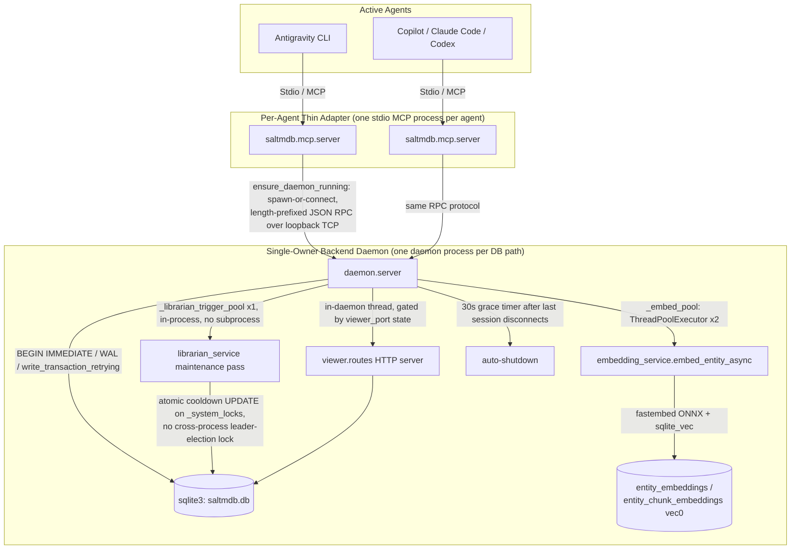

# SALTMDB Architecture

Full technical reference for SALTMDB's storage engine, daemon model, search pipeline, quality gate, and core-memory governance. See [README.md](../README.md) for a project overview and quickstart, and [INSTALL.md](../INSTALL.md) for setup and configuration.

## System Architecture

SALTMDB is built using standard Python libraries and SQLite, prioritizing concurrency safety, security, and low memory overhead.

> [!NOTE]
> **Memory-core rework, Track B.** As of `v0.1.0-alpha.72`, SALTMDB no longer lets each agent's MCP process open SQLite directly. A single backend daemon (`src/saltmdb/daemon/`) is now the sole process that ever opens the DB; every agent process is a thin RPC adapter. See "Single-Owner Backend Daemon" below the feature list for the full design.

- **Mechanical Text Quality Gate & Duplicate Handling:** Sub-millisecond multi-stage pre-embedding quality evaluation — idempotent auto-formatting (`auto_format_markdown`), prose extraction (`extract_prose_content`), Shannon character entropy ($H(X) \in [2.5, 5.3]$), Word 3-gram and 5-gram sequence repetition, Type-Token Ratio ($\ge 0.35$), Coleman-Liau readability bounds ($CLI \in [2.0, 26.0]$), and MSDI structural density scoring — followed by Stage A SHA-256 exact hash collision lookup before ONNX embedding generation. The quality gate aggregates every finding into one response rather than failing on the first: only malformed/empty/placeholder content, unmistakable extreme generation loops, and missing required structure at length (a paragraph break past 500 chars, a heading/list past 1500, more than one heading past 4000) are hard rejections — entropy/repetition/TTR/readability/symbol-ratio/oversized-payload findings are all advisory warnings that never block the write. Duplicate handling runs on every brand-new `store_memory` write (skipped when the call already resolves to an existing entity via an explicit `entity_id`): an **exact** content-hash match is a hard rejection naming the existing entity; FTS-prefiltered candidates are judged by the bundled ONNX cross-encoder, and a candidate above the configured logit threshold always stores with `duplicate_candidates` (ids/titles/scores) plus lifecycle guidance. A genuine cross-encoder failure falls back to the older cosine/lexical comparison. No two-phase review-token gate, no async queue, no auto-linking, no auto weight demotion.
- **Hybrid Search (FTS5 + Vector Candidate Fusion):** Parallel FTS5/BM25 keyword search and `BAAI/bge-small-en-v1.5` dense vector search (via `fastembed` + `onnxruntime`) form a candidate pool through weighted Reciprocal Rank Fusion. Query-side dense embeddings use BGE's asymmetric retrieval instruction; stored document embeddings remain unprefixed. A fixed final-reranker stage uses the configured ONNX cross-encoder when `SALTMDB_RERANKER_MODEL` is set, with deterministic RRF ordering as the disabled/error fallback. FTS5 uses a Porter tokenizer with title-biased BM25 weights (10:1 title-to-content, 5:1 alias-to-content).
- **Secrets Redaction:** Built-in regex scrubbing pipeline automatically redacts API keys, tokens, and private paths before any write. Custom patterns can be added via `.saltmdb_redact` in the working directory (one regex per line).
- **Folksonomy & Canonical Tags:** Flexible tagging with alias resolution, canonical redirects, and three seeded top-level tags (`episodic`, `semantic`, `procedural`). Write-time validation now collapses any single character outside `[a-z0-9]` between alphanumeric runs to `-` (for example, `#wayfinder:task` becomes `#wayfinder-task`) and rejects 2+ adjacent disallowed/separator characters — including an existing `-` adjacent to another separator — pre-transaction rather than silently deleting them; `consolidate_memories`, which previously had no tag validation at all, now uses the same validation.
- **Immutable Identity & Lineage:** Every memory's `entity_id` is permanent — a genuine content change (`revise_memory`/`supersede_memory`) always archives the predecessor byte-for-byte, unchanged, under its own existing ID and links a brand-new entity to it (`revises`/`supersedes`), rather than mutating the old row in place. A narrow administrative-only path (governance/lifecycle metadata fields only, never content) still updates in place on the same ID with no new entity created. Pre-redesign rows created before immutable identity existed (`<entity_id>_h_<8-char-suffix>` snapshots, from the old SCD Type 2 in-place-upsert model) remain in the database and were backfilled with `revises` edges into the lineage graph; see `MIGRATION.md`.
- **Lossless Consolidation:** Soft-archives source memories, auto-creates `consolidated_from` graph edges — never hard-deletes.
- **Bi-Temporal Relations:** Relation edges carry both a system/transaction-time axis (`valid_from`/`valid_to`, set by consolidation) and an independent event/world-time axis (`valid_at`/`invalid_at`, settable directly by agents via `manage_relation(invalidate=True)`).
- **Single-Owner Backend Daemon (memory-core rework, Track B):** Exactly one background daemon process (`src/saltmdb/daemon/`) opens SQLite for a given DB path; every MCP client and most CLI entrypoints connect as a thin RPC adapter over loopback TCP (length-prefixed JSON framing), auto-spawning the daemon on first connect (`saltmdb-viewer` is the one exception — a read-only status client that never spawns, see "Running the Database Dashboard Viewer" below). Ownership is arbitrated by a bind-only guard socket on a per-DB-path election port — never a stale-lock file a crashed process could leave behind. The Librarian and web viewer both moved in-process into the daemon as part of this change, eliminating the old cross-process leader-election lock entirely. See "Single-Owner Backend Daemon & Librarian Throttling" under Core Features for the full design.

### 1. Database Schema
The SQLite database operates in **Write-Ahead Logging (WAL)** mode (`PRAGMA journal_mode=WAL`, `PRAGMA synchronous=NORMAL`). All writes use explicit `BEGIN IMMEDIATE` transactions with exponential backoff retry (up to 4 total attempts). The current migration marker is `PRAGMA user_version=3`; initialization reaches it atomically only after the v1/v2 prerequisites and the lifecycle cleanup described in `MIGRATION.md`, leaving the prior version intact for retry if migration fails.

> [!WARNING]
> **Never open the database file directly** (`sqlite3 saltmdb.db`, a DB browser GUI, or any ad hoc script) — not even for a read-only query. The single-owner backend daemon below is the only process meant to ever open this file; a second connection risks WAL lock contention with the daemon's own writer, and any write made outside it skips the secrets-redaction middleware and the FTS5 sync triggers entirely, silently corrupting search/redaction state. Use the MCP tools, `saltmdb-cli`, or the Viewer instead.

The schema includes the following tables:

* **`events`**: An immutable, append-only ledger tracking agent operations (`decision`, `issue`, `fix`, `attempt`, `consolidation_gate_override`, `relation_gate_override`). `type` is free text, not `CHECK`-constrained — `supersession_candidate`/`consolidation_request`/`domain_suggestion` are legacy values from the retired Librarian scanners and may still appear on old rows, but nothing generates them anymore. Columns: `id`, `timestamp`, `agent_id`, `type`, `content`, `error_code`, `agent_session_id`, `context_id`.
* **`entities`**: The long-term knowledge base. Key columns: `id` (UUID), `title`, `full_content` (markdown), `status` (`raw`/`consolidated`/`archived`), `embedding_status` (`pending`/`ready`/`failed`/`archived`), `memory_type` (`fact`/`event`/`procedure`/`decision`/`preference`), `is_core`, `weight`, `scope` (`private`/`shared`), `owner_id`, `context_id`, `agent_session_id`, `last_touched_session_id`, `content_hash` (SHA-256), `quality_score`, `quality_status`, `quality_flags`, `valid_from`/`valid_to` (SCD Type 2 windows).
* **`_agent_sessions`**: Durable adapter-session provenance: `session_id`, `cwd`, `started_at`, configured `owner_id`, receipt-time `last_activity_at`, and nullable `ended_at`. Registration and explicit normal close are foreground writes through the daemon's single writer; each MCP tool receipt queues a best-effort background activity update through that same writer. Raw connection loss intentionally leaves `ended_at` null because an adapter may reconnect with the same session ID. Rows are retained indefinitely.
* **`tags`**: A folksonomy table allowing tags, categorizations, and canonical redirects. Seeded with `episodic`, `semantic`, `procedural`.
* **`entity_tags`**: A mapping table linking knowledge entities to folksonomy tags.
* **`relations`**: A typed directional edge table for the knowledge graph (`source_id → predicate → target_id`). Supports bi-temporal tracking via `valid_from`/`valid_to` (system time, set by `consolidate_memories`) and `valid_at`/`invalid_at` (event time, set by agents via `manage_relation`). A **partial unique index** `WHERE valid_to IS NULL` prevents duplicate live edges while allowing expired + live replacements to coexist.
* **`predicates`**: A canonical-predicate lookup table (mirrors `tags`' alias-resolution shape), the live-DB mirror of the closed vocabulary defined in `src/saltmdb/utils/predicate_vocabulary.py`. A fresh `init_db()` seeds all **51 canonical spellings**: 11 agent-selectable predicates (`elaborates_on`, `related_to`, `resolves`, `depends_on`, `verifies`, `corrects`, `caused_by`, `derived_from`, `distinguishes_from`, `part_of`, `contradicts`, each with `canonical_id IS NULL`), 3 reserved/system-owned predicates created only by their matching lifecycle tool (`supersedes` by `supersede_memory`, `consolidated_from` by `consolidate_memories`, `revises` by `revise_memory`), 1 legacy read-only predicate (`similar_to` — existing edges stay traversable, no new ones may be written), plus 36 known drifted aliases (30 same-direction renames, 6 requiring a source/target swap) each pointing `canonical_id` at its replacement. **`relates_to`/`references` alias onto `related_to` now, not `elaborates_on`** (reversed from older releases). Write-time predicate validation is closed-vocabulary, not open substitution: `manage_relation` **rejects** a drifted or unrecognized predicate outright with a schema-derived `corrected_call`, rather than silently canonicalizing and noting the substitution in the result string the way older releases did.
* **`entities_fts`**: A virtual table using **SQLite FTS5** (Porter tokenizer) indexing `title`, `full_content`, and `search_aliases` (from `metadata.search_aliases`). Kept in sync with entities via four triggers (`insert_entity_fts`, `update_entity_fts`, `update_entity_fts_unarchived`, `archive_memory_fts`, `delete_entity_fts`).
* **`entity_embeddings`**: A `sqlite-vec` `vec0` virtual table storing 384-dimensional ONNX float32 embeddings (`embedding FLOAT[384]`). Loaded via `sqlite_vec.load(conn)` on a per-connection basis; the extension is pre-imported *before* any `BEGIN IMMEDIATE` transaction opens to prevent stalled cold-import from holding the write lock.
* **`_system_locks`**: A system table backing the Librarian's cooldown throttle inside the single backend daemon (Track B retired its former cross-process leader-election use — see "Single-Owner Backend Daemon & Librarian Throttling" above). Columns: `task_name`, `locked_at`, `locked_by_pid`, `last_run_at`. Trigger cooldown: 5 minutes between in-daemon maintenance passes, claimed via a single atomic `UPDATE`. `locked_at`/`locked_by_pid` are retained columns from the pre-Track-B leader-election shape but are no longer written to.
* **`_viewer_sessions`**: Tracks active web viewer sessions by `port` + `session_pid` for reference-counted lifecycle management.

---

## Core Features

### 1. Hybrid FTS5 + Vector Search
SALTMDB runs FTS5/BM25 keyword search and dense vector semantic search **in parallel** using a `ThreadPoolExecutor`, then forms the candidate set via weighted **Reciprocal Rank Fusion (RRF)**:
* FTS5 uses SQLite's built-in `bm25` auxiliary function with a **10:1 title-to-content weight ratio** (alias weight: 5:1). An AND-query is tried first; if it returns no results with multiple terms, an OR-fallback is automatically applied.
* Semantic search uses `fastembed` (`BAAI/bge-small-en-v1.5`, 384-dim ONNX, ~66MB pre-bundled model weights) stored in a `sqlite-vec` `vec0` virtual table. Stored documents embed `{title}\n\n{full_content}` without a prefix; query-side calls prepend BGE's asymmetric `Represent this sentence for searching relevant passages: ` instruction.
* Weighted RRF merges channel ranks (not raw scores) with `k=60` to select and score the candidate pool. Rows that matched via FTS5 carry a query-centered `fts_snippet` excerpt with `<mark>`/`</mark>` highlighting; rows that only surfaced via semantic search fall back to the heuristic snippet extractor.
* In `broad` and `history` modes, a byte-identical title matching exactly one active entity inside the caller's filters uses an identity fast path: that entity is returned without running hybrid retrieval. Title collisions retain ordinary hybrid ordering. Explicit supersession-family collapse takes precedence and uses the normal pipeline. Relation popularity is deliberately not a relevance signal.
* Enabled by default; set `SALTMDB_ENABLE_SEMANTIC=false` to explicitly disable vector search. **Note**: `search_memory` no longer has an FTS-only fallback for query-based calls -- with semantic search disabled, a call that passes `query_keywords` returns `[{"error": "..."}]` instead of degraded FTS-only results, unless the query resolves through the unique exact-title identity fast path above. Filter/tag-only browsing (no `query_keywords`) is unaffected.
* Duplicate checks use FTS5/scalar pre-filtering to cap the judge pool at roughly 30 candidates, then the bundled `Xenova/ms-marco-MiniLM-L-6-v2` cross-encoder is the primary near-duplicate judge. Raw cosine/lexical scoring is retained only as a genuine model-failure fallback; `DEDUP_CROSS_ENCODER_THRESHOLD=4.0` is explicitly provisional rather than a universally calibrated guarantee.
* Search has one fixed final-reranker stage and no `use_cross_encoder`/`force_cross_encoder`/`rerank_by_topic` call flags. Setting `SALTMDB_RERANKER_MODEL` to a supported ONNX model makes its scores the final order for scored candidates, even when RRF has a decisive dual-channel winner. If the setting is absent/unsupported or model scoring fails, the pool remains exactly in RRF order. This deployment-level choice affects MCP searches even though agents cannot change it per call. No PyTorch runtime is required.

> [!NOTE]
> **Calibration caveat.** SALTMDB's constants fall into two different categories that must not be conflated:
> * **Benchmark-calibrated embedding thresholds** — `COHESION_MIN_PAIRWISE_THRESHOLD`, `RERANK_SAME_TOPIC_THRESHOLD`/`RERANK_BROAD_THEME_THRESHOLD`, `DEDUP_SUPERSESSION_THRESHOLD`/`DEDUP_LEXICAL_THRESHOLD`, `RELATION_GATE_MIN_SIMILARITY_THRESHOLD` — are cosine-similarity cut points locked from English-language, codebase/engineering-domain benchmark corpora against this specific embedding model (`bge-small-en-v1.5`); they are defaults calibrated to that measurement, not a universal guarantee across other languages, content domains, or embedding models, and re-tuning any of them requires new benchmark evidence, not ad hoc adjustment.
> * **Cardinality / review-safety policy constants** — `MAX_CONSOLIDATION_REQUEST_SIZE`, `COHESION_OVERRIDE_MIN_LENGTH` — are **not** embedding measurements; they're deliberately chosen operational safeguards (how many items is reviewable in one commit, how long an override justification must be). These are reviewed and changed through normal policy/design review, not benchmark evidence.
> * Retired (memory-core rework, Track A): `CLUSTER_MIN_PAIRWISE_THRESHOLD`, `SUPERSESSION_MIN_SIMILARITY_THRESHOLD`, `SUPERSESSION_MIN_OVERLAP_COUNT`, `COHESION_MAX_COMPONENT_SIZE_FOR_EXTRACTION` calibrated/bounded the now-deleted async Librarian scanners and no longer exist. Also retired (agent API redesign): `MAX_REVIEW_CANDIDATES`/`REVIEW_TOKEN_TTL_SECONDS` governed the now-deleted store-time disposition review-token gate and no longer exist.

### 2. Hybrid Title Extraction
When storing new knowledge, agents can optionally specify a custom `title`. If omitted, the server automatically extracts the first markdown heading (`# Heading`) as the title, falling back to a snippet of the first line if no heading is present. Title bounds: minimum 5 characters, maximum 120 characters.

### 3. Quality Gate Pipeline
`store_memory` and `consolidate_memories` calls pass through a multi-tier quality gate (`evaluate_memory_quality`) before any embedding or write. The gate aggregates every finding it makes into one response instead of stopping at the first problem, and classifies each finding as either a **hard rejection** (blocks the write, `status: "REJECT"`) or an **advisory warning** (never blocks — surfaced in the response's `warnings`, `status: "WARN"` or `"ACCEPT"`):
1. **Tier 1 — Boundary & Fluff:** Minimum length (20 chars), non-string content, conversational fluff regex patterns, and an unresolved placeholder marker are all **hard rejections**. Maximum symbol-to-alpha ratio (0.35) and oversized payload (>8000 chars) are **advisory warnings**.
2. **Tier 1.5 — Markdown Syntax Integrity:** Unbalanced code fences, asymmetric table pipes, or a header-hierarchy level-skip are **hard rejections** (`BROKEN_MARKDOWN_SYNTAX`). Also scored here: MSDI (Markdown Structural Density Index = ratio of words in headers+lists+code blocks to total words), which only feeds Tier 4's advisory structural score, not a rejection.
3. **Tier 2 — Information-Theoretic Filters:** Shannon entropy outside `[2.5, 5.3]` bits/char, 3-gram duplicate ratio > 0.30, 5-gram duplicate ratio > 0.20 (checked at ≥20 words), and Type-Token Ratio < 0.35 (checked at >30 words) are all **advisory warnings** — this inverted from earlier releases, where several of these were hard rejections. The one exception that remains a **hard rejection**: an unmistakable extreme generation loop (`EXTREME_GENERATION_LOOP`, very low entropy combined with heavy repetition) is still blocked outright.
4. **Tier 2.5 — Coleman-Liau Readability (prose-only, advisory):** On extracted prose (code blocks, URLs, file paths stripped), if >30 prose words: CLI outside `[2.0, 26.0]` is an **advisory warning** (`EXTREME_READABILITY_BOUNDS`), no longer a rejection.
5. **Tier 3 — Structural Requirements by Length (hard rejections):** Length-tiered structure requirements: content ≥500 chars needs a paragraph break (`MISSING_PARAGRAPH_BREAK`), ≥1500 chars needs a heading or list (`MISSING_HEADING_OR_LIST`), and >4000 chars needs more than one heading (`INSUFFICIENT_HEADINGS`) — each is a **hard rejection** when the required structure is missing at its length tier.
6. **Tier 4 — Structural Scoring (advisory `quality_score`, never blocking):** Base score 0.50; +0.15 for headers, +0.10 for lists, +0.15 for MSDI ≥ 0.35, −0.15 for MSDI < 0.10 on large (>80 word) text, −0.10 for untyped code blocks, −0.10 for non-hierarchical headers. Score clamped to `[0.0, 1.0]` — purely informational.

`auto_format_markdown` runs as an idempotent pre-pass: normalizes line endings, annotates untyped code fences with language identifiers (Python/SQL/JSON/JavaScript heuristics), collapses 3+ consecutive blank lines.

### 4. Security & Redaction Middleware
Before any database writes occur, the text is evaluated by a regex-based scrubbing pipeline:
* **Core Redactions:** Automatically censors standard credentials (GitHub tokens, Anthropic API keys, OpenAI API keys, AWS credentials, Discord tokens).
* **Custom Developer Rules:** On startup, the server reads `.saltmdb_redact` from the current working directory. You can add one custom regex pattern per line (e.g. internal staging domains, proprietary IDs) to strip out company-specific secrets.

### 5. Ephemeral State Layer (internal-only, not agent-facing)
The server still maintains an isolated `:memory:` SQLite database (`src/saltmdb/domain/services/ephemeral_service.py`, backed by a module-level singleton connection) capable of holding temporary data such as short-lived session tokens or process variables — these variables are never written to disk and disappear completely when the server stops. **As of the agent API redesign, this layer has no MCP-facing tool** — the standalone volatile-storage tool that used to expose it to agents was removed with no replacement. The underlying mechanism is documented here purely as an architectural fact about the codebase; do not tell an agent it can reach it.

### 6. Single-Owner Backend Daemon & Librarian Throttling
Exactly one daemon process (`src/saltmdb/daemon/server.py`) ever opens SQLite for a given DB path. Ownership is arbitrated by a **bind-only guard socket** on a per-DB-path "election port" (derived deterministically from the resolved DB path into the `49500`–`65499` range) — the daemon binds it and holds it for its entire lifetime, never `accept()`-ing a connection; a losing contender's own bind attempt fails almost instantly and it exits cleanly without ever touching the DB. This replaces a lock *row* (which a crashed process could leave stale) with a lock the OS itself releases the instant the holding process dies. A paired "probe port" (`election_port + 1`) answers lightweight identify requests so a client can tell "daemon still starting up" apart from "a stale/foreign process holds this port," without needing to open the DB to find out.
* Every MCP client and most CLI entrypoints (`python -m saltmdb`, `--librarian`, `--backfill-chunk-embeddings`) are thin RPC adapters: `ensure_daemon_running()` connects to an already-running daemon or spawns one (detached subprocess, `CREATE_NO_WINDOW` on Windows / `start_new_session=True` on Unix, stdout/stderr redirected to `daemon.log`) and retries discovery for a bounded window. `saltmdb-viewer` is the one exception — a read-only `viewer_status` RPC client that requires an already-running daemon and never spawns one itself; run any of the other entrypoints first if you get a "no daemon running" message.
* The daemon starts a 30-second grace-period shutdown timer (`DAEMON_SHUTDOWN_GRACE_PERIOD_S`) both at its own startup and every time its session count returns to zero, so a daemon spawned only to service a one-shot RPC (no client ever opens a session) still shuts itself down on the same timer, not just after a connected session disconnects. An in-flight RPC (a librarian pass, a chunk-embedding backfill) is tracked separately and blocks the timer from firing mid-call. `saltmdb-daemon --foreground` (explicit manual launch) disables this timer entirely and runs until `SIGINT`/`SIGTERM`.
* **Librarian throttling**, now that only one process ever runs the maintenance pass: the old cross-process leader-election lock (`acquire_librarian_lock`/`release_librarian_lock`, two separate `BEGIN IMMEDIATE` transactions against `_system_locks`) is retired outright — there is nothing left to elect a leader among. The cooldown check collapses to a single atomic `UPDATE _system_locks SET last_run_at = ? WHERE last_run_at IS NULL OR last_run_at < now - 300s` on the daemon's single-worker `_librarian_trigger_pool` thread, and a manual pass (`--librarian`, or the `run_librarian_now` RPC) shares that same pool so the automatic and manual paths can never run concurrently.

### Session registration, reconnect, and call fencing

An MCP adapter's `hello` succeeds only after the daemon has synchronously committed its
`_agent_sessions` registration through the centralized foreground writer. Registration failures
are fail-closed: coordinator shutdown returns `DAEMON_SHUTTING_DOWN`, while an exhausted database
or invariant failure returns `INTERNAL_ERROR` and removes the in-memory live-session entry. The
adapter transparently retries once for connection failure, stale authentication, or daemon
shutdown; a final durable-registration error is surfaced and startup cleanup does not send a
goodbye for a session that never opened.

For a successful hello, the daemon mints a random 256-bit session capability. It is returned only
in the internal hello response, kept in adapter memory, and attached to internal tool-call RPCs
next to `caller_agent_session_id`. It never appears in public MCP schemas or responses, and public
MCP calls continue to expose no `owner_id`. Metadata-free one-shot CLI calls remain valid. Missing
or malformed ID/capability pairs are rejected as `MALFORMED_REQUEST`; inactive, mismatched, or
closing sessions receive `CALLER_SESSION_INVALID`.

Reconnect is transactional. The adapter serializes opening, discovery refresh, session-metadata
snapshots, and close; a failed refresh blocks the current call rather than sending stale
authentication or metadata, while leaving the logical session retryable. Re-registering an ended
session reopens its row, preserving the earliest `started_at`, first known `cwd`, and first known
`owner_id`, advancing `last_activity_at` monotonically, and clearing `ended_at`.

Goodbye first marks the session closing, rejects late calls, waits for leases held by already
accepted calls (including calls that raise), persists `ended_at`, acknowledges, and then unregisters
the live connection. A raw disconnect unregisters without writing `ended_at`, because the same
logical session may reconnect. Older `_agent_sessions` tables missing nullable `cwd` are upgraded
automatically and retain their historical rows.

Bulk ownership is intentionally split between trusted internals and public surfaces. Relation
batches use the configured adapter owner as their default; trusted in-process callers may override
an item, but public MCP wrappers strip per-item owners. Bulk consolidation keeps its configured
batch-owner behavior, with per-item overrides retained only for internal compatibility. The
`saltmdb-cli orphans` scan is scoped by `SALTMDB_OWNER_ID`; `saltmdb-cli corpus-health` is a
cross-owner administrative report.

### 7. Automated Session Lifecycle Hooks
SALTMDB integrates with native lifecycle hooks across major AI agent frameworks (**Claude Code**, **Google Antigravity CLI**, and **GitHub Copilot CLI**):
* **Context Digest Injection (`SessionStart` / `PreInvocation` / `sessionStart`):** Automatically injects the canonical core-memory bootstrap digest (global, core-only, fail-closed) at session initialization.
* **Directory-Scoped Last-Session Digest (`SessionStart` / `PreInvocation` / `sessionStart`):** Additively injects the most recent prior session's logged memories for the same working directory, distinct from the global core-only digest above; remains silent when there is nothing to show and walks back past content-free sessions so it works correctly under concurrent multi-agent use of one directory.
* **Pre-Action Memory Search Gate (`PreToolUse`):** Enforces Rule 1 ("Think Before You Leap") by requiring a memory search before executing code edits or terminal commands. Supports Copilot CLI's JSON `permissionDecision` (`allow`/`deny`) protocol.
* **Pre-Compaction Memory Sweeps (`PreCompact`):** Triggers autonomous background agent sweeps to persist unrecorded decisions and bug fixes before transcript truncation.
* **Stop Self-Critique Gate (`Stop` / `agentStop`):** Triggers mandatory self-reflection checks on confidence and unknown risks before finishing complex turns.

---

## The Librarian Process (Garbage Collection)

> [!NOTE]
> **Memory-core rework, Track B.** The Librarian is no longer its own detached subprocess (`python -m saltmdb --librarian` spawned per triggering client process). It now runs **in-process inside the single backend daemon**, on the daemon's existing single-worker `_librarian_trigger_pool` — see "Single-Owner Backend Daemon & Librarian Throttling" above. The description below reflects the current in-daemon behavior; the subprocess-spawn description this section used to carry is gone along with the subprocess itself.

Whenever the database is modified, the daemon schedules a fire-and-forget cooldown check on its single-worker `_librarian_trigger_pool` background thread. If at least 2 raw entities exist and 5 minutes have elapsed since the last pass, the maintenance pass runs directly on that thread — no subprocess spawn, no separate process to detach or redirect. A manual pass (`python -m saltmdb --librarian`, now an RPC-forwarding client, or the daemon's own `run_librarian_now` RPC) submits to the *same* pool and blocks on the result, which is what makes the automatic and manual paths mutually exclusive without any separate lock.

A spawned background daemon's output goes to its own `daemon.log` (same directory as `saltmdb.db`) rather than a dedicated `librarian.log` — there's no longer a separate subprocess whose output needs its own redirection. (A daemon launched explicitly in the foreground, `saltmdb-daemon --foreground`, logs to the terminal as normal instead.)

Once the Librarian's cooldown-claim UPDATE wins (see above), it runs:

1. **Tag Merging (`merge_tags_heuristics`):** Merges case-insensitive, punctuation-stripped tag aliases (e.g. `#Auth-Error` and `#auth_error` normalize to `autherror`) into a canonical tag to prevent folksonomy fragmentation. Arbitrary SQL row order determines the canonical winner.

**Maintenance pass (`_run_librarian_maintenance`):** Runs unconditionally after the tag-merging pass (even on partial failure), on the same trigger-pool thread: `PRAGMA wal_checkpoint(TRUNCATE)` + `PRAGMA optimize=0x10002`.

> [!NOTE]
> **Retired (memory-core rework, Track A).** The Librarian used to run two additional async passes here — vector topic clustering (`consolidate_vector_clusters`) and consolidated-supersession scouting (`scout_consolidated_supersessions`) — each logging a reviewable `consolidation_request`/`supersession_candidate` event for a human/agent to resolve later. Both were deleted outright, no replacement queue. Track A folded that evidence-gathering into a synchronous `store_memory` preflight instead, evaluated inline on the write that's actually relevant rather than from a periodic scan of the whole DB — that preflight was itself later replaced (agent API redesign) by the simpler exact-duplicate-hard-rejection / near-duplicate-`duplicate_candidates` split described in the Quality Gate section above; there is no two-phase review gate at either point in this history's current end state.

### No LRU Decay
Memories are **never** weight-decremented or archived due to inactivity or disuse. Archiving occurs only upon explicit supersession, revision, or synthesis consolidation. The previously-present `decay_low_quality_memories` function was removed in alpha.62 as confirmed-dead code.

---

## Core-Memory Bootstrap Governance

`is_core=True` is a **scarce, temporary bootstrap-delivery mechanism**, not a general "important knowledge" tier. It exists for urgent cross-session hazards an agent must know before it could reasonably search for them (active bugs, temporary overrides, environment failures, migrations in progress) — stable coding rules, standing behavioral guidelines, and user preferences belong in `AGENTS.md`/`CLAUDE.md`/skills instead. All logic lives in `src/saltmdb/domain/services/core_governance_service.py`, the sole authority every write path (`store_memory`, `consolidate_memories`, `review_core_memory`) and the bootstrap-digest renderer route through.

Three independent hard limits, enforced inside every write transaction that can create/promote/enlarge a core memory:

| Limit | Value |
| :--- | :--- |
| Active (non-archived) core memories, globally | ≤ 5 |
| `full_content` per core (Unicode code points) | ≤ 2,500 |
| Exact rendered bootstrap digest (Unicode code points) | ≤ 15,000 |

**Lifecycle fields.** Every core requires `scope="shared"` (no private cores), `core_reason` (20-500 chars: the harm before natural retrieval), `core_exit_condition` (20-500 chars: the observable condition that ends the urgency), and an absolute `core_review_after` timestamp (default 14 days out, max 30). While any core is overdue for review, creating/promoting a new core, enlarging an existing core's content, or changing its review timestamp is blocked — call `review_core_memory(outcome='retain')` to resolve the overdue review first; demote/archive/non-expanding edits stay allowed. Overdue cores are still injected (rendered first, with `review_due="true"`) — an overdue-but-otherwise-valid core is never a bootstrap failure.

**Capacity failures are side-effect-free.** A write that would exceed any limit returns `status: "rejected"` with an `errors[0].code == "CORE_CAPACITY_EXCEEDED"` entry, the violated dimensions, current/proposed totals, and a balanced inventory of every active core (ID/title/type/owner/review timestamp/due state/rendered size — never full content) — no memory, relation, or other state is created. Rebalancing (demote/archive/shorten/consolidate) is fully autonomous; it never requires a human decision.

**Detail memories.** A core must stay directly actionable even if a weaker agent never follows a link — rationale, chronology, evidence, and examples belong in linked normal memories instead. `detail_memory_ids` (at most 3 full UUIDs of existing shared, non-core memories whose canonical title and UUID must appear in the core's own `content`) atomically maintains `detail --elaborates_on--> core` relations; `manage_relation` cannot create such an edge directly against an active core (`REJECT_CORE_ELABORATES_ON`) — only the core's own declaration governs it.

**Consolidation never inherits core status.** If any resolved `consolidate_memories` parent is currently an active core and `is_core` is omitted, the call is rejected — pass `is_core=True` (with lifecycle fields) explicitly to keep the result core, or `is_core=False` to let it become ordinary.

**Review.** `review_core_memory(entity_id, outcome, review_rationale, core_review_after)` is a direct, synchronous operation (never a queue/event): `retain` extends the review date, `demote` returns the memory to ordinary searchable status, `archive` retires it. The configured `SALTMDB_OWNER_ID` identifies the *reviewing* agent, not an ownership check.

**Bootstrap fails closed.** The `saltmdb-cli bootstrap-digest` hook (global, core-only — no project-keyword search, no arbitrary core-count limit) renders every active core in canonical order (overdue first, then earliest upcoming review, then creation time). If any active core is malformed or the set exceeds a limit, bootstrap emits one bounded `<core-bootstrap-error>` report (violations + compact inventory + a rebalancing instruction) instead of a partial, truncated, or oversized digest.
